<div class="subtitle" markdown>
Explore registered teams in Gluon, and add or edit its members.
</div>

## Introduction

The 'Team Management Page' is a powerful instrument for controlling and organizing your teams on the Gluon platform.
It gives you a comprehensive overview of your teams, facilitating the process of adding or removing members, as well as editing team details or assigning roles.

In this guide, we'll walk you through the core features of the 'Team Management Page', such as how to modify the team composition and roles effectively. It's a crucial resource for efficient team management and unlocking the full potential of collaboration.

In this in-depth guide, you will:

- Navigate the team overview
- Understand how to add or remove team members
- Learn to edit team details and assign roles
- Grasp the importance of each piece of team information

## Accessing the User's Team Page

<div class="steps" markdown>

- **Go to application's detail view.** This view contains the details of the application as well as the list of application owners. By clicking on the application owner's name to copy their email on the clipboard or directly open a new email message.

 For more information on how to access an application's detail view, go to [Explore applications](../application-management/application-onboard.md#explore-applications).  

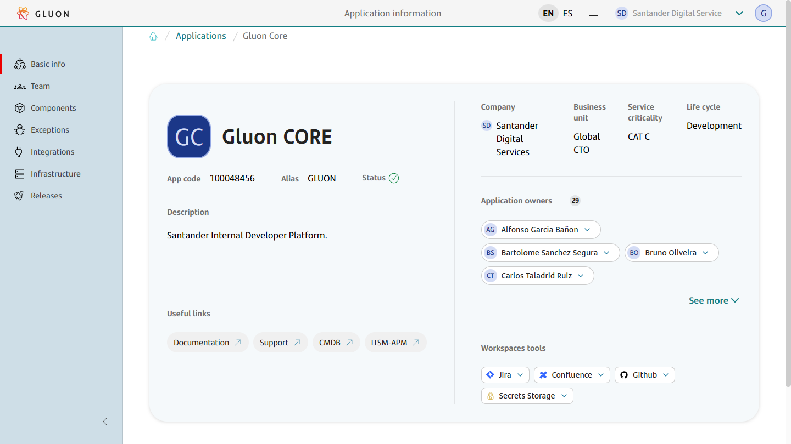

- **Explore the Team Page.** By clicking on the `Team` button on the left to access the team page. It provides a list of the members of the team with their respective roles. The list can be filtered by their name and email.

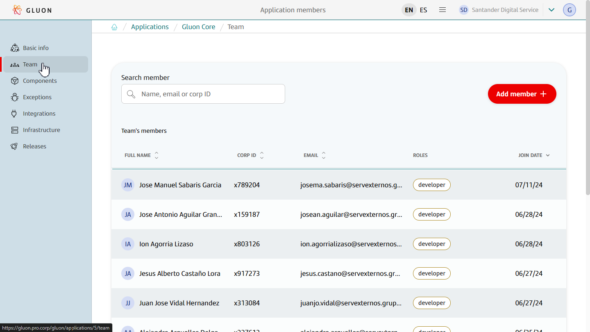

To get the most out of Gluon, explore the other features and functionalities the platform offers. Happy team managing!

</div>

## Add new members to a team

This functionality is only available to **application owners** or **admins**.

<div class="steps" markdown>

- **Accessing the Add Member Function.** For application owners, on the Team page an "Add Member" button is located on the top right corner. Click this button to open the "Onboard Member" pop-up.  
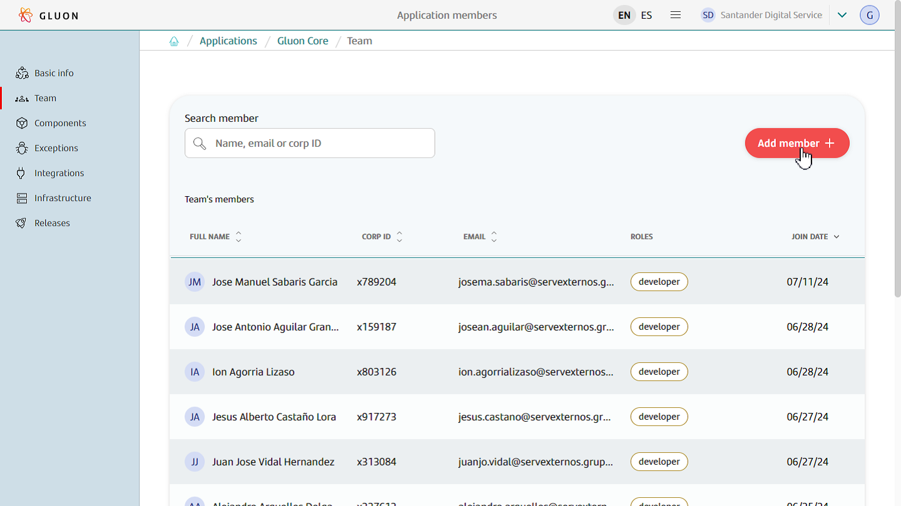

- **Onboarding a new Member.** In the "Onboard Member" pop-up, write the user codes of the users to onboard and click the `Add` button. {== The user to be onboarded must exist in the corporate LDAP and in Azure AD,
and their email must be the same in both directories.==} Omce added to remove a member during this step, click the dash button. Once added all the necessary members, click "Next."  
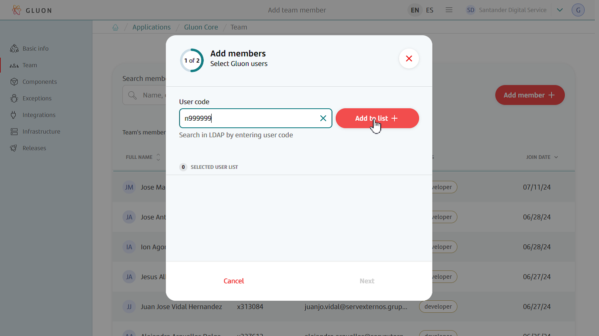
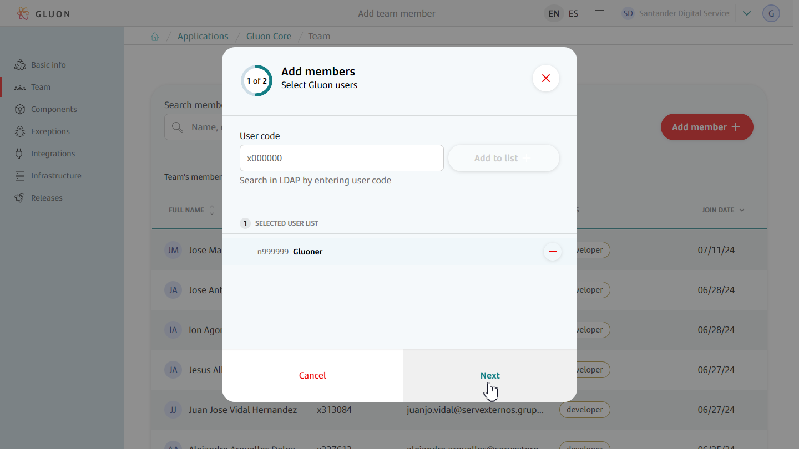

- **Assigning Roles.** In the next step of the pop-up, it is possible to assign roles to the new members. In the drop-down menu the _developer_ role is marked by default. To choose a different role check the correspondent
boxes of the roles to assign. Each new member can have multiple roles. To solve any doubts about types of users in Gluon, check the [User Permissions section](../../application/users-teams/user-permissions.md#roles).
After finish, click the `Onboard member` button.  
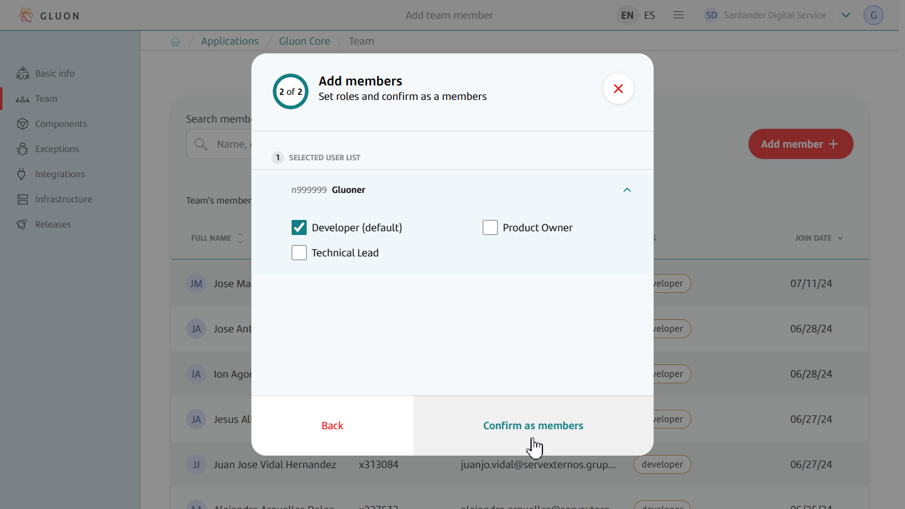

- **New team member added.** Once assigned the roles, if the process has finished correctly a pop up message will appear. The new member is located at the top of the list.  
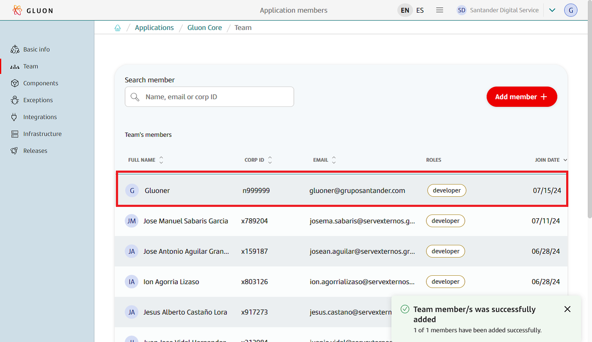

That's it! You've successfully added a new member to your team and assigned their roles. Happy team building!

</div>

## Editing a Team Member

This functionality is only available to **application owners** or **admins**.

<div class="steps" markdown>

- **Accessing the Edit Function** On the Team page, appears the list of all members in the team. To edit a team member, locate the pen button in the right column next to the member's join date. Click this button to open the "Edit Member" pop-up.  


- **Editing a Team Member's Role or Status.** In the "Edit Member" pop-up is possible adjust the roles of the team member. Select or deselect the checkboxes to assign or remove roles from the member.
In order to remove the member from the application, there is an option to do so in this pop-up as well.  
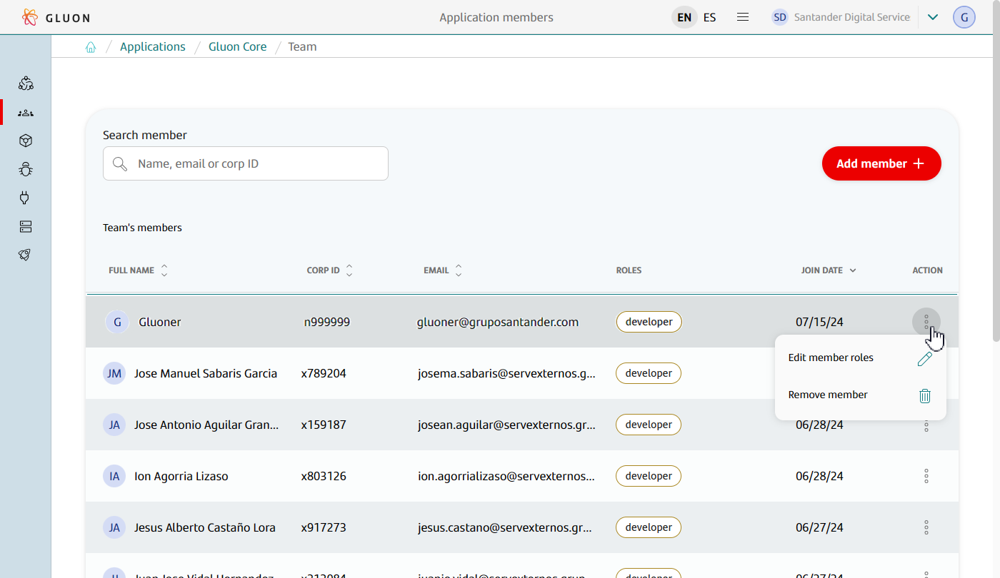
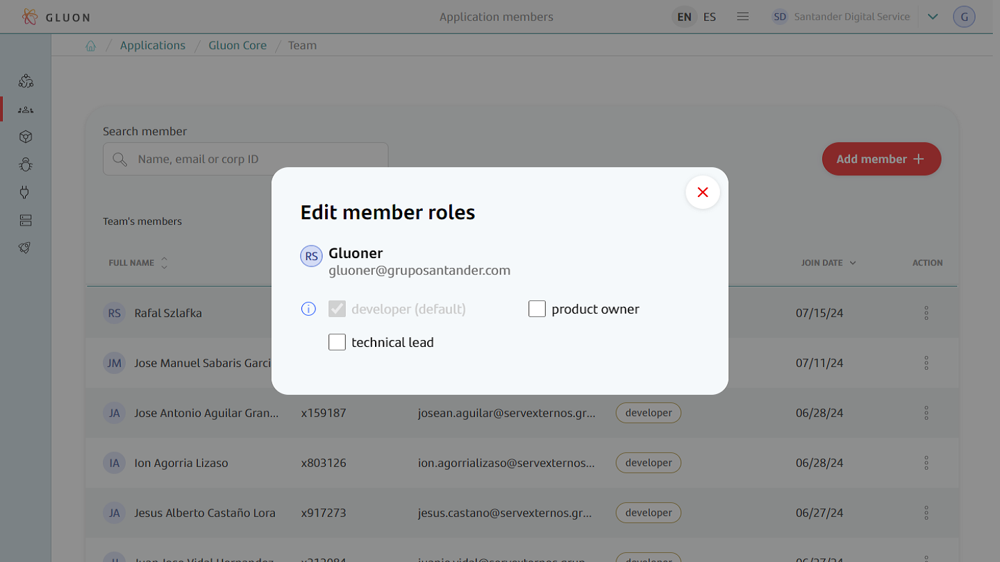

- After the changes are applied, a notification appears claiming that "Member roles updated successfully".  
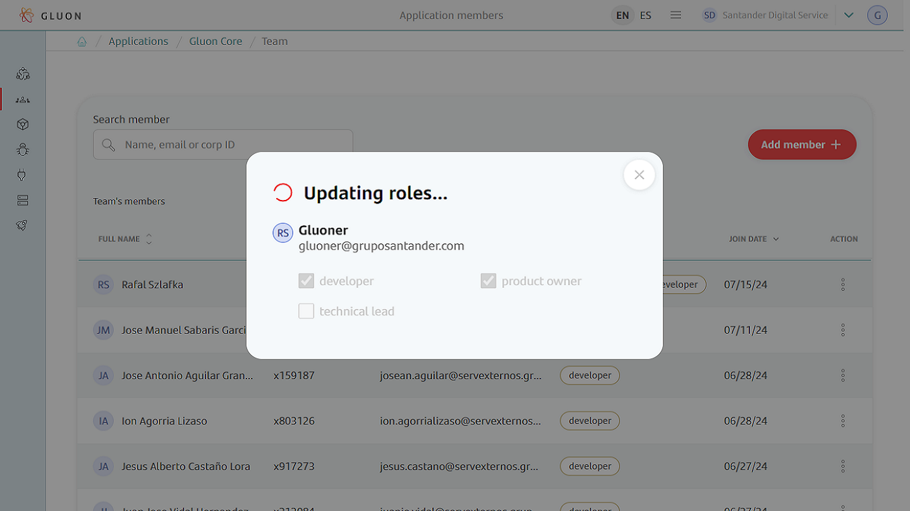
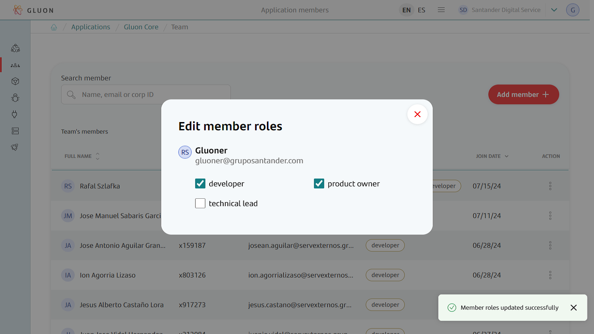

And you're done! You've successfully edited a member's roles in the team. Happy team editing!

</div>

## Removing a Team Member

This functionality is only available to **application owners** or **admins**.

<div class="steps" markdown>

- **Accessing the remove Function.** On the Team page, appears the list of all members in the team. To remove a team member, locate the three point button in the action column.
Click this button to show the "Editing a Team Member's Role or Status.", then click "Remove member" and a pop-up will appear.  


- **Remove a Team Member.**  Click "Yes, remove" button after pop-up opens to remove team member.  
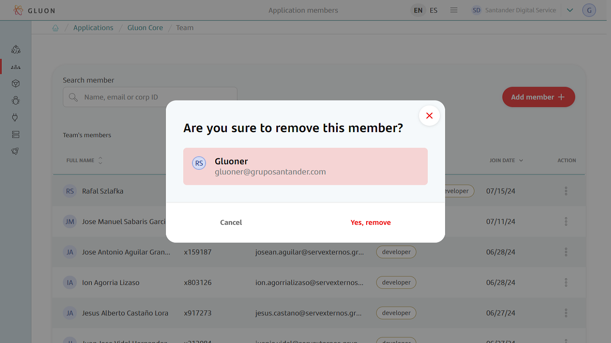  
**Note:** if an application member is removed from all applications in a company, they will lose the licenses for the tools they have.

- After the changes are applied, a notification appears claiming that "Member removed successfully".  
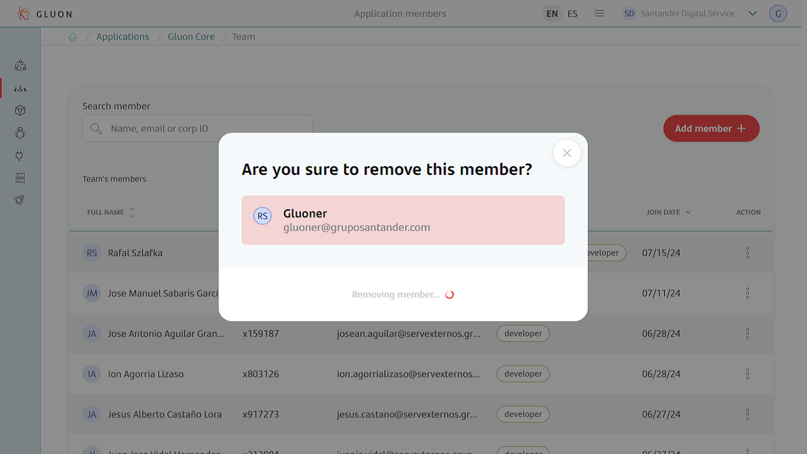
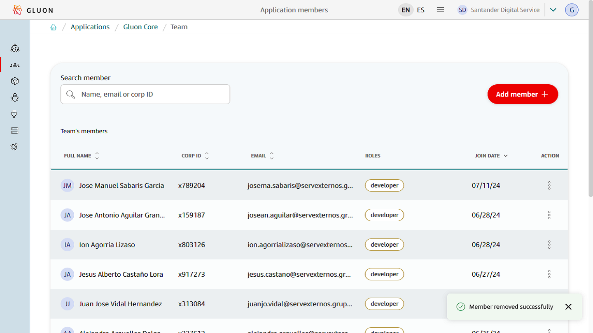

And you're done! You've successfully removed a Team Member!

## Application Teams in Microsoft Entra ID

When added to the Application Team, members will be added to Entra ID Groups depending on their role

```GR_ALMNXTGN_<Entity Acronym>-<Application ALIAS><Role Suffix>```

| Title           | Role          | Role Suffix in Entra ID      |
|-----------------|----------------------|-----------------------|
| Team Member     | Developer   | _DEV                   |
| Team Member     | Technical Lead   | _TL                   |
| Team Member     | Product Owner   | _PO                   |

Example : for **Gluon CORE** Application of the previous screenshots, Entra ID groups would be:

- GR_ALMNXTGN_SGT-GLUON_DEV
- GR_ALMNXTGN_SGT-GLUON_TL
- GR_ALMNXTGN_SGT-GLUON_PO

</div>
