## Onboarding an Application

The only users with permissions to onboard applications in a company are the **owners of the company** and **admins**.

- **Select the company where the application will be onboarded** in the top right corner. {==The application can only be onboarded in the **same company as the one associated in ITSM**. ==}
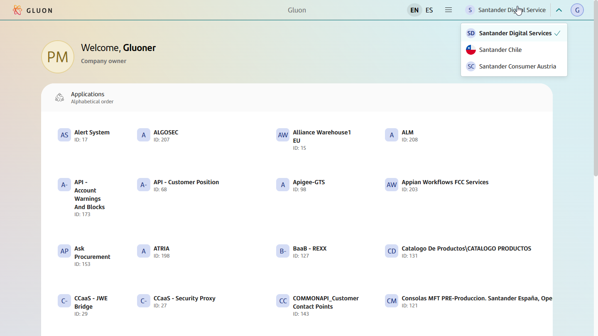  
- **Initiate Application Onboarding.** Once you're in the Applications section, locate the "Onboard Application" button at the upper right side of the search
  application section. Click on it to start the onboarding process.
  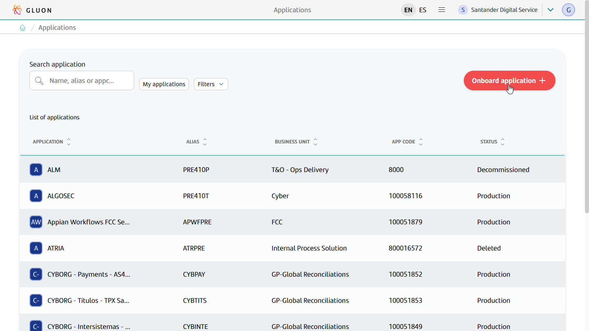  
- **Search for Onboarded Application.** In the pop-up window, search your onboarded application by code. This code
  corresponds to an application that is registered on the ITSM platform (to find the code for your application see [How to discover the target application identifier](#how-to-discover-the-target-application-identifier)).
  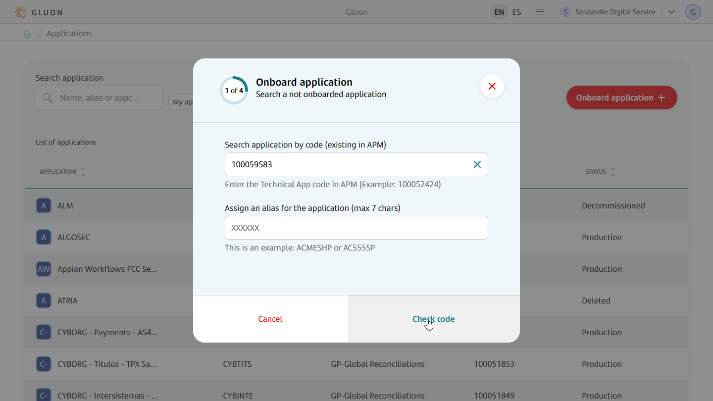
- **Assign an application alias.** The alias can have a maximum of 7 characters consisting of letters and numbers. Each application has a unique alias within the company. This alias will be later used as identifier of the application when
creating the tools. After assigning the alias, click on the 'Next' button to continue with the onboarding process.  
  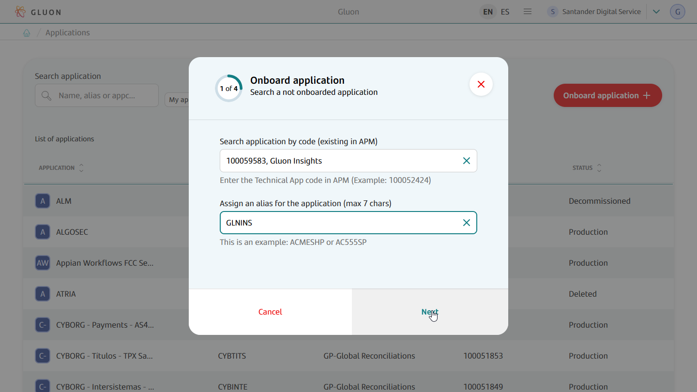
- **Select Jira instance.** Choose the Jira instance where the application project will be available.
  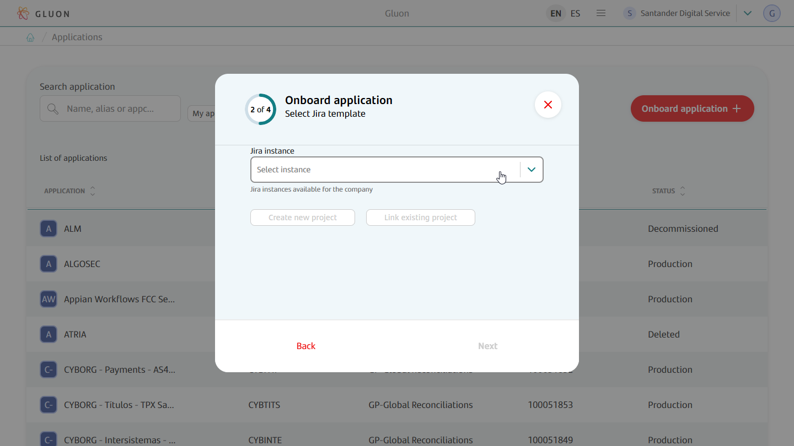
  Decide whether to create a new Jira project for the application by levaraging a specific project template or reuse a Jira project already available in the selected Jira instance.
  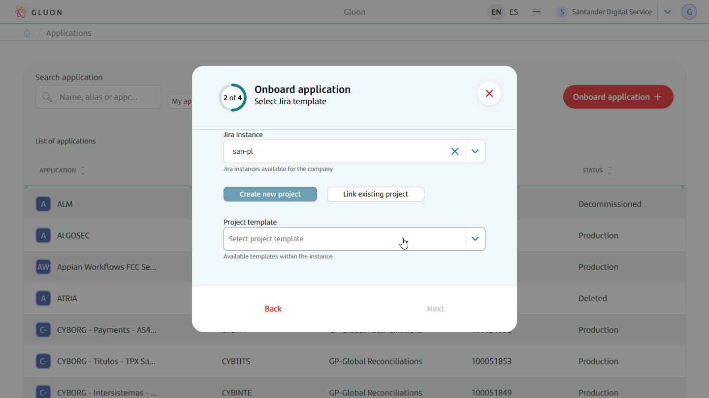
  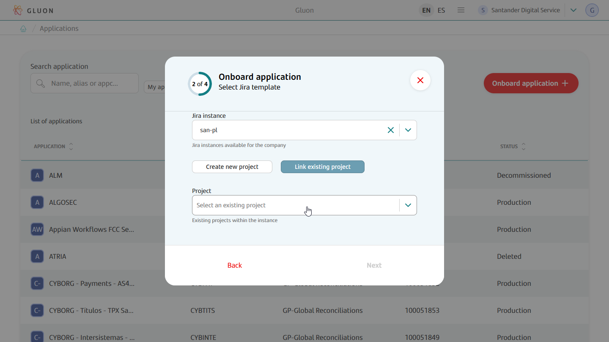
- **Select Confluence instance.** Choose the Confluence instance where the application space will be available.
  
- **Select Github organization.** Choose the GitHub organization where the application components will be created.
  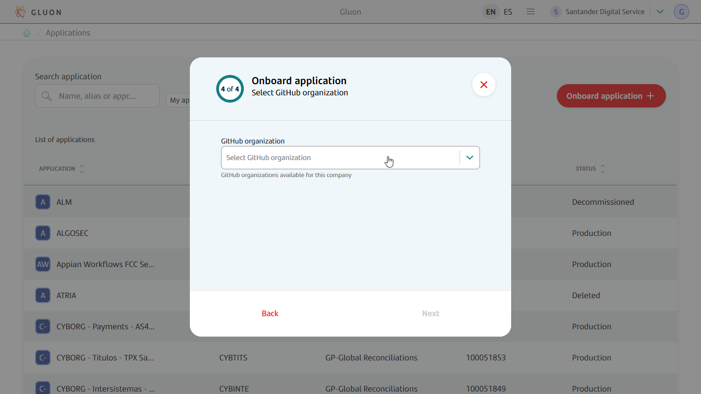
- **Review the information of the application.** In this last step review the information of the application to be onboarded. If everything is correct, click the 'Confirm' button to finish the onboarding process.  
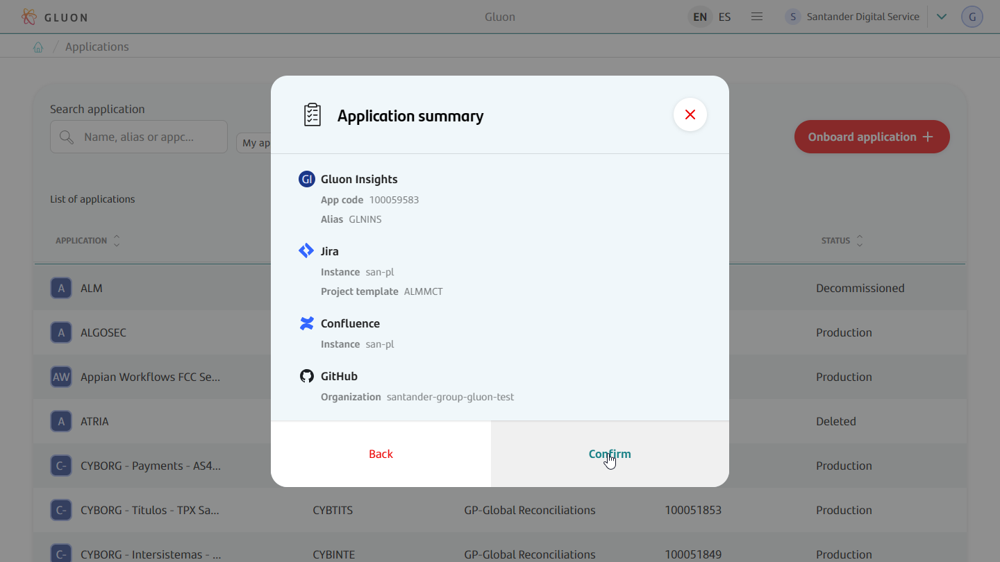
- **Application was onboarded.** If the process has finished correctly, you should see a pop up message.  
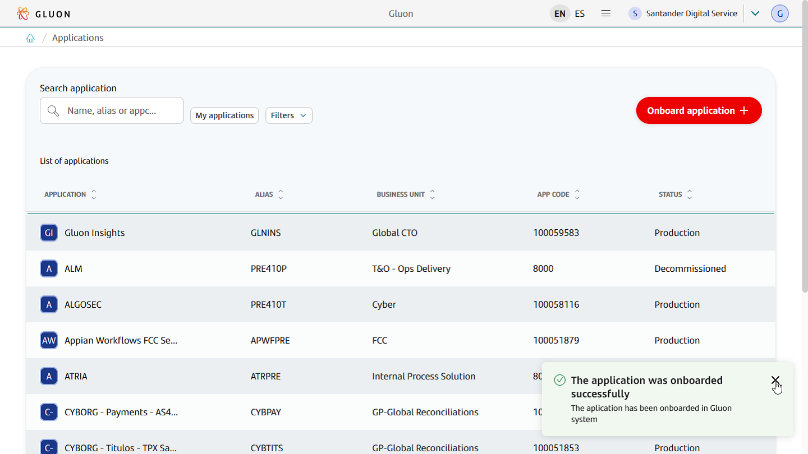
- **Check the application's details.** Application details can be accessed searching in the list.  
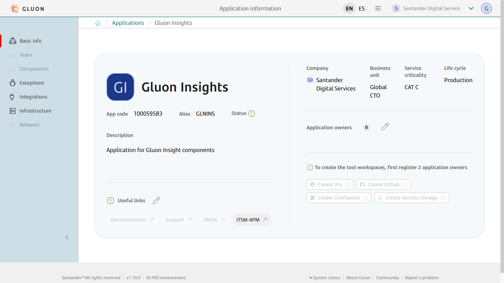  

By following these steps, you can successfully onboard an application in Gluon, ensuring its proper registration and ownership assignment.

### How to discover the target application identifier

- Go to the [technical applications catalog](https://santander.service-now.com/nav_to.do?uri=%2Fu_cmdb_ci_technical_app_list.do%3Fsysparm_query%3Dcompany%3D37a94e62dbce6bc02cdd2dcb0b961922%26sysparm_first_row%3D1%26sysparm_view%3D) in ITSM.

- Filter by the **company** the application belongs to:  
  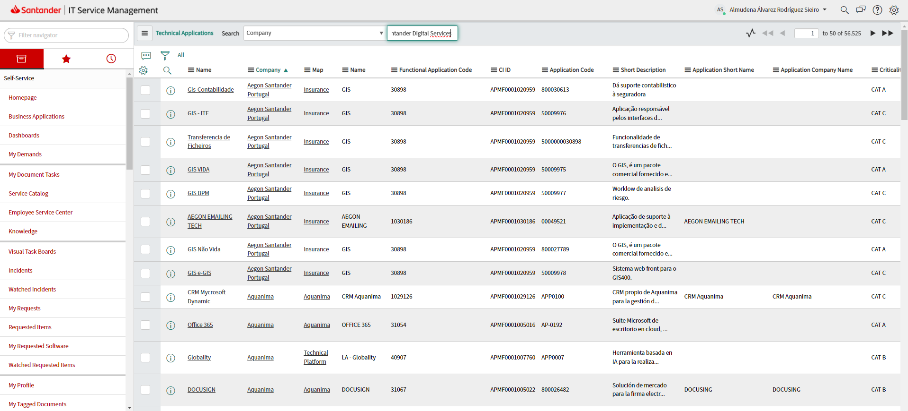

- Filter by the **name** of the technical application and hit the `RUN` button:  
  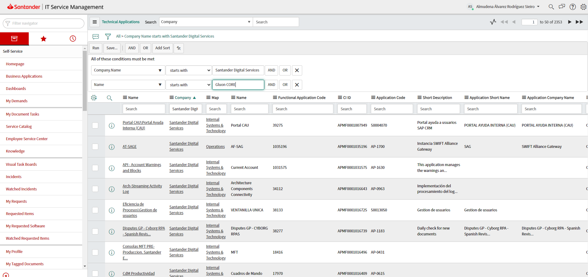

- The identifier we are looking for is defined in the _Cat Apli Code (ID)_ column, which is not visible by default.
  In order to show the column, click on the `Settings` button in the table:  
  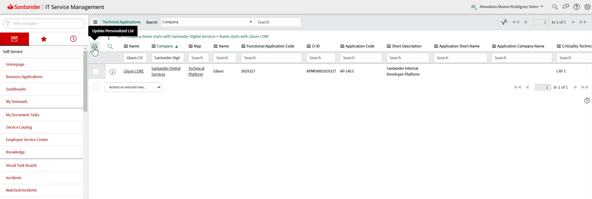

- Select the _Cat Apli Code (ID)_ column from the **Available** list and move it to the **Selected** list using the right arrow button.  
  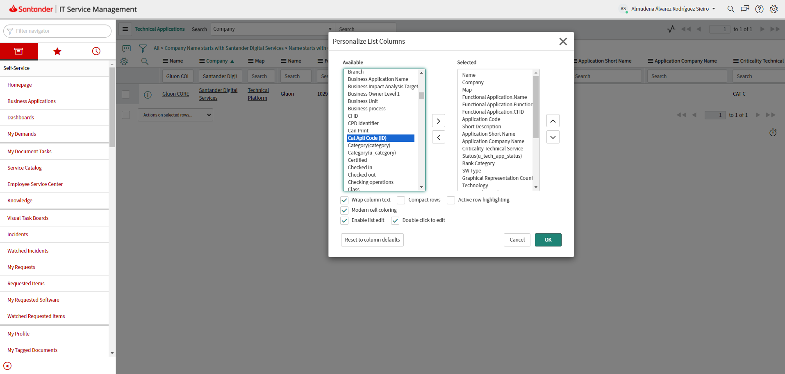

- The column will be placed at the bottom of the list and shown as the last one on the table. To avoid scrolling, you can move the column
  up in the **Selected** list using the up arrow button. Click the OK Button when you are done.  
  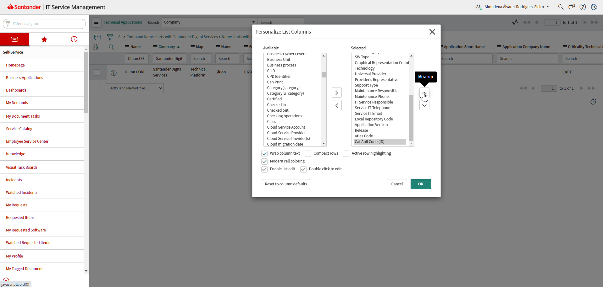

- Now the table shows the _Cat Apli Code (ID)_ and the desired identifier.  
  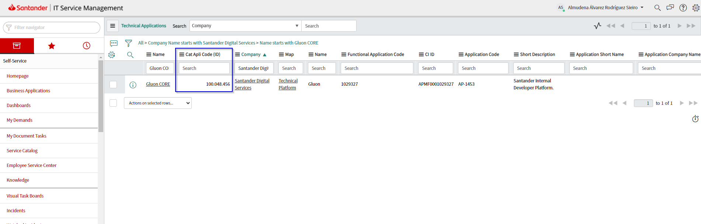

!!! note

    ITSM displays the column value as a **number** and it may use symbols for [grouping](https://learn.microsoft.com/en-us/globalization/locale/number-formatting#number-grouping-and-separation).
    Those symbols are not part of the identifier itself. Thus, in the example above, the `100.048.456` value should be interpreted as the
    `100048456` identifier, which would be the value to use when onboarding the technical application in Gluon.

## Explore applications

- **Select the company of the applications you want to explore.** In the top right corner select the company of the applications you want to explore. Only companies that you own or that you are a member of will appear.  
  
- **View the applications of the chosen company.** Locate the "Applications" section, usually found in the upper right corner of the page. Click on it to access the list of applications.  
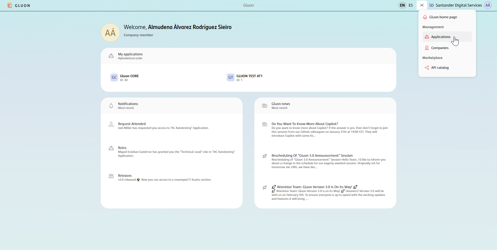  
- **Explore and filter applications.** The Applications page shows the applications of the company you have previously chosen. Use the search bar on the top left corner to enter specific keywords and narrow down
the application list. Applications can also be filtered by their lifecycle and business unit.  
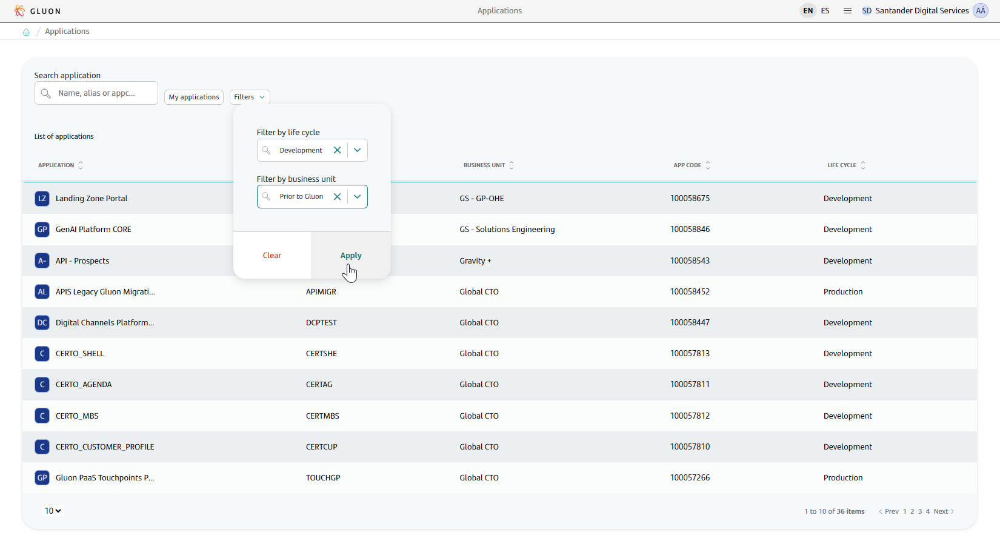
- **Filter by applications.** To review only the applications you belong to as application owner or member click the 'My applications' filter.  
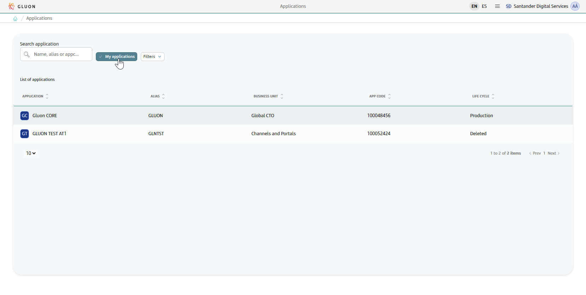
- **Explore the details of an application.** Select an application of the list and it will redirect to the details section of the application.  

## Related content

[Learn how to manage applications owners](./application-owners-management.md)

[Learn how to manage applications tools](./application-tools-management.md)

---
