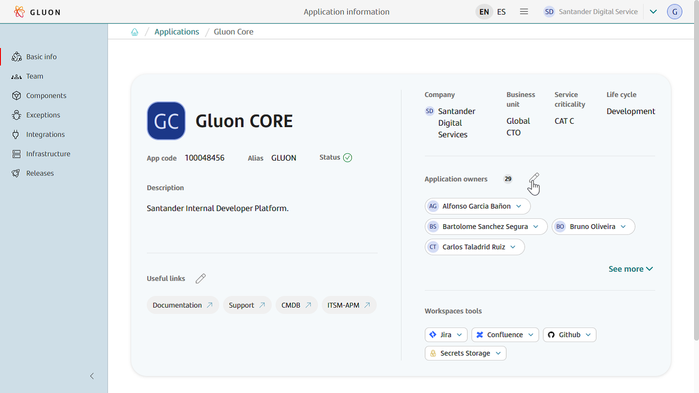
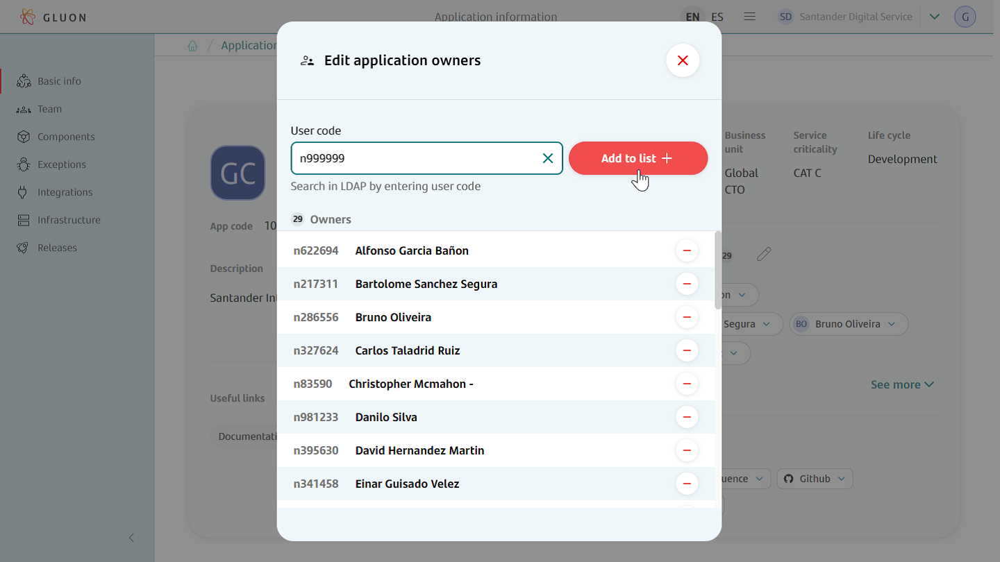
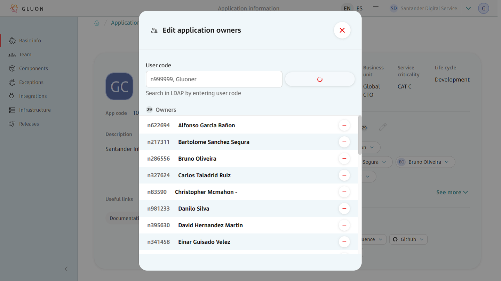
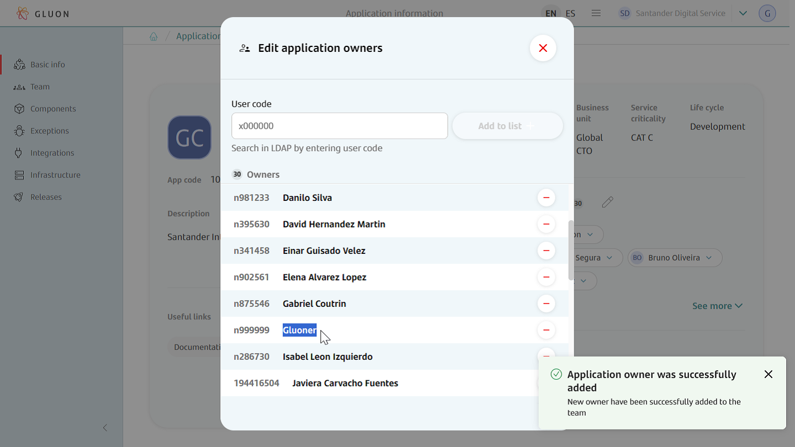
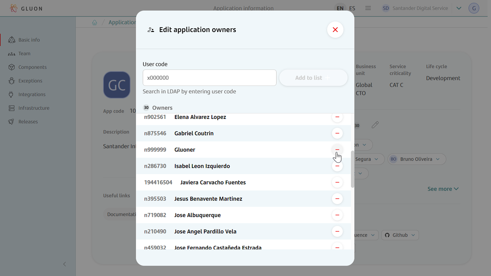
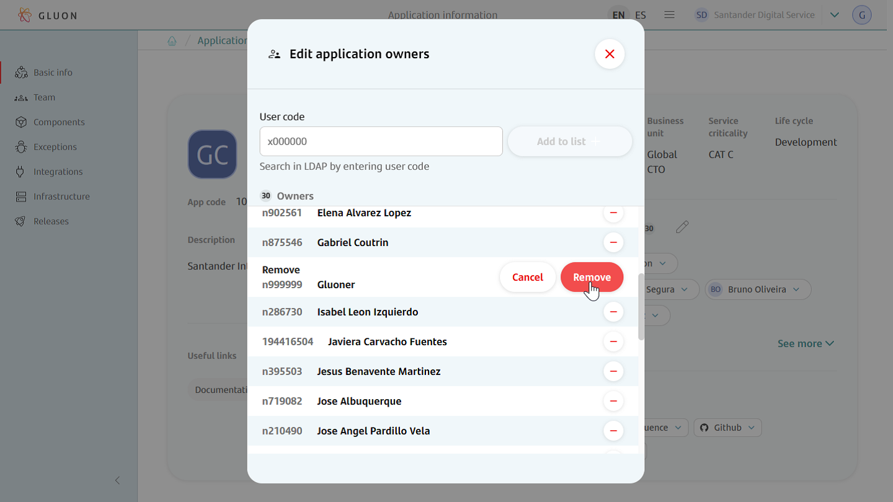
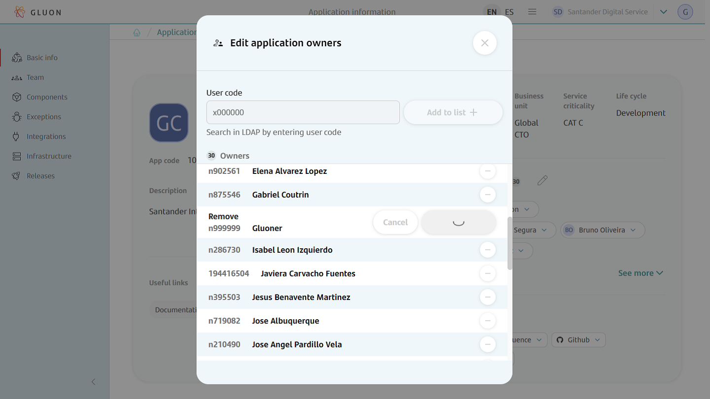
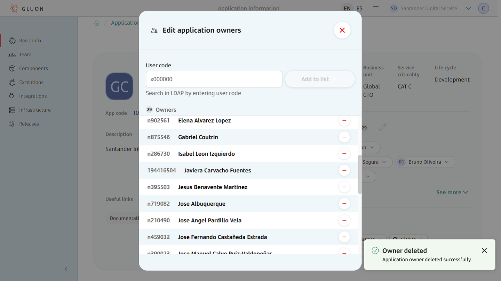

## Introduction

<div class="steps" markdown>

This document is provided for **admins** and **company owners** profiles and explains how to manage users that own applications. It contains two main sections:

  - Onboard a user as an application owner.
  - Remove an application owner.

</div>

## Onboarding Application Owner

<div class="steps" markdown>

This functionality is only available to company owners or admins.

- **Manage Application Owners.** Once into Application Details section click on the application owners edit icon to access the Application Owners detail.  


- **Select owner to onboard.** Once the application's owners detail window opens, their information will be visible. To onboard a new one just type the corporate identifier in text box and hit "Add +" button.  




- **Check owner is onboarded.** Once the application's owner is onboarded a notification appears claiming that "Application owner was successfully added", and it will be visible in the detail window.  


!!! note "Keep in Mind!"

    In order to onboard users they must exist in the corporate LDAP and in Microsoft Entra ID, and the email must be the same in both identity providers.
</div>

## Removing Application Owner

<div class="steps" markdown>

This functionality is only available to company owners or admins.

- **Manage Application Owners.** Get to the applications details section and click on the application owners edit icon to access the Application Owners detail.  
  

- **Remove Application Owner.** Once in the application owners detail section just choose the owner to remove and click the corresponding "-" icon.  
  
  
  

- **Check application owner is removed.** Once the application's owner is removed you will see a notification with the operation result and the application owner details will be updated.  
  

!!! note "Keep in Mind!"

    Every application must always maintain at least two owners, so you can not remove an owner when only a pair are associated with the application.

## Application Teams in Microsoft Entra ID

When added to an Application, Application Owners will be added to all Entra ID Groups for the Application

```GR_ALMNXTGN_<Entity Acronym>-<Application ALIAS><Role Suffix>```

| Title           | Role          | Role Suffix in Entra ID      |
|-----------------|----------------------|-----------------------|
| Application Owner     | Developer   | _DEV                   |
| Application Owner     | Technical Lead   | _TL                   |
| Application Owner     | Product Owner   | _PO                   |
| Application Owner     | Asset Owner   | _AO                   |

Example : for **Gluon CORE** Application of the previous screenshots, Entra ID groups would be:

- GR_ALMNXTGN_SGT-GLUON_DEV
- GR_ALMNXTGN_SGT-GLUON_TL
- GR_ALMNXTGN_SGT-GLUON_PO
- GR_ALMNXTGN_SGT-GLUON_AO

</div>
