## Introduction

This document is provided for **admins**, **company owners** and **application owners** profiles and explains how to manage tools associated to applications.

Tools can be found in the "Workspaces tools" section in the "Application Details Page". Here they can be managed by admins, the owners of the company and application and accessed by the members of the application. Available tools
are Jira, Github, Confluence and Secrets Storage (Vault).  

To access the application details you can follow the steps [here.](./index.md)

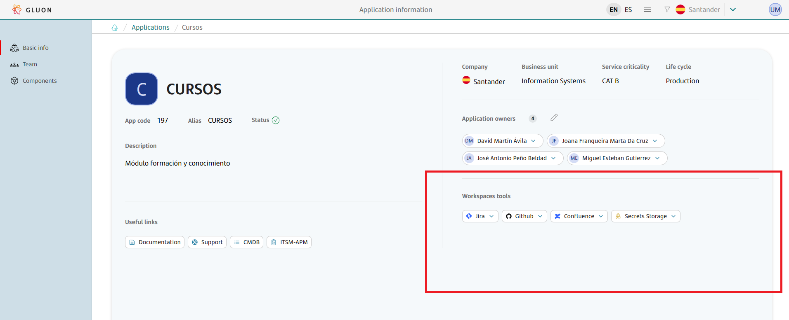

!!! warning
    You must take into account that for any of the tools to be provided the application needs to have at least **two registered application owners**.

    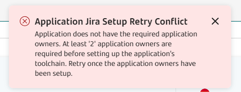

To see the licenses that each user has for the different tools you can explore the [User permissions section](./../users-teams/user-permissions.md#licenses).

## Tool status and actions

- **Creation pending:** a button will allow you to start the creation of the tool.

- **Creation failed:** a button will allow you to retry the creation of the tool.

- **Tool created:** a drop-down menu will allow you to copy the url of the tool, to visit it in a new tab or to edit the url (this functionality will be available soon).

## Toolchain

### Jira

1. **To provision Jira**, you must click on the button "Create Jira".

    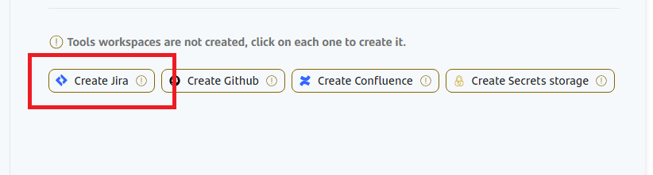

2. **In case there is a problem with the Jira provisioning**, click the button "Retry Jira".

    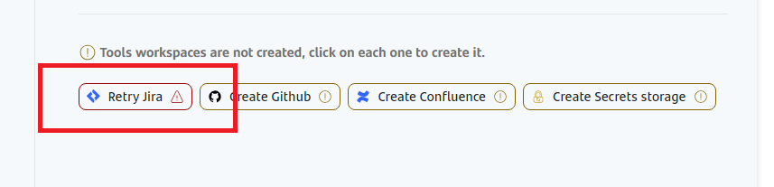

3. **Once provisioned**, you can access the application Jira page from the drop-down menu.

    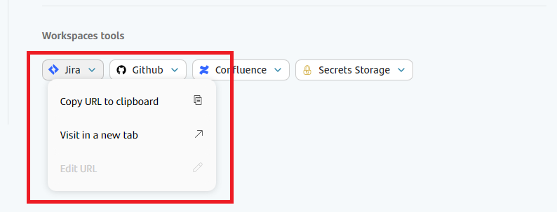

### Github

1. **To provision Github**, you must click on the button "Create Github".

    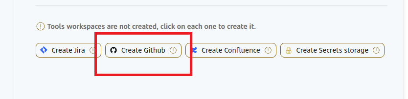

2. **In case there is a problem with the Github provisioning**, you can retry the creation by clicking the button "Retry Github".

    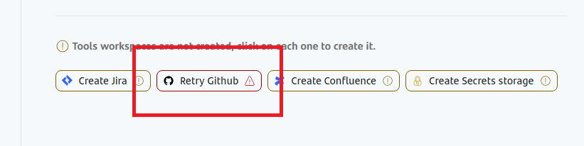

3. **Once provisioned**, you can access the application Github page from the drop-down menu.

    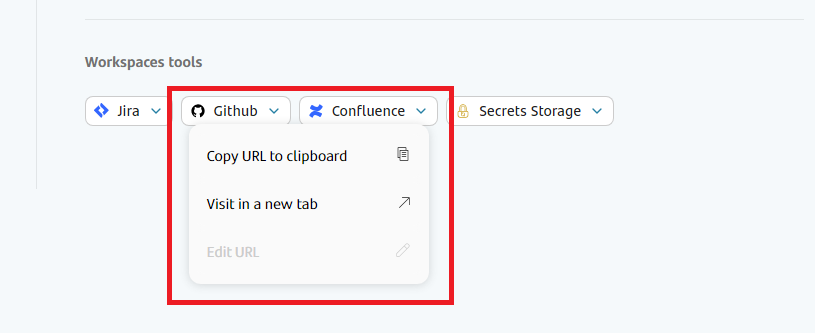

### Confluence

1. **To provision Confluence**, you must click on the button "Create Confluence".

    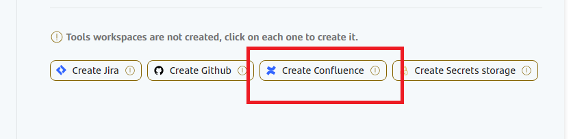

2. **In case there is a problem with the Confluence provisioning**, you can retry the creation by clicking the button "Retry Confluence".

    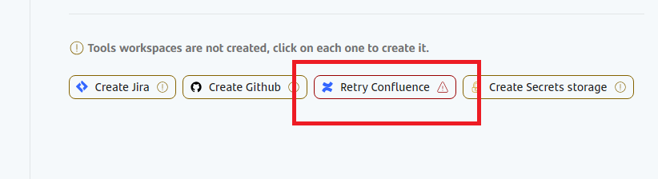

3. **Once provisioned**, you can access the application Confluence page from the drop-down menu.

    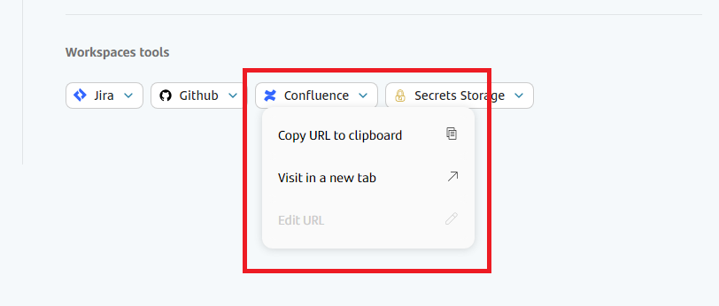

### Secrets Storage

1. **To provision Secrets Storage**, you must click on the button "Create Secrets Storage".

    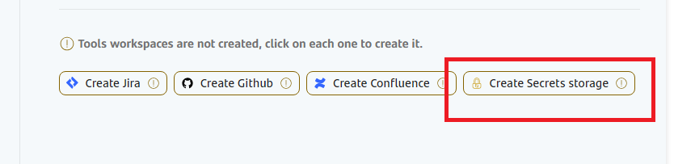

2. **In case there is a problem with the Secret Storage provisioning**, you can retry the creation by clicking the button "Retry Secrets Storage".

    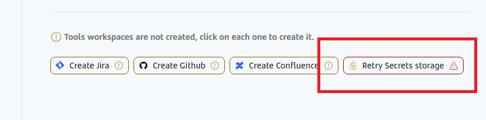

3. **Once provisioned**, you can access the application Secrets Storage page from the drop-down menu.

    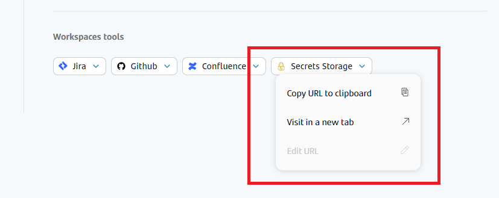
