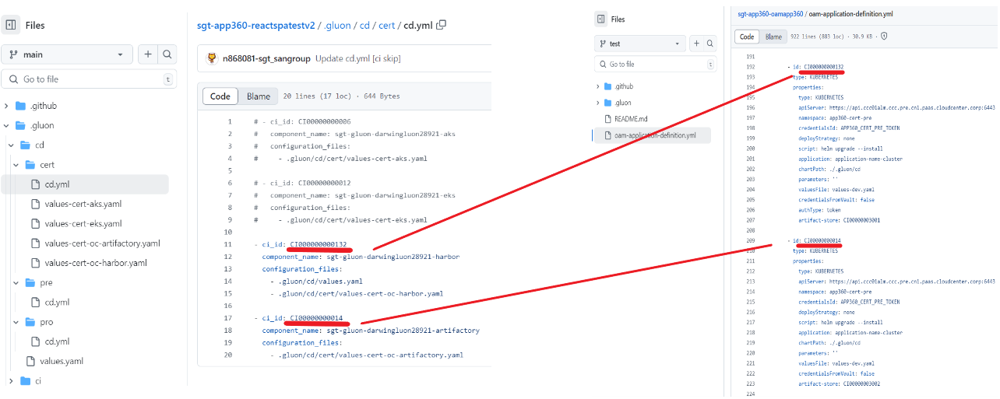

# CD Repository Folder Configuration

To configure our repository, we need to define the environments in the `.gluon/cd` folder. We will have as many folders as environments we want to use, usually `cert`, `pre`, and `pro`.

``` bash
📂.gluon
┣ 📂cd
┃ ┣ 📂cert
┃ ┃ ┣ 📜cd.yml
┃ ┃ ┗ 📜values-cert.yml
┃ ┣ 📂pre
┃ ┃ ┣ 📜cd.yml
┃ ┃ ┗ 📜values-pre.yml
┃ ┣ 📂pro
┃ ┃ ┣ 📜cd.yml
┃ ┃ ┗ 📜values-pro.yml
┃ ┗ 📜values.yaml
┗ 📂ci
  ┗ 📜properties.env
```

Each environment folder will contain a `cd.yml` file, in which we will define the `ci_id` we want to target for deployments or uploads to the registries.
Each `ci_id` deployment infrastructure must have defined an `ci_id` of an artifact-store, this match between both id (deployments and registries) will be used to know which registries we will upload the images.
It will also contain any necessary `values.yml` files.

:exclamation: These `ci_id` must be the same as we have in [`OAM oam-application-definition.yml`](../gluon-application-model-oam/oam-config-and-params/oam-example.md){:target="_blank"}. Example:

## Example View of: `ci_id` must be the same as we have in OAM



## To Take Into account

- In **release** deployments, when it pushes to the registries, it will extract this list from all `ci_id` defined in all environments inside this path `.gluon/cd` and get the `artifact-store` associated to it.
- In **pre-release** deployments, the `environment_type` will be set by default to `certification` what it means,
push to registries will be done in all of `environments` inside `.gluon/cd` which has `environment_type == 'certification'` and the associated `ARTIFACT-STORE` associated has the property `snapshots == 'true'` defined in the OAM.

> **Warning:** The OAM `environments` defined and the `environments` of `.gluon/cd` folders directory (name of folders) must match.
That means, even if `environment == 'XXX'`, any of them would be pushed to registries if they would have `environment_type == 'certification'`, not just those with `ci_id` defined in `cd.yml`.
