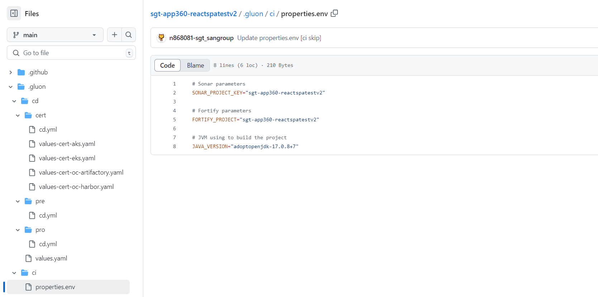

# CI Repository Folder Configuration

## Introduction

In this document, we will explain the changes made to the CI folder structure and how to configure the `properties.envs` file in the new location.

## New CI Folder Structure

Previously, the `properties.envs` file was located in the `envs` folder. However, it has now been moved to the `.gluon/ci` folder.

## Configuration

To configure the `properties.envs` file in the new location, follow the same steps as before:

1. Locate the `.gluon/ci/properties.env` file in your repository.
2. Open the file in a text editor.
3. Modify the necessary environment variables according to your requirements.
4. Save the changes.

> **Warning:** Please note that the configuration process remains the same, only the location of the `properties.env` file has changed.

## Location

``` bash
📂.gluon
┣ 📂cd
┃ ┣ 📂cert
┃ ┃ ┣ 📜cd.yml
┃ ┃ ┗ 📜values-cert.yml
┃ ┣ 📂pre
┃ ┃ ┣ 📜cd.yml
┃ ┃ ┗ 📜values-pre.yml
┃ ┣ 📂pro
┃ ┃ ┣ 📜cd.yml
┃ ┃ ┗ 📜values-pro.yml
┃ ┗ 📜values.yaml
┗ 📂ci
  ┗ 📜properties.env
```

## Example View

:exclamation: This content depends on the chosen technology



## Summary

In this document, we explained the changes made to the CI folder structure and how to configure the `properties.envs` file in the new location. Make sure to update your repository accordingly.
