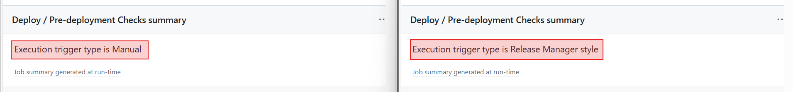
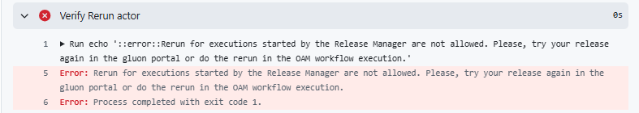
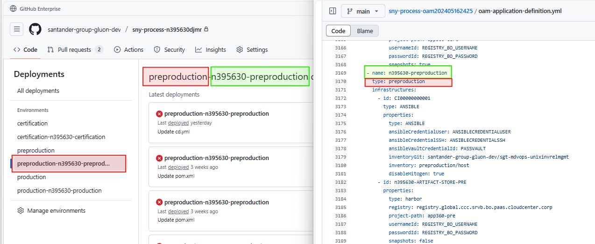
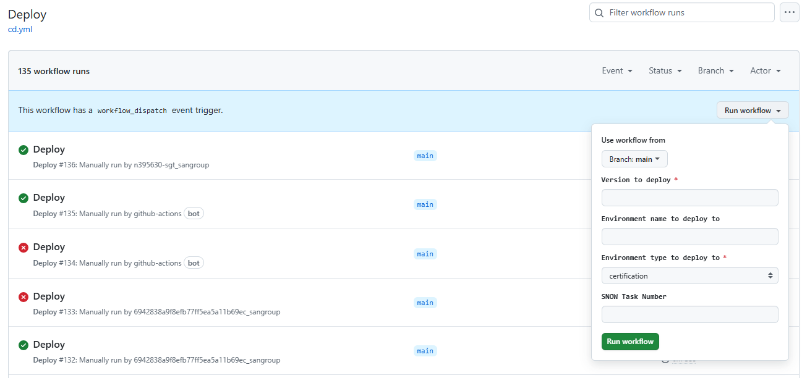
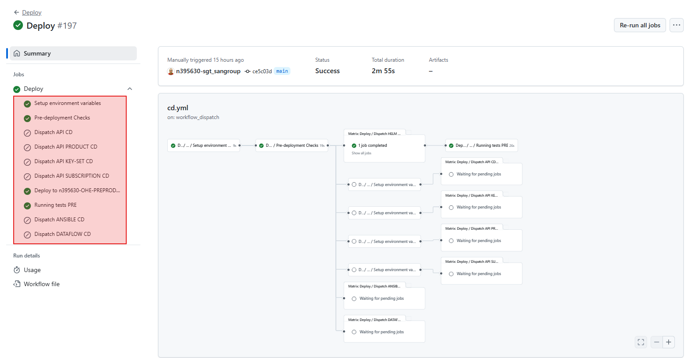

# Common CD Workflow

## Execution Methods

There are three ways to execute the `CD Workflow`:

1. **Manually**: Trigger the workflow manually from the GitHub Actions tab in
  your repository.

2. **From the Integration Workflow**: Automatically deploy to all certification
  environments defined in the Gluon Application Model component for the
  associated Gluon Application.

3. **Via Release Management**: Recommended for pre-production and production
  deployments. This method starts by creating an application release in the
  Gluon portal and promoting it to production.

### Manual vs. Release Manager Deployments

- The first two methods are considered _manual deployments_ as they require user
  actions directly in the repository.
- The third method is _automatic_ and is triggered by an external event, such as
  promoting a release in the Gluon portal. This triggers an orchestration
  process that determines which deployment workflows should be executed for the
  application's components.

### Execution Tracking

Both manual and automatic executions are logged in the deployment job summary:



### Validation Differences

- **Release Manager Execution**: Validates that the release to be deployed has
  been created and promoted in the Gluon portal.

- **Manual Execution**: Skips release validation but ensures an approvers
  team exists for production deployments to prevent accidental changes.

- **Both**: To prevent deployments outside the authorized window and strengthens
  control over the deployment process, once a deployment has been triggered
  using Release Manager, the component deployment job cannot be executed
  manually from the deployment workflow in the component's repository.
  Deployment must always be performed from Release Manager or, alternatively,
  from the OAM's orchestrator workflow that deploys the components defined in
  the OAM. If a manual deployment is attempted by directly running the workflow
  in the repository, the system will block it and display the following warning
  message:

    

These mechanisms ensure a robust and secure deployment process tailored to the
execution method.

### Deployment Environments Names

As defined in the OAM Gluon Application Model, each Gluon application consists
of multiple components and their target deployment environments. Components are
versioned, and their versions are tracked in the OAM. To prevent triggering
deployments for all components when only one component's version changes,
environment names for each component have been updated.

Now, environment names follow the format:
`{environment-type}-{environment-name}` (e.g., `production-europe`). This allows
the orchestrator workflow to verify if a specific component version has already
been deployed to a particular environment.

The following image illustrates how the environment name is constructed from the
properties defined in the OAM:



This change is transparent to users for several reasons:

- The environment name is constructed **internally** as
  `{environment-type}-{environment-name}`.
- The environment names defined in the OAM remain unchanged; the new naming is
  handled **internally** since the environment type is already part of the OAM
  definition.
- Environments are dynamically created in each component's GitHub repository.
  The initial configuration is copied from existing environments, which are
  named by their type. These original environments remain available for new
  components.
- Access to secrets stored in Vault is unchanged. Secrets continue to be
  registered using the environment type (`certification`, `preproduction`, or
  `production`), not the new combined name.

## Workflow Definition

Below is an example of a deployment workflow. This workflow is executed when a
deployment is triggered. In this case, the workflow is named
[cd.yml](https://github.com/santander-group-shared-assets/gln-user-commons-workflows/blob/main/workflows/cd.yml)
and is located in the `.github/workflows` directory of the repository.

??? note "cd.yml"
    ```yaml
    name: Deploy

    on:
    workflow_dispatch:
        inputs:      
        version:
            required: true
            type: string
            description: 'Version to deploy'   
        environment:
            required: false
            type: string
            description: 'Environment name to deploy to'
        environment-type:
            description: 'Environment type to deploy to'
            required: true
            type: choice
            options:
            - certification
            - preproduction
            - production
        task-number:
            required: false
            type: string
            description: "SNOW Task Number"  

    jobs:
        call-reusable-workflow:
            name: Deploy
            uses: santander-group-shared-assets/gln-workflows/.github/workflows/<dispatch-workflow>.yml@v1
            with:
            version: ${{ inputs.version }}
            technology: <technology to be set by component template> 
            environment: ${{ inputs.environment }}
            environment-type: ${{ inputs.environment-type }}
            task-number: ${{ inputs.task-number }}
            secrets: inherit
    ```

The visual aspect of this workflow in the GitHub Actions tab is as follows:



The inputs that must be filled are:

- `version`: The version to be deployed. This is a required field.

- `environment`: The environment to which the deployment will be made. This is
  a required field, except when the `environment-type` is set to
  `certification`, in which case it is not required.
- `environment-type`: The type of environment to which the deployment will be
  made. This is a required field.
- `task-number`: The task number associated with the deployment. This is an
  optional field and will only be completed if the execution of this workflow is
  performed via Release Management.

This workflow is directly copied into the component templates and must be
modified to adjust the `<technology>` and `<dispatch-workflow>` values. Once in
the templates, the file can reach the component repositories in two ways:
through the update process or through the creation of a new component. In both
cases, the workflow is copied into the `.github/workflows` folder of the
component. As we will see later, the values defined in the `technology` input
will determine the final deployment mechanism.

## Jobs

Below, we will review the phases a deployment workflow goes through. In the
following image, we have an example of an execution for a deployment that
ultimately uses HELM. However, depending on the technology used and the type of
environment being deployed to, some phases may vary. The phases that always
remain fixed are highlighted in green in the screenshot.



- **setup-env-vars**: This job configures the environment variables needed for
  the deployment process. The environment variables can include
  environment-specific configurations and other data needed for deployment.

- **Pre-deployment Checks**: This job ensures that all necessary data for
  deployment is retrieved and primarily focuses on validating input parameters
  and gathering deployment information. During this step, protection mechanisms
  for environments are also established to ensure deployments comply with
  established controls.
  
    - **Validation of Input Parameters**: The
      `environment` and `environment-type` inputs are mandatory. If either of
      these inputs is missing, the job will fail. The only exception is when the
      `environment-type` is set to `certification`, in which case the
      `environment` input is not required but the deployment will be done to all
      the certification environments defined in the Gluon Application Model
      component for the associated Gluon Application. This is the defaulta
      behaviour when running the workflow from the Integration Workflow.

    - **Protection Mechanisms**: When the deployment is executed via Release
      Management, this job removes any approvers associated with the target
      environment to ensure proper functionality. The environment's protection
      is enforced by validating the deployment task provided by Release Manager
      at the time of workflow execution. If the deployment is manual and targets
      a production environment, this job automatically configures a default
      group of approvers for the environment.

    - **Information retrieved**: This job retrieves the data needed for the
      deployment process, such as CI properties, application information,
      component configuration, and templates. It uses actions from the
      repository `santander-group-shared-assets/gln-infra-manager-action` and
      also extracts the necessary data from the Gluon Application Component
      the component belongs to.

- **Dispatch-[TECHNOLOGY]-CD**: In general, depending on the technology used and
  specified in the deployment workflow, a specific job will be executed for each
  of them. Below is the list of jobs that can be found during the deployment
  phase:

    - **Dispatch-ANSIBLE-CD**: This job initiates the CD process for Ansible
      playbooks. It is triggered if the `technology` input is set to "ansible".
      This job is responsible for deploying artifacts using Ansible playbooks.

    - **Dispatch-API-CD**: This job initiates the continuous deployment (CD)
      process for APIs. It is triggered if the `technology` input contains the
      value "API". This job is responsible for handling the deployment of APIs.

    - **Dispatch-APIPKEYSET-CD**: This job initiates the CD process for API key
      sets. It is triggered if the `technology` input contains the value
      "APIPKEYSET". This job is responsible for managing the deployment of API
      key sets.

    - **Dispatch-APIPRODUCT-CD**: This job initiates the CD process for API
      products. It is triggered if the `technology` input contains the value
      "APIPRODUCT". This job is responsible for the deployment of API products.

    - **Dispatch-APISUBSCRIPTION-CD**: This job initiates the CD process for API
      subscriptions. It is triggered if the `technology` input contains the
      value "APISUBSCRIPTION". This job is responsible for managing the
      deployment of API subscriptions.

    - **Dispatch-APPIAN-CD**: This job initiates the CD process for Appian
      applications. It is triggered if the `technology` input contains the value
      "appian". This job is responsible for deploying Appian applications.

    - **Dispatch-ARTIFACT-S3**: This job initiates the CD process for artifacts
      stored in S3. This job is responsible for deploying artifacts to S3
      storage.

    - **Dispatch-DATAFLOW-CD**: This job initiates the CD process for data
      flows. It is triggered if the `technology` input contains the value
      "dataflow". This job is responsible for deploying data flows.

    - **Dispatch-EVENTAUTHORIZATION-CD**: This job initiates the CD process for
      event authorizations. It is triggered if the `technology` input contains
      the value "EVENTAUTHORIZATION". This job is responsible for managing the
      deployment of event authorizations.

    - **Dispatch-EVENTDEPLOY-CD**: This job initiates the CD process for event
      deployments. It is triggered if the `technology` input contains the value
      "EVENTDEPLOY". This job is responsible for deploying events.

    - **Dispatch-EVENTSUBSCRIPTION-CD**: This job initiates the CD process for
      event subscriptions. It is triggered if the `technology` input contains
      the value "EVENTSUBSCRIPTION". This job is responsible for managing the
      deployment of event subscriptions.

    - **Dispatch-HELM-CD** and **Dispatch-Secrets-HELM-CD**: These jobs initiate
      the CD process for technologies deployed using HELM Charts. They are
      triggered if the `technology` input is set to "helm". These jobs are
      responsible for deploying various technologies, mostly related to
      Kubernetes.

    - **Dispatch-IMAGE**: This job is used to deploy front-end images and is
      related to S3.

Each job has its own specific purpose and dependencies on other jobs. Together,
they form a comprehensive CD workflow for the project.

## CD - CI Folders Configurations

More information for `cd` and `ci` folders configuration:

- [CD Folder Configuration](cd-envs-configuration.md){:target="_blank"}
- [CI Folder Configuration](ci-envs-configuration.md){:target="_blank"}
