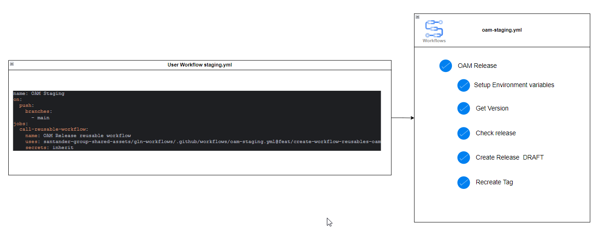
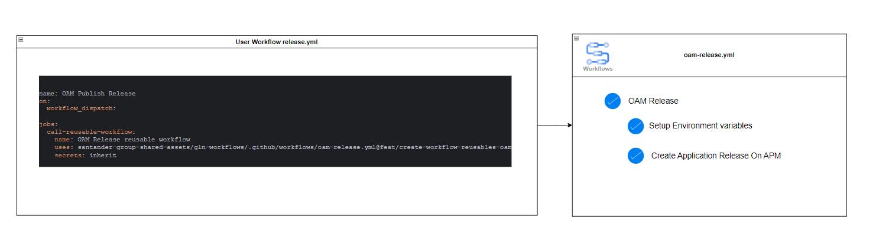

# **Gluon Application Model (OAM)**

The Gluon Application Model is a set of reusable workflows that can be called
from the `user workflow repository` created through the Gluon Template
`Gluon Application Model`.

## **Workflows**

The OAM repository contains the following reusable workflows:

* OAM Staging workflow
* OAM Release workflow
* OAM Quality workflow
* OAM Deploy workflow

## **OAM Staging workflow**

The OAM Staging workflow is used to create a new draft release of the application.
This workflow is triggered by the user workflow with exist a push event on the
main branch.

```yaml
name: OAM Staging
on:
  push:
    branches:
      - main
jobs:
  call-reusable-workflow:
    name: OAM Release reusable workflow
    uses: santander-group-shared-assets/gln-workflows/.github/workflows/oam-staging.yml@v1
    secrets: inherit
```

This workflow:

* create a new `Draft release` with the version that exist on a descriptor
application yaml file `application-model-definition.yml`
* Create a new `tag` with the version that exist on a descriptor application
yaml file `application-model-definition.yml



The workflow consists of three main jobs:

### **Setup Environment Variables**

This job sets up the environment variables required for the workflow.
It uses the `santander-group-shared-assets/gln-multipurpose-child-reusable-workflows/.github/workflows/setup-env-vars.yml@v1.15.0`
action and sets the runner, repository, and repository branch.

### **Get Version**

This job retrieves the version of the release. It depends on the
`setup-env-vars` job and uses the `santander-group-shared-assets/gln-alm-version-manager-action@v1.8.0`
action to get the release version from the `oam-application-definition.yml` file.

### **Check and Create Release**

This job checks if a release exists and is in draft mode, and creates
a release if it doesn't exist. It depends on the `setup-env-vars` and
`get-version` jobs. It uses the `santander-group-shared-assets/gln-get-github-app-token-action@1.2.0`
action to get the project token. Then, it checks if the release exists
and is in draft mode. If the release doesn't exist, it creates a new
draft release using the `gh release create` command.

### **Workflow Triggers**

The workflow is triggered by a push on the main branch.

### **Workflow Runners**

The workflow uses the runner specified in the `gluon-runner` input,
or the `base-runner` if no runner is specified.

### **Workflow Secrets**

The workflow inherits secrets from the parent workflow.

### **Workflow Inputs**

The workflow has one input:

* `gluon-runner`: The runner to use on workflow run. This input is not required
and defaults to 'python-runner'.

## **OAM Release workflow**

This workflow is part of the Gluon Application Model and is triggered by a manual
workflow dispatch. It is designed to publish a new release of the application.

```yaml
name: OAM Publish Release
on:
  workflow_dispatch:

jobs:
  call-reusable-workflow:
    name: OAM Release reusable workflow
    uses: santander-group-shared-assets/gln-workflows/.github/workflows/oam-release.yml@feat/create-workflow-reusables-oam
    secrets: inherit
```

The workflow consists of three main jobs:



### **Setup Environment Variables**

This job sets up the environment variables required for the workflow. It uses
the `santander-group-shared-assets/gln-multipurpose-child-reusable-workflows/.github/workflows/setup-env-vars.yml@v1.15.0
action and sets the runner, repository, and repository branch.

### **Get Version**

This job retrieves the version of the release. It depends on the `setup-env-vars`
job and uses the `santander-group-shared-assets/gln-alm-version-manager-action@v1.8.0`
action to get the release version from the `oam-application-definition.yml` file.

### **Publish Release**

This job checks if a release exists and is in draft mode, and publishes the release
if it exists and is in draft mode. It depends on the `setup-env-vars` and `get-version`
jobs. It uses the `santander-group-shared-assets/gln-get-github-app-token-action@1.2.0`
action to get the project token. Then, it checks if the release exists and is in
draft mode. If the release exists and is in draft mode, it publishes the release
using the `gh release edit` command.

### **Workflow Triggers**

The workflow is triggered by a manual workflow dispatch.

### **Workflow Runners**

The workflow uses the runner specified in the `gluon-runner` input, or the `base-runner`
if no runner is specified.

### **Workflow Secrets**

The workflow inherits secrets from the parent workflow.

### **Workflow Inputs**

The workflow has one input:

* `gluon-runner`: The runner to use on workflow run. This input is not required
and defaults to 'python-runner'.

## **OAM Quality workflow**

The OAM Quality workflow is used to run the quality checks on the application
release. This workflow will be triggered by the user workflow with exist a
pull-request event on the main branch.

```yaml
# workflow to validate the quality of the code
name: Quality Assurance for the OAM project
on:
  pull_request:
    branches:
      - main
jobs:
    call-reusable-workflow:
      name: OAM Quality Assurance
      uses: santander-group-shared-assets/gln-workflows/.github/workflows/oam-quality.yml@feat/create-workflow-reusables-oam
      secrets: inherit
```

:exclamation: This workflow is coming soon.

## **OAM Deploy workflow**

This workflow is designed to deploy an application release to a specified
environment. This workflow will be triggered by the `Gluon Release Management`
Module through Gluon Portal. This workflow will call the `oam-cd.yml` reusable
workflow with the required inputs.

```yaml
name: OAM Deployment Application Release
run-name: 'Deploy application release ${{ inputs.release-version }} with ${{ inputs.release-number }} into ${{ inputs.environment }} environment'
on:
  workflow_dispatch:
    inputs:
      release-version:
        description: 'Release version to deploy'
        required: true
        type: string
      release-number:
        description: 'ITSM Release number to deploy'
        required: true
        type: string
      environment:
        description: 'Environment to deploy to'
        required: true
        type: string
      environment-type:
        description: 'Environment type to deploy to'
        required: true
        type: choice
        options:
          - certification
          - preproduction
          - production
jobs:
  call-reusable-workflow:
    name: Deployment Application Release reusable workflow
    uses: santander-group-shared-assets/gln-workflows/.github/workflows/oam-cd.yml@v1
    with:
      release-version: ${{ inputs.release-version }}
      release-number: ${{ inputs.release-number }}
      environment: ${{ inputs.environment }}
      #environment-type: ${{ inputs.environment-type }}
    secrets: inherit
```

### **Workflow Inputs**

* `release-version`: The version of the release to deploy.
* `release-number`: The ITSM release number associated with the deployment.
* `environment`: The environment to deploy to.
* `environment-type`: The type of environment to deploy to.

### **Workflow Jobs**

The workflow consists of for main jobs:

* [Setup Environment Variables](#setup-environment-variables)
* [Call Workflow Dispatch](#call-workflow-dispatch)
* [Notify Workflow Execution Status](#notify-workflow-execution-status)
* [Create Summary](#create-summary)

### **Setup Environment Variables**

This job sets up the environment variables required for the workflow.
It uses the `santander-group-shared-assets/gln-multipurpose-child-reusable-workflows/.github/workflows/setup-env-vars.yml@v1.10.0`

### **Call Workflow Dispatch**

This job performs the deployment of the application release. It includes the
following steps:

* Get project token.
* Generate corporate token.
* Retrieve release information.
* Retrieve component details.
* Deploy the component to the specified environment.
* Notify workflow execution status.

### **Notify Workflow Execution Status**

This job notifies the workflow execution status to the `Gluon Release Management`
module. It used by the Gluon Release Management for the deployment status and
close the ITSM Task associated with the deployment.

### **Create Summary**

This job generates a summary of the deployment process and outputs it to the
GitHub Actions summary.

## **More Info About How It Works Config and Params**

* [Gluon Application Model Configuration](oam-config-and-params/gluon-application-model-oam-config.md){:target="_blank"}
* [Gluon Application Model Parameters](oam-config-and-params/gluon-application-model-oam-params.md){:target="_blank"}
* [OAM Example](oam-config-and-params/oam-example.md){:target="_blank"}
