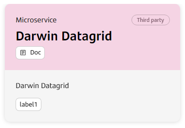
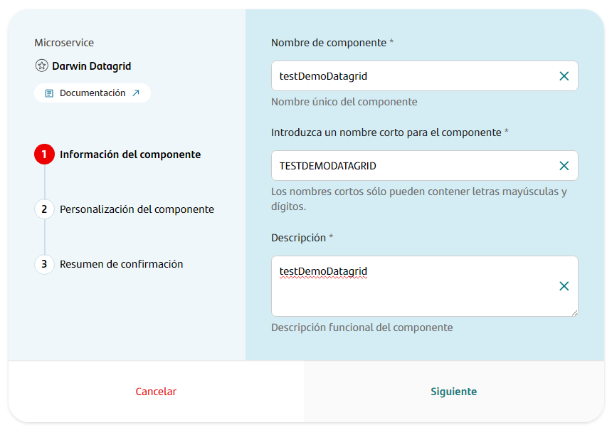
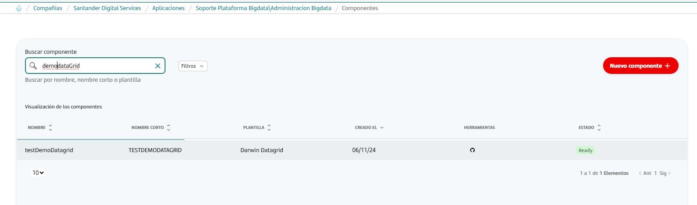
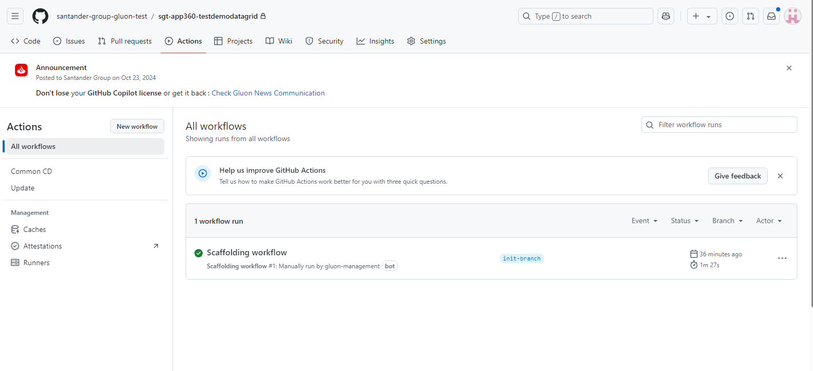
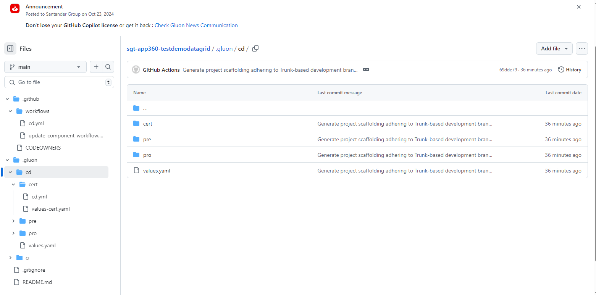
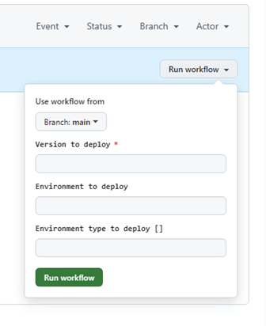

## Introduction

This guide is intended to serve as a manual for creating and deploying a Darwin Datagrid component in Gluon.

### Create Component

#### Gluon Portal

First, onboard your application. Once created, you can start creating your component.
To create a component, follow these steps:

1. Select the type of component you want to create. In this case, create a **Darwin Datagrid**.

   

2. Component Name Selection: Following the convention, assign a name that reflects the environment and functionality.

   

   Fill in the name, description, and branch strategy of the component. The component template configuration branch strategy is `Trunk Based development`.

3. Once the component is created, you’ll see a new repository under the application with the name of the component.

   

### Darwin Datagrid Template

#### Branches

When you creates the component from the Gluon Portal, the component is created with the default values of the template from the scaffolding workflow.

* Creates an empty main branch.
* Creates an main branch with the structure of files and folders to configure and run your component.
* The integration branch (main by default) This is because the workflows works with Trunk Based Development strategy,
so we need to have the feature branches and create the Pull Request to the main branch.

#### Structure

The generated Darwin Datagrid has a structure similar to the following:

##### Darwin Datagrid Structure

## Repository Structure and Key Files

## Workflows

Darwin Datagrid component includes the following workflows:

* `.github/workflows/`: contains the CI/CD workflows for creation and component updates.

* `cd.yml`: Deploys the component using Helm.

  * **Usage**: From the GitHub Actions tab, select Run workflow, choose the branch with the deployment configuration, and click execute.

* `update-component-workflow.yml`: Automates component updates, ensuring configurations and versions remain up to date in the repository.

## Component Configuration

### Specific Configuration Files

* .gluon/cd/ENV/values-ENV.yaml: Contains customizable chart configurations per environment.
* values.yaml: Contains the default chart configurations.

### Configuration file descriptions

**values-ENV.yaml** and **values.yaml**: Define customized configurations for each environment.
Types of Secrets in GitHub:

* Organization: Secrets available at the organization level.

* Repository: Secrets limited to the current repository.

* Environment: Secrets specific to the environment and repository.

To request an organization-level secret, contact the organization's DevOps team.

### Executing Deployment

To deploy Datagrid in the cluster:

* Go to the Actions tab in GitHub.

* Select Common CD workflow.

* Choose the desired branch, version and select the environment name and environment type (certification, preproduction or production) where you want to deploy.

* Verify that the deployment has been successfully completed in the target environment.

**If you have any questions about the configuration on Darwin Datagrid**, contact the Spain Architecture Team or refer to:

[Darwin Datagrid](https://santandernet.sharepoint.com/sites/tech-platform-spain/SitePages/Back-End.aspx)
