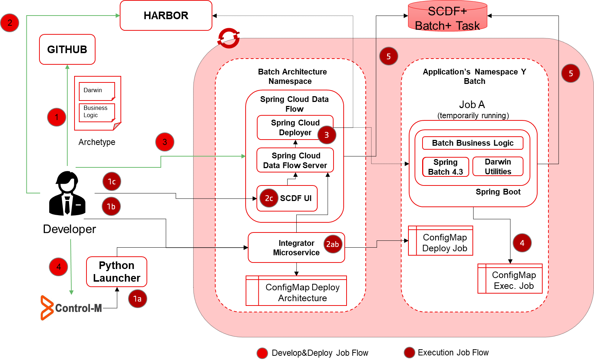
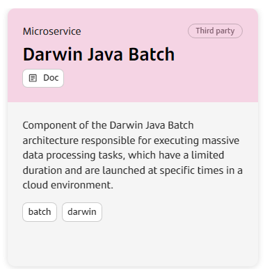
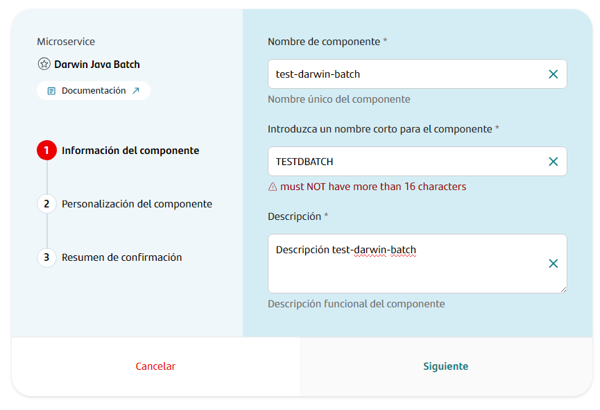
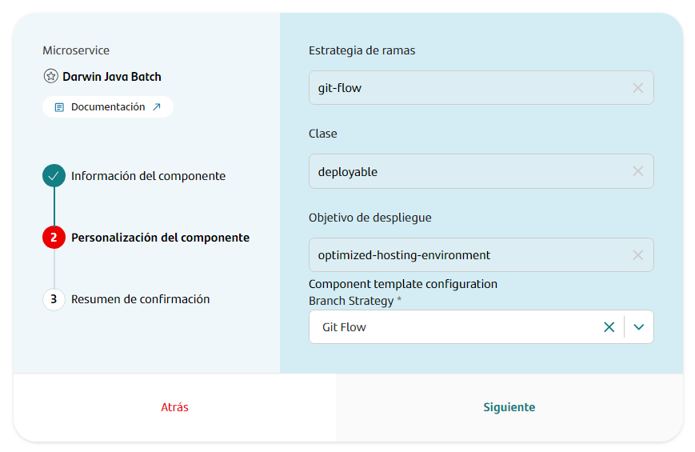
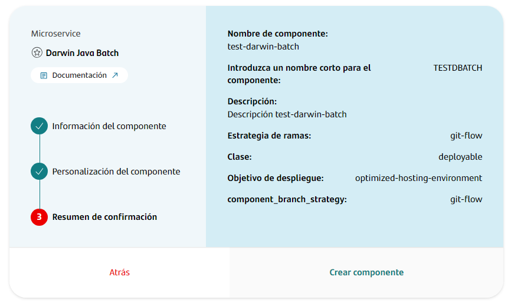
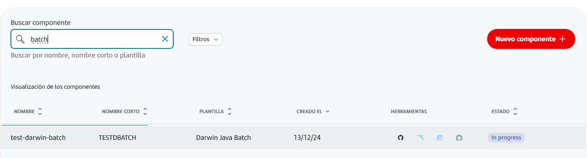
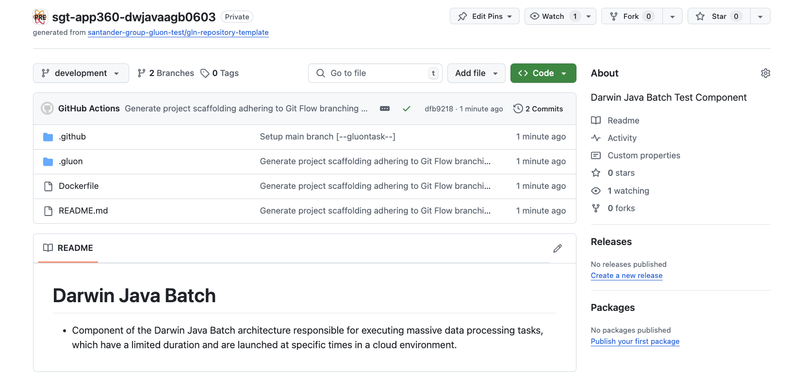
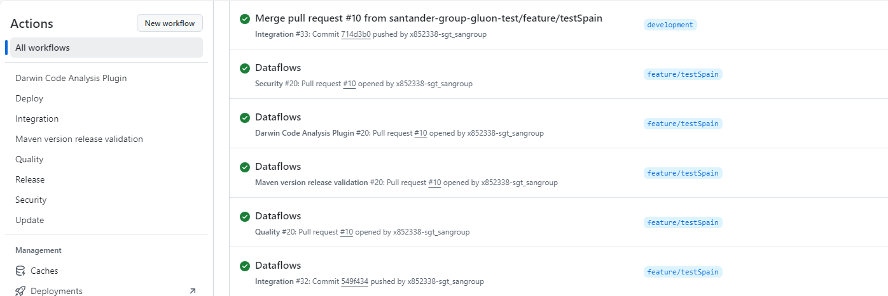
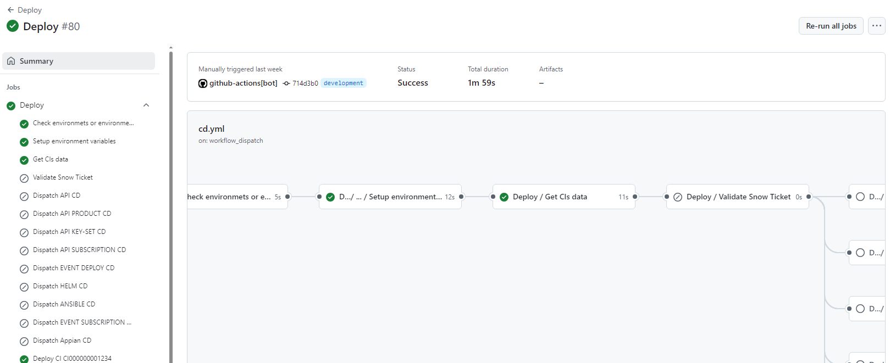
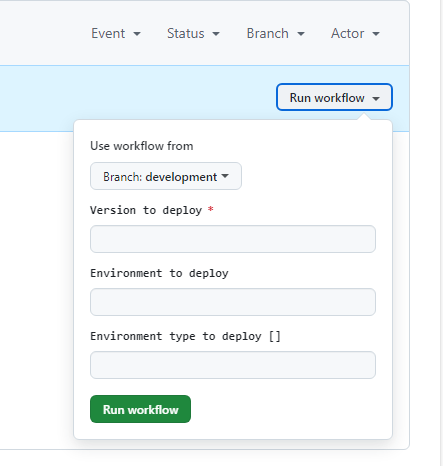

## Introduction

The purpose of this documentation is to provide a **step-by-step guide** on how to orchestrate the integration of batch processes built with the **Darwin Java Batch** framework within the GLUON platform, and with Maven as the basis for building your project.

This guide will allow you to understand how to build and deploy our batch processes through a CI/CD process.

The complete life cycle process is as follows and it will be explained at different points in the document:



## Setup your local environment

{!
   include-markdown "../../../../components/snippets/setup/maven-setup.md"
!}

## Create Component

### Gluon Portal

First, you have to [**onboard your application.**](../../../../application/application-management/index.md)
Once you have your application created, you can start creating your component.

To create a component,
follow the steps described in [**Component Management**](../../../../application/component-management/create-component.md),
searching for the component to be created.

To create a component, follow these steps:

- Select the type of component you want to create. In this case, create a **Darwin Java Batch**.

  

- Component Name Selection: Following the convention, assign a name that reflects the environment and functionality.

   

- Fill in the name, description, and branch strategy of the component.

   

   

- Once the component is created, you’ll see a new repository under the application with the name of the component.

     

## Darwin Batch Template

When you create the component from the Gluon Portal, the component is created with the default values of the template from the scaffolding workflow.

> **IMPORTANT:** As in the NextGen onboarding system, the project archetype must be created by the user.

### Git Flow

#### Branches

- Create an empty main branch
- Create a development branch with default structure

### Trunk Based Development

#### Branches

- Create a main branch with default structure.

### Darwin Batch Structure

The generated Darwin Batch has a structure similar to the following:



### Workflows

The Batch component includes the following workflows:

- `version-validation.yml`: Validates the version release of Maven projects.  

  Triggered from a pull request to the `development`, `develop`, `main`, or `master` branches, the workflow validates the version release using the `pom.xml` file.

- `update-component-workflow.yml`: Automates updating components to ensure configurations and versions remain up to date.

  Triggered manually via the GitHub Actions tab using the `Run workflow` option. Specify the new version to update in the input field and execute the workflow.

- `security.yml`: Performs security validation for Maven projects.

  Automatically runs on a pull request to the `development`, `develop`, `main`, or `master` branches. It uses the `maven-security-image.yml` reusable workflow to perform security checks.

- `release-tbd.yml`: Manages the release process for Maven projects using Trunk-Based Development.

  Triggered automatically when a release is published. It utilizes the `maven-release-tbd.yml` reusable workflow to ensure consistency with `Java_Maven` standards.

- `release-gfw.yml`: Handles the release process for Maven projects using Git-Flow Workflow.

  Automatically executes when a push event occurs on the `main` or `master` branches. It uses the `maven-release-gfw.yml` reusable workflow.

- `quality.yml`: Ensures the quality of Maven projects by performing validation checks.

  Triggered automatically on a pull request to the `development`, `develop`, `main`, or `master` branches. It uses the `maven-quality.yml` reusable workflow to run quality checks.

- `darwin-code-analysis.yml`: Executes Darwin Code Analysis for code validation.

  Automatically triggered on pull requests to the `development`, `develop`, `main`, or `master` branches. It uses the `darwin-code-validation.yml` reusable workflow.

- `ci-tbd.yml`: Handles continuous integration for Maven projects using Trunk-Based Development.

  Automatically triggered on a push to the `main` or `master` branches. It uses the `maven-ci-tbd.yml` reusable workflow and supports `Java_Maven` technology.

- `ci-gfw.yml`: Manages continuous integration for Maven projects using Git-Flow Workflow.

  Triggered automatically on a push to the `development`, `develop`, or branches matching the patterns `feature/*` or `fix/*`. It uses the `maven-ci-gfw.yml` reusable workflow and supports `Java_Maven` technology.

- `cd.yml`: Deploys the application to the specified environment.

  Manually triggered via the GitHub Actions tab. Provide the version to deploy, the target environment, and the environment type in the input fields before running the workflow. It uses the `cd.yml` reusable workflow for deployment.

## Component Configuration

### Configuration Files

<!--Start Configuration Files 2.0-->
- **properties.env**: Properties with the CI configuration
- **Continuous Deployment files**: Configuration with the infrastructure identifiers and values of deployment. There is a file by environment (cert, pre, pro).
<!--End Configuration Files 2.0-->
#### Properties
<!--Start Common Properties-->

The **properties.env** file contains the configuration for the CI/CD pipeline. It is generated automatically.
The parameters that are configured by default are:

| **Variable**        | **Required** | **Description** | **Example value**               |
|---------------------|--------------|-----------------|---------------------------------|
| **SONAR_PROJECT_KEY** | true         | Project key in Sonar | sgt-gluonad-probemicroframework |
| **FORTIFY_PROJECT** | true         | Project name in Fortify | sgt-gluonad-probemicroframework |
| **JAVA_VERSION** | true         | Java version to use | adoptopenjdk-17.0.8+7 |
| **TASK_NAME** | true         | Task name | sgt-app360-componentname |
| **TASK_DESCRIPTION** | true         | Task description | description |
| **IMAGE_NAME** | true         | Image name | registry-project/sgt-app360-componentname |

???+ info "Naming convention"

    The project name in **Sonar** and **Fortify** must be the same as the component repository name. 
    To avoid possible errors, the **properties.env** file is generated with the necessary values for the variables **SONAR_PROJECT_KEY** and **FORTIFY_PROJECT**.
    
    Example values:

    SONAR_PROJECT_KEY="sgt-gluonad-probemicroframework"

    FORTIFY_PROJECT="sgt-gluonad-probemicroframework"

??? info "All the properties"

    {!
       include-markdown "**/application/ci-cd/**/maven/snippets/project-properties.md"
    !}
<!--End Common Properties-->

#### Continuous Deployment files
<!--Start Deployment 2.0-->
In that set of files,
we are going to define the necessary infrastructure references.
The Continuous Deployment file (`cd.yml`) must
contain the target deployment configuration that we want to use for deploying the component.
For each environment (cert, pre, pro),
we have a folder with the `cd.yml` file, and there,
we can define several infrastructures to deploy in as many regions as we need.
Remember that `cd.yml` files are empty,
and the developer is responsible for filling them with the necessary deployment information.

``` bash
📂.gluon
┣ 📂cd
┃ ┣ 📂cert
┃ ┃ ┣ 📜cd.yml
┃ ┣ 📂pre
┃ ┃ ┣ 📜cd.yml
┃ ┣ 📂pro
┃ ┃ ┗ 📜cd.yml
```

For that purpose,
it will only be necessary to add the `ci_id` identifiers
defined by environment type in the `oam-application-definition.yml` file inside **Gluon Open Application Model repository**
associated with the company of the component.
Keep in mind that **`ci_id` must be the same as we have in OAM the config file**.
The `configuration_files` key allows
setting the `values` chart files that they are necessary to be able
to deploy in the infrastructures to which they refer.

| **Property**       | **Description**                                                             | **Example**                    |
|--------------------|-----------------------------------------------------------------------------|--------------------------------|
| ci_id              | Identifier of the infrastructure in the oam-application-definition.yml file | CI00000000097                  |
| configurationFiles | Path to the Helm configuration file in that environment                     | .gluon/cd/cert/values-cert.yml |

The following template shows an example of the structure that the `cd.yml` file should have:

```yaml
- ci_id: CI00000000001
  configuration_files:
    - .gluon/cd/values.yml
    - .gluon/cd/{environment}/values-{environment}.yml
- ci_id: CI00000000002
  configuration_files:
    - .gluon/cd/values.yml
    - .gluon/cd/{environment}/values-{environment}.yml
```

For getting more information about how-to-configure the deployment environment files,
please refer to the [Continuous Deployment file documentation](../cd-rm/cd-workflow/cd-envs-configuration.md).

For getting to know how to configure the `Gluon Open Application Model` repository,
the following documentation is available [here](../cd-rm/gluon-application-model-oam/oam-config-and-params/gluon-application-model-oam-config.md)

Below is an example of an OAM file with the deployment infrastructure of a Darwin Java Batch component:

```yaml  
kind: application
version: v1
metadata:
  name: TEST_APPLICATION
  version: 1.0.1

environments:
  - name: cert
    type: certification
    infrastructures:
      - id: darwin_batch_scdf_onprem_dev
        type: DATAFLOW
        properties:
          SDCF_URL: https://s-java-50078578-scdf-sanes-darwin-dev.apps.san01bks.san.dev.bo1.paas.cloudcenter.corp
          SCDF_APP_PATH: /apps/task/
          SCDF_TASK_PATH: /tasks/definitions
          REPO_URL: registry.harbor.san.dev.bo1.paas.cloudcenter.corp
          usernameId: REGISTRY_USERNAME
          passwordId: REGISTRY_PASS
          artifact-store: harbor-darwin-back-dev
      - id: harbor-darwin-back-dev
        type: ARTIFACT-STORE
        properties:
          type: harbor
          registry: registry.harbor.san.dev.bo1.paas.cloudcenter.corp
          project-path: sanes-darwin-san
          usernameId: REGISTRY_USERNAME
          passwordId: REGISTRY_PASS
          snapshots: true
```

### Pull Request to development

When you initiate a **Pull Request event to your development branch**, the workflows: `quality.yml`, `security.yml` `darwin-code-analysis.yml`, `ci-gfw.yml` y `version-validation.yml` will automatically execute.

The steps performed during this workflow are as follows:



### Push to development

When you approve the Pull Request in the development branch, it triggers a push event on this branch. Consequently, the workflow `cd.yml` is executed automatically.

Here are the steps performed during this stage of the process:

- **Checking if environment or environment-type is defined**: Ensure the target environment is correctly set up in the repository, including its folder in the `.gluon` path and the configured `cd.yml` file.
- **Setup environment variables**: Load the required properties for the workflow.
- **Get CIs data**: Retrieve infrastructure details based on the `cd.yml` configuration files.
- **Common CD**: Fetch the artifact produced in the `cd.yml` workflow, deploy the Darwin Batch.



### Executing Deployment in OpenShift

To deploy Batch in OpenShift:

- Go to the Actions tab in GitHub.

- Select Common CD workflow.

- Choose the desired branch, version and select the environment (cert, pre, pro) or environment type (certification, preproduction or production) where you want to deploy.

- Verify that the deployment has been successfully completed in the target environment.



For more information about **Darwin Java Batch**, please refer to:

[Darwin Batch Architecture Team](https://sanes.atlassian.net/wiki/spaces/SANACLOUD/pages/24724933076/Darwin+Batch+Architecture)

<!--End Deployment 2.0-->
