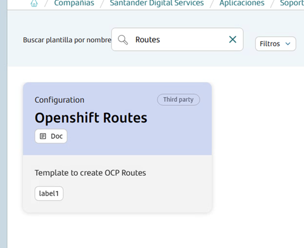
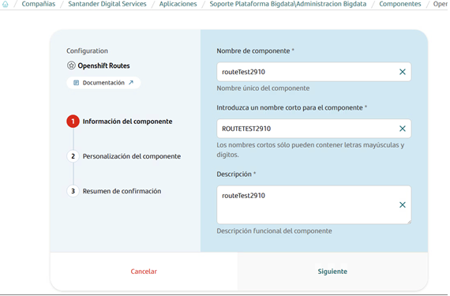
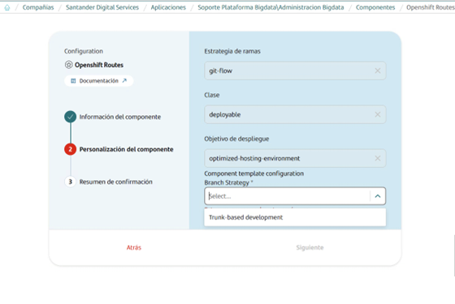
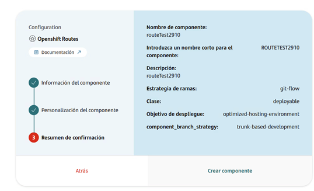
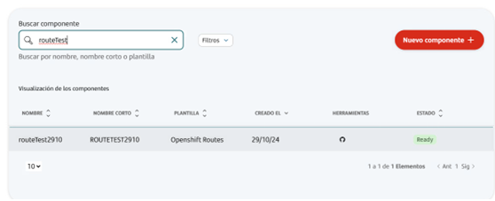
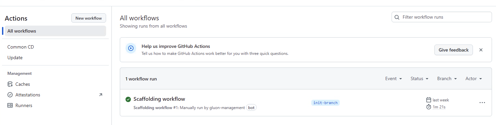
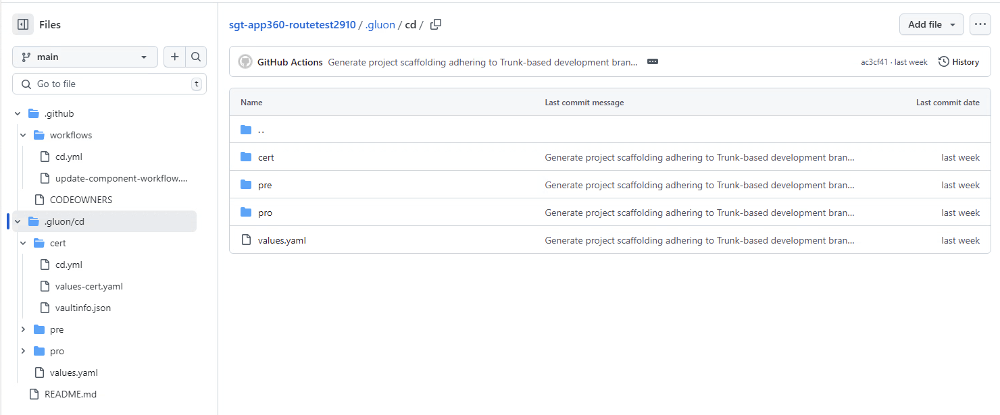

## Introduction

This guide provides a detailed overview of how to configure and deploy a Routes component in an OpenShift environment
using files and workflows provided in the organization's template. This component allows for the creation of routes
in OpenShift clusters, using information from HashiCorp Vault and Helm to manage configurations and secrets.

In this documentation, users will find detailed instructions, best practices, and examples to effectively
utilize the OpenShift Routes workflow for their routes.

### Create Component

#### Gluon Portal

First, onboard your application. Once created, you can start creating your component.
To create a component, follow these steps:

1. Select the type of component you want to create. In this case, create a **Routes OpenShift**.

   

2. Component Name Selection: Following the convention, assign a name that reflects the environment and functionality.

   

   Fill in the name, description, and branch strategy of the component. The component template configuration branch strategy is `Trunk Based development`.

   

   

3. Once the component is created, you’ll see a new repository under the application with the name of the component.

   

### OpenShift Routes Template

#### Branches

When you creates the component from the Gluon Portal, the component is created with the default values of the template from the scaffolding workflow.

* Creates an empty main branch
* Creates an main branch with the structure of files and folders to configure and run your route
* The integration branch (main by default) This is because the workflows works with Trunk Based Development strategy,
so we need to have the feature branches and create the Pull Request to the main branch.

#### Structure

The generated OpenShift Route has a structure similar to the following:

##### OpenShift Routes Structure





## Repository Structure and Key Files

## Workflows

The Routes component includes the following workflows:

* `.github/workflows/`: contains the CI/CD workflows for route creation and component updates.

* `cd.yml`: Deploys the Routes component on OpenShift using Helm.

  * **Usage**: From the GitHub Actions tab, select Run workflow, choose the branch with the deployment configuration, and click execute.

* `update-component-workflow.yml`: Automates component updates, ensuring configurations and versions remain up to date in the repository.

## Component Configuration

### Branches

Gluon works with two branches that will need to be incorporated into our project:

* The main branch (main by default or master in old projects)
* The integration branch (development/develop by default)

This is because the workflows works with GitFlow strategy, so we need to have the integration branch to merge the feature branches and create the Pull Request to the main branch.

### Specific Configuration Files

* .gluon/cd/ENV/vaultinfo.json: JSON mapping file needed to indicate which secrets to extract from HashiCorp Vault.
* .gluon/cd/ENV/values-cert.yaml: Contains customizable chart configurations per environment.
* values.yaml: Contains the default chart configurations.

### Configuration file descriptions

**values-ENV.yaml** and **values.yaml**: Define customized configurations for each environment. Include details about the secrets to be used.

**values.yaml**
This file defines general configurations applicable to deployment in OpenShift. It includes common and default values that Helm will use.
This chart values template consists in a route parent tag with a list of http and https route blocks that tell the chart which routes we want to create in the cluster namespace.

This is the most simple use case, as we only provide information where vault mappings are not involved. Lets see the values to provide to create one of this routes

Example configuration in values.yaml:

???+ info "Non secure route block (HTTP)"

    ```yaml linenums="1"
    name: route1
    host: www.amazon.com
    path: search.php
    serviceName: back
    targetPort: 8080
    termination: edge
    https: false
    ```

**values-ENV.yaml**
This file defines specific configurations applicable to each environment (cert, pre, pro) for deployment in OpenShift. It overrides and defines the common and default values that Helm will use

The following shows a configuration example of an https route added to the routes list to generate with the chart

Example values in `values-cert.yaml`:

???+ info "Secure route block (HTTPS)"

    ```yaml linenums="1"
    name: routename
    host: vostok-release.santander.dev.corp
    path: /api
    serviceName: backendservice
    https: true
    targetPort: 8080
    caCertificate:
      fromFile: true
      value: 
        - fileinsiderepository.crt
    certificate: 
      fromFile: true
      value:
        - route_certificates_data_customer_engagement_sandoku_totta_gs_corp_certificate
    key: 
      fromFile: true
      value:
        - route_certificates_data_customer_engagement_sandoku_totta_gs_corp_key
    ```

#### Params Description

**Variable**|**Description**|**Example value**|
|---|---|---|
**routes**|List of routes to create in OpenShift. Each route specifies parameters like name, host, service target, and target port.|-|
**name**|Route name identifying this entry within the cluster.|`SAMPLE_HTTP_ROUTE`|
**host**|DNS domain for the route, accessible externally. Replace with the specific domain of the exposed API or service.|`myapi.company.com`|
**path**|Path within the host where the resource is located. Typically used `/` for main access.|`/api`|
**serviceName**|Name of the OpenShift service to which this route directs traffic. Must match the backend application service name.|`my-api-service`|
**targetPort**|Backend service port the route should connect to. For example, if the application listens on port 8080, specify 8080 here.|`8080`|
**termination**|SSL termination type for the route. "edge" is used to encrypt traffic from the client to the load balancer in OpenShift.|`edge`|
**https**|Defines whether the route should use HTTPS (true) or HTTP (false).|`true`|
**caCertificate.value**|Path in Vault containing the CA certificate file for HTTPS connections. This file authenticates the certificate of the certificate authority.|`vault/certificates/ca.crt`|
**certificate.value**|Path in Vault where the HTTPS route certificate is stored. This certificate ensures that traffic between the client and OpenShift is encrypted.|`vault/certificates/tls.crt`|
**key.value**|Path in Vault containing the private key used for the HTTPS route certificate.|`vault/certificates/tls.key`|

**vaultinfo.json**
The file defines the secrets that will be extracted from Vault for use in OpenShift.

The JSON snippet below illustrates a simple vault configuration:

```json title="Simple vault example"

[
  {
    "vault_path": "path/a/your/secret",
    "key": "secret_key",
    "file": "virtual_file_name"
  }
]

```

### GitHub Authentication and Secrets Configuration

Types of Secrets in GitHub:

* Organization: Secrets available at the organization level.

* Repository: Secrets limited to the current repository.

* Environment: Secrets specific to the environment and repository.

To request an organization-level secret, contact the organization's DevOps team.

### Executing Deployment in OpenShift

To deploy routes in OpenShift:

* Go to the Actions tab in GitHub.

* Select Common CD workflow.

* Choose the desired branch, version and select the environment (cert, pre, pro) or environment type (certification, preproduction or production) where you want to deploy.

* Verify that the deployment has been successfully completed in the target environment.


For more information about **Routes OpenShift** Onboarding, please refer to:

[Routes OpenShift](https://sanone.atlassian.net/wiki/spaces/ALMEU/pages/41181741061/Helm+routes+and+secrets+creation)
