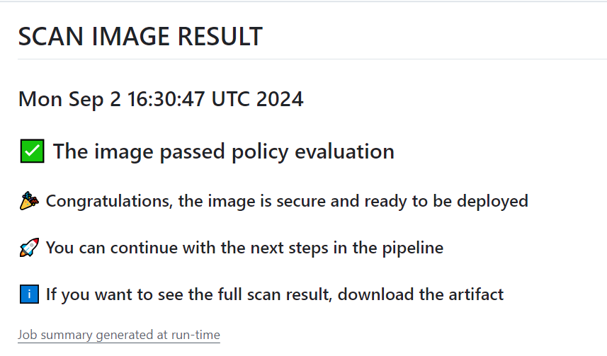
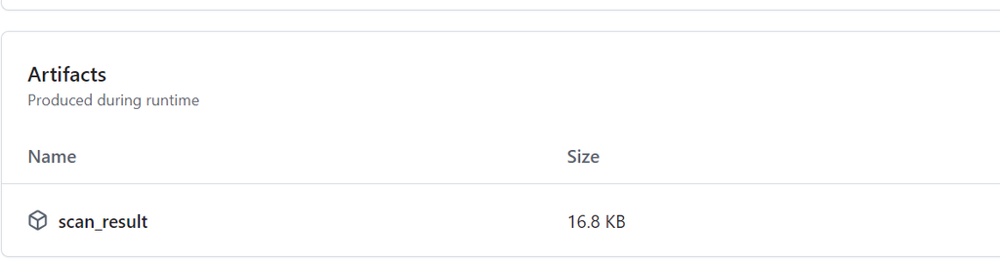
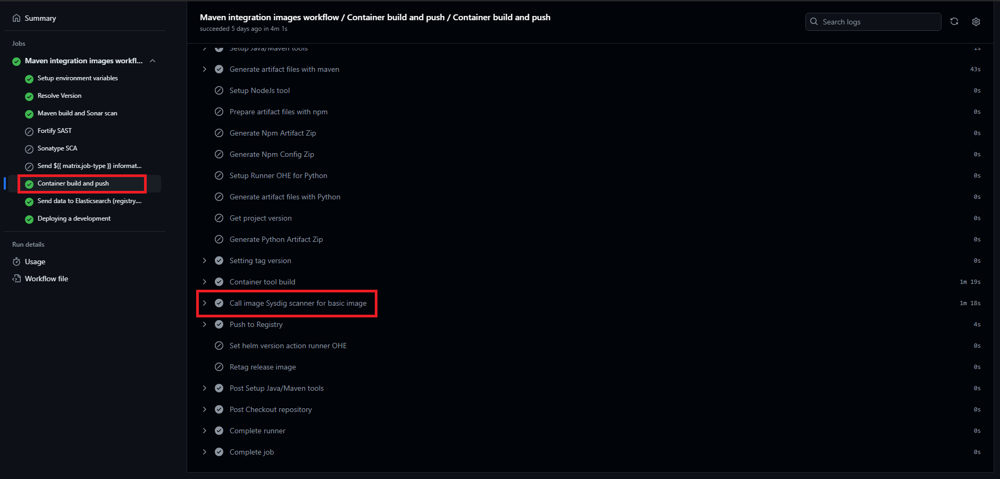

# **Sysdig Scan Action**

## **About  Sysdig Scan action**

The goal of Sysdig Scan Action is to perform the image scan and analysis.

Gluon CI/CD standard performs the image scan always **before publishing the release** image to the container registry. The concrete step depends on the technology and the branching model (gitflow or trunk development).

Each component locates this information into the component journey, inside [Gluon Components section](./../../../components/index.md). As an example, [Santander Spring Boot Release Image Scan](./../../../components/software/backend/java/santander/ms.md#release-workflow).

## **How Sysdig action works**

The result summary is shown in the own workflow:

<figure markdown>
   {: style="height:190px"}
   <figcaption>Sysdig Scan Result</figcaption>
</figure>

Also, an artifact with result analsys is generated to be downloaded below the summary:

<figure markdown>
   {: style="height:190px"}
   <figcaption>Sysdig Scan Result Artifact</figcaption>
</figure>

The analysis results will be sent to Elastic using the gln-post-elastic-action.

In the current version of Gluon, this action will be restrictive in case the scan fails or fails the analysis. The result of the process will be indicated and the image will not be uploaded to the registry, not allowing the workflow to continue.

> **INFO:**
>
> - If you are having an error related to the base image, you can use this FAQ to try to resolve it. [FAQ](https://github.com/orgs/santander-group-gluon/discussions/529 ){:target="_blank"}
> - In this case above, where you cannot upload to Harbor in case the scan fails or the analysis fails and it is not related to this above FAQ, the next step will be to analyze if there is any active exemption to exempt it. [Waivers Doc](../waivers/index.md){:target="_blank"}

This action will be executed in all immutable image workflows of Gluon that upload images to Harbor, in a preliminary step before the image upload.

Here is the action working in GLUON Workflows:

<figure markdown>
   {: style="height:190px"}
   <figcaption>Sysdig Call</figcaption>
</figure>
