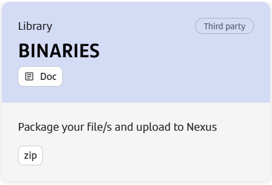

## General Description

This Component Template is designed to automate the process of packaging and uploading artifacts to a Nexus repository.

## Create Component

### Gluon Portal

First you have to [**onboard your application.**](../../../../index.md)
Once you have your application created, in order to have the template available and create components, you must open a Request: Portal - Authorize local Template in TECHNICAL CATALOG →
Cloud → Gluon → Gluon Tools Request. All Request ITSM to authorize the use of the binary
templates must include:

- Approval from your  **Destination Company Owner**
  
- Approval of the Local Chief Information Security Officer (CISO)

- URL of Gluon Application detail page.

- URL of last release in Nexus

To create a component, follow the steps described in [**Component Management**](../../../../application/component-management/create-component.md),
searching for the component to be created.

You have to select the type of component you want to create:

???+ remember

    To follow the naming convention visit [Repository Naming Convention](../../../../application/component-management/create-component.md#repository-naming-convention).

Once the component is created we can see under the application that there is a new repository created with the name of the component.

We have the following links in:

| Item | Link | Role Permission |
| --- | --- | --- |
| GitHub Repository | Link to the repository created in GitHub | Developer (RW) /Technical Lead (Maintain) [All roles explained](https://docs.github.com/es/organizations/managing-user-access-to-your-organizations-repositories/managing-repository-roles/repository-roles-for-an-organization) |

## Workflow

This workflow automates the process of validating, packaging, and uploading artifacts to a Nexus repository. It includes steps for checking out the repository, installing dependencies,
validating environment variables and version format, creating a ZIP package,
checking for existing artifacts, and uploading the package to Nexus.

The workflow ensures that artifacts are not overwritten if they already exist in the binaries_releases repository, providing a robust and reliable deployment process.

Workflow Name: Upload Package to Nexus
Trigger Event: workflow_dispatch

## properties.env File

The properties.env file contains environment variables used throughout the workflow. Below is a table explaining the functionality of each parameter:

| Parameter | Description |
| --- | --- |
| ENTITY | The code of the permitted entity. |
| TECHNOLOGY | The code of the permitted technology. |
| COMPONENT_NAME | The name of the component being packaged and uploaded. |
| APPLICATION_NAME | The name of the application to which the component belongs.|
| NEXUS_REPOSITORY | The Nexus repository where the artifact will be uploaded. |
| PACKAGE_DOC | Indicates whether to include the doc directory in the ZIP package. If set to "yes" (case insensitive), both deploy and doc directories are included. Otherwise, only the deploy directory is included. |

## Nexus Package

The package in Nexus will be created with the following structure:

[https://nexusmaster.alm.europe.cloudcenter.corp/repository/$NEXUS_REPOSITORY/$ENTITY/$TECHNOLOGY/$APPLICATION_NAME/$COMPONENT_NAME/${COMPONENT_NAME}-${VERSION}.zip](https://nexusmaster.alm.europe.cloudcenter.corp/repository/$NEXUS_REPOSITORY/$ENTITY/$TECHNOLOGY/$APPLICATION_NAME/$COMPONENT_NAME/${COMPONENT_NAME}-${VERSION}.zip)

And the process will package the contents of the deploy folder into a zip file.

If we set the PACKAGE_DOC parameter in the properties.env file to "Yes", it will also package the contents of the "doc" folder.

## Jobs

### Job: upload-to-nexus

Runs-on: ansible-runner
Description: This job performs a series of steps to validate, package, and upload an artifact to Nexus.

### Steps

- 1.Checkout Repository

**Name:** Checkout repository
**Action:** actions/checkout@v4
**Description:** Checks out the repository to the runner.

- 2.Install Dependencies

**Name:** Install dependencies
**Run:** Installs necessary dependencies, including pip and python-dotenv.

- 3.Validate ENTITY and TECHNOLOGY

**Name:** Validate ENTITY and TECHNOLOGY
**Run:** Runs a validation script to ensure that ENTITY and TECHNOLOGY are correctly set.

- 4.Validate NEXUS_REPOSITORY

**Name:** Validate NEXUS_REPOSITORY
**Run:** Validates that the NEXUS_REPOSITORY parameter is either binaries_releases. If it is any other value, the workflow exits with an error message.

- 5.Load Environment Variables

**Name:** Load environment variables
**Run:** Loads environment variables from the .gluon/ci/properties.env file and sets them in the GitHub environment.

- 6.Validate VERSION Format

**Name:** Validate VERSION format
**Run:** Validates the format of the VERSION file to ensure it follows the X.Y.Z pattern.

- 7.Create ZIP Package

**Name:** Create ZIP package
**Run:** Creates a ZIP package. If PACKAGE_DOC is set to "yes" (case insensitive), it includes both the deploy and doc directories. Otherwise, it only includes the deploy directory.

- 8.Check if Artifact Already Exists

**Name:** Check if artifact already exists
**Condition:** This step only runs if NEXUS_REPOSITORY is binaries_releases.
**Run:** Checks if an artifact with the same version already exists in the Nexus repository. If it does, the workflow exits with an error message.

- 9.Upload to Nexus

**Name:** Upload to Nexus
**Run:** Uploads the ZIP package to the Nexus repository. If the upload fails, the workflow exits with an error message.
