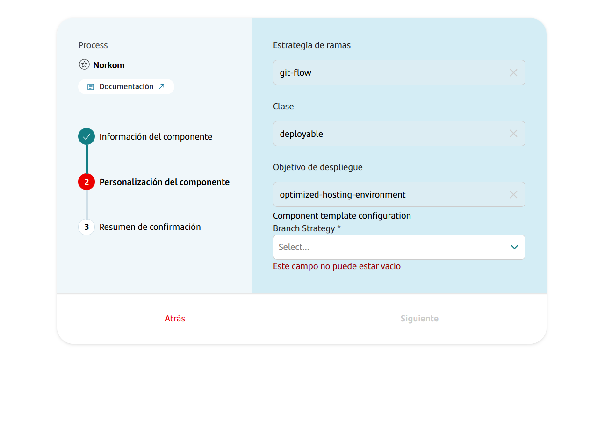

## Introduction

The purpose of this documentation is to provide a **step-by-step guide** on how to build, upload and deploy (if applicable) artifact built with Maven.

All deployments will be uploaded in [Nexus] or Jfrog.

## Create Component

### Gluon Portal

First you have to [**onboard your application.**](../../../../..//index.md)
Once you have your application created, you can start creating your component.

To create a component, follow the steps described in [**Component Management**](../../../../../application/component-management/create-component.md),
searching for the component to be created.

You have to select the type of component you want to create, for example in this case you are going to create a **Norkom component**.



???+ remember

    To follow the naming convention visit [Repository Naming Convention](../../../../../application/component-management/create-component.md#repository-naming-convention).

The user can customize the type of application that they want to create. For this example we have created a Norkom microservice with the following characteristics:

- **Branch Strategy**: branching model that involves the use of feature branches and multiple primary branches.  Values: Git Flow or Trunk-based development.

Once the component is created we can see under the application that there is a new repository created with the name of the component, Sonar project and Fortify project (if applicable to the created component)

We have the following links in:

| Item | Link | Role Permission |
| --- | --- | --- |
| GitHub Repository | Link to the repository created in GitHub | Developer (RW) /Technical Lead (Maintain) [All roles explained](https://docs.github.com/es/organizations/managing-user-access-to-your-organizations-repositories/managing-repository-roles/repository-roles-for-an-organization) |
| Sonar Project | Link to the Sonar project created | All Users (Read) |
| Fortify Project | Link to the Fortify project created | All Users (Read) |

### Artifacts

#### Branches

##### Git Flow

When you create the component from the Gluon Portal, the component is created with the default values of the template from the scaffolding workflow.

Create an empty main branch
Create a develop branch with the structure of files and folders to configure and deploy your artifact.

The generated artefact (git flow branch strategy) has a structure similar to the following:

``` bash

📂.github
 ┣ 📂workflows
 | ┣ 📜ci-fix-gfw.yml
 | ┣ 📜ci-gfw.yml
 | ┣ 📜create-release-branch.yml
 | ┣ 📜quality.yml
 | ┣ 📜release-fix-gfw.yml
 | ┣ 📜release-gfw.yml
 | ┣ 📜security.yml
 | ┣ 📜update-component-workflow.yml
 | ┗ 📜version-validation.yml
 ┗ 📜CODEOWNERS
📂.gluon
 ┗ 📂ci
    ┗ 📜properties.env
📂src
📜pom.xml
📜README.doc

```

##### Trunk-based development

When you create the component from the Gluon Portal, the component is created with the default values of the template from the scaffolding workflow.

Create a main branch with the structure of files and folders to configure and deploy your artifact.

The generated artefact (Trunk-based development branch strategy) has a structure similar to the following:

``` bash

📂.github
 ┣ 📂workflows
 | ┣ 📜ci-tbd.yml
 | ┣ 📜create-release-branch.yml
 | ┣ 📜quality.yml
 | ┣ 📜release-tbd.yml
 | ┣ 📜security.yml
 | ┣ 📜update-component-workflow.yml
 | ┗ 📜version-validation.yml
 ┗ 📜CODEOWNERS
📂.gluon
 ┗ 📂ci
    ┗ 📜properties.env
📂src
📜pom.xml
📜README.doc

```

## Local Running

??? abstract "Cloning your repository"

    ### Cloning your repository

    Once we have the device properly configured, the first step is to clone the project locally.

    To do so, visit [**How to clone the project**](../../../../../application/component-management/create-component.md#cloning-a-repository).

## Infrastructure

All artifacts will be upload in corporate [Nexus](https://nexus.alm.europe.cloudcenter.corp/) or Jfrog

## Component Configuration

The user has a file (properties.env) to configure the properties of the CI cycle. The location of the properties.env is:

``` bash
📂.gluon
┗ 📂ci
  ┗ 📜properties.env
```

``` bash
# if applicable, sonar properties
SONAR_PROJECT_KEY="real-sonar-project-key"

# if applicable, fortify properties
FORTIFY_PROJECT="real-fortify-project-key"

#if applicable, JAVA version properties
JAVA_VERSION="adoptopenjdk-17.0.7+7"

# Deploy Artifact Packaging: zip, ear, jar, tar.gz, etc
DEPLOY_ARTIFACT_PACKAGING='zip'

# Deploy Artifact CLASSIFIER: Deploy artifact classifier (Optional e.g. bin)
DEPLOY_ARTIFACT_CLASSIFIER='distributionDefault'

# Deploy ARTIFACT ID: Deploy artifact id (Optional, by default pom.xml artifact id'
DEPLOY_ARTIFACT_ID='canary-installer'

# MAVEN_ARGS: Maven properties (Optional, e.g. -PtestProfile)
MAVEN_ARGS='-PassemblyDefault'
```

### How to configure your deployment environment, if your artifact is not a library

If your artifact is not a library, in addition to uploading to Nexus or Jfrog, automatic scripts will be executed that will carry out the deployment in different environments
{!
   include-markdown "../snippets/snippet-oam-artifact.md"
   start="<!--Start Infrastructure 2.0-->"
   end="<!--End Infrastructure 2.0-->"
!}

## Build and Upload to Nexus/Jfrog your application (Git Flow Branch strategy)

{!
   include-markdown "../snippets/gitflow-artifact.md"
!}
