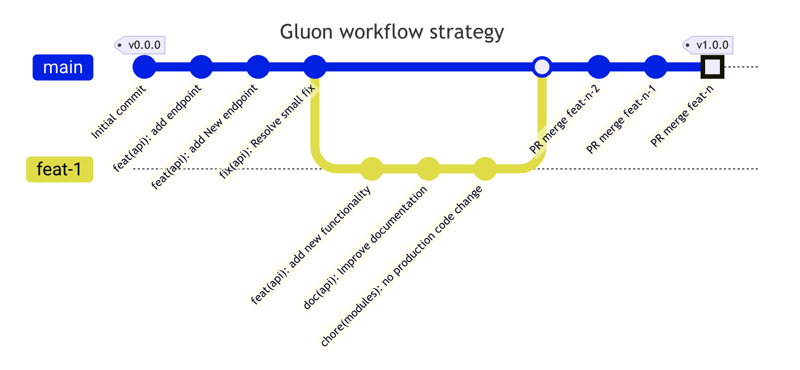

# Devops workflows

## Integration (maven-snapshot-image-tb.yml)

This trunk-based workflow is executed when the following branches are pushed:

* main
* master

### Requirements

{!
   include-markdown "**/ci-cd/technologies/snippets/requirements.md"
   start="<!--maven-start-->"
   end="<!--maven-end-->"
!}

### Jobs

All the jobs described clones the project repository when starts the execution
and reads the properties from `configuration project`, the repository itself
and resources necessaries to the proper workflow execution.

* `Setup environment variables:` Load the properties defined in
  `properties.env` file and in the `configuration project`. The configuration
  project is obtained according to the secrets defined.

{!
   include-markdown "**/ci-cd/technologies/snippets/organization-secrets.md"
   start="<!--setupenvironment-start-->"
   end="<!--setupenvironment-end-->"
!}

  Generate a json file with all properties (param=value).

* `Resolve Version:` Gets the current project version from prom. This job will
check if the `pom.xml` version has the -SNAPSHOT suffix. If it is not the case,
the workflow will be cancelled.

* `Maven build & Sonar scan:` Executes the default commands of MAVEN_BUILD_GOAL variable.
  If you want overwrite the maven command you can configure in
  `properties.env`.

{!
   include-markdown "**/ci-cd/technologies/maven/snippets/project-properties.md"
   start="<!--build-sonar-start-->"
   end="<!--build-sonar-end-->"
!}

* `Container build and push:` It takes the feature or development branch as
  image version and sets the environment variable `TAG_VERSION` with
  this value.
  Then execute the command `mvn clean package -Dmaven.test.skip=true` to build
  the application artifact.
  To continue, it builds the container image based on `Dockerfile` located in the
  project and make a push to one or several harbor registries definided in the
  [`multiregistry.yaml`](https://github.com/santander-group-shared-assets/gln-alm-push-scan-multiregistry#readme)
  file.
  Finally, scan the image vulnerabilities in Harbor and send the data related
  to the image build to elasticsearch.

  Send data to elasticsearch related to the image.

  If `IMAGE_DEPLOY_TYPE` property is `helm` then execute the command to package
  the Helm chart according to the defined properties.

{!
   include-markdown "**/ci-cd/technologies/snippets/common-project-properties.md"
   start="<!--helm-start-->"
   end="<!--helm-end-->"
!}

  Afterthat, the Helm package is pushed to one or several harbor registries
  definided in the [`multiregistry.yaml`](https://github.com/santander-group-shared-assets/gln-helm-package-push-action#readme)
  file. The chart version is the SNAPSHOT version of the application.

{!
   include-markdown "**/ci-cd/technologies/snippets/common-project-properties.md"
   start="<!--deployment-start-->"
   end="<!--deployment-end-->"
!}

* `Create tag and Pre release:` Creates a new tag and new draft-release
  version.

{!
   include-markdown "**/ci-cd/technologies/snippets/common-project-properties.md"
   start="<!--deployment-start-->"
   end="<!--deployment-end-->"
!}

* `Deploying development:` Deployment to the environment according to
 `SNAPSHOT_DEPLOYMENT_ENV` by default the value is cert,
 this property have possibility of multi-region deployment.
 Could be cert, pre, cert/pre and should be added this parameter in properties.env
 Validate the destiny entity.
 Deploy the application according to the type of deployment indicated by the
 `IMAGE_DEPLOY_TYPE`.

  Send data to elasticsearch related to the deployment.

{!
   include-markdown "**/ci-cd/technologies/snippets/common-project-properties.md"
   start="<!--deployment-start-->"
   end="<!--deployment-end-->"
!}

**NOTE:**

* See [here](../project-properties.md){:target="_blank"}
  to set the necessary project properties.
* See [here](../project-secrets.md){:target="_blank"} to
  set the necessary project secrets.
* See [here](../../../organization-properties.md){:target="_blank"}
  to set the necessary organization properties.
* See [here](../../../organization-secrets.md){:target="_blank"} to
  set the necessary organization secrets.

### Workflow

[Integration workflow link](https://github.com/santander-group-shared-assets/gln-user-reusable-workflows/blob/main/maven/immutable-images/maven-snapshot-image-tb.yml)
