## Introduction

The Components Management Page is your place for managing and expanding your project's components on Gluon. Discover and add new components with ease, elevating your project to new heights.

In this guide, we'll explore the key features of the Components Management Page. Navigate the component listing, search and filter by various criteria, and access detailed views revealing vital information like associated projects, dependencies, and licenses.

By the end, you will:

- Effortlessly navigate and comprehend the component listing.
- Master search and filtering for precise component discovery.
- Access detailed views with crucial project insights.

To get started, simply access the Gluon platform. Let's dive in and unleash the full potential of your project's components!

## Accessing the Components Management Page

- **Select an Application.** From the Gluon home menu, navigate to the "Applications" section, and select the desired application from the list to proceed.
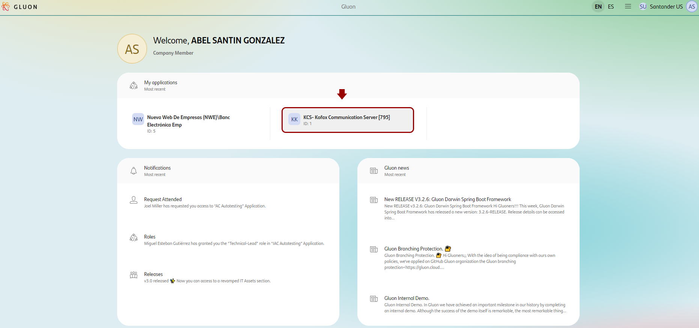

- **Navigate to the Components Section.** Inside the selected application, locate the left-side menu. Scroll through the menu options and find the "Components" item. Click on it to access the Components page.
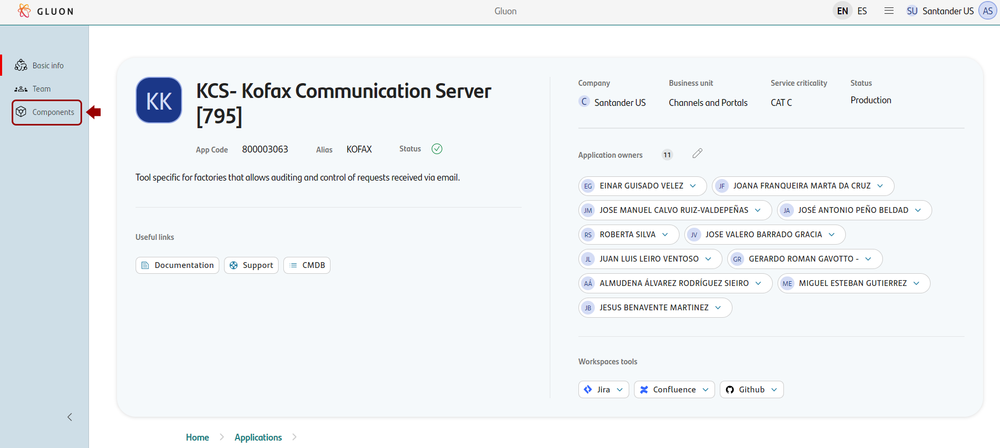

- **Exploring the Components Page.** On the Components page, you will find a comprehensive listing of all the components associated with the application.
Here you can search, filter, or add new components to your application.
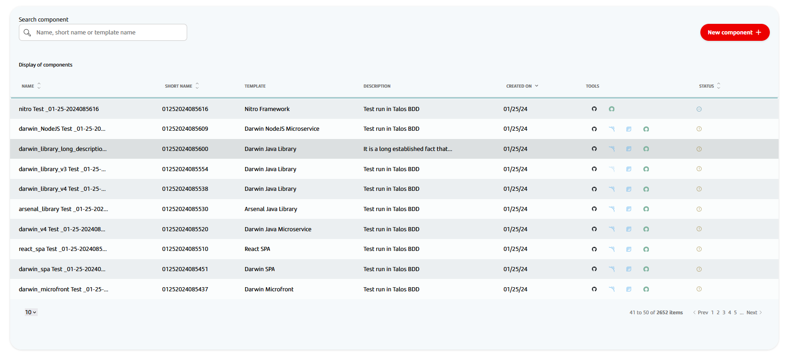

The Components page is divided into two main sections:

- **Component Global**: Section that allows you to search for components by name or short name, and add new components to the application.
- **Components Listing**: The main section of the page is dedicated to the listing of components. Here you can find all the components associated with the application.

Each component created in Gluon shows information about the name, short name, template used for the creation of the component, its status, and the set of tools that we've configured on the component.

### Component Tools

On the right side of each component listed, a link is shown with access to the component tools.

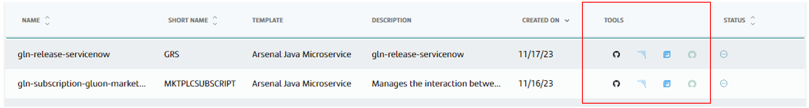

Below, the set of tools associated to the component:

  {: style="float:left;vertical-align:bottom"} `GitHub`: Link to the GitHub repository.

  {: style="float:left;align:baseline"} `Sonar`: Link to the Sonar project.

  {: style="align:baseline;float:left"} `Fortify`: Link to the Fortify project.

  {: style="float:left"} `ITSM`: Link to the component Catalog.

!!! warning "Only ITSM and GitHub tools are mandatory"  
    All components created from a template have a SCM (GitHub) repository and all are catalogued in ITSM tool (ITSM).  
    Quality and security gates inclusion (Sonar and Fortify tools respectively) depends on the technical component definition.

    - For components from a template that has **quality gates** defined, Gluon creates a project into **Sonar**.  
    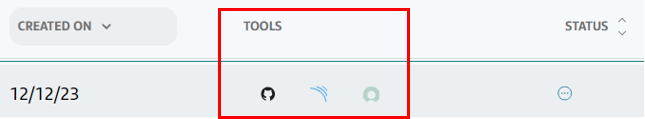{: style="width:50%"}
    
    - For components from a template that has **security gates** defined, Gluon create a Project into  **Fortify**.  
    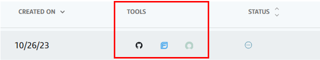{: style="width:50%"}

### Component Status

The status of the component can be:

- `In Progress`: At least one tool creation is still in progress, with no creation failures in the rest.
  
  - `Ready`: All tools are rightly configured.
      
    - GitHub repository created, team added and scaffolding done.
    - Sonar project created and teams added.
      - SECaaS project created and teams added.
      - APM Catalog component created and associated with the application.
  - `Requires attention`. At least one tools failed in the onboarding process.
      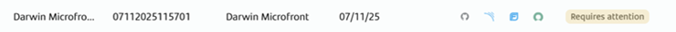
  - `Archived`: The component is archived and no longer active.
      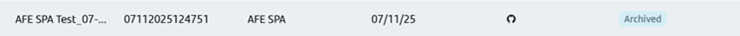
  - `Archived requires attention`: The component is going to be archived but requires attention due to issues in the archived process.
      
  - `Unarchived requires attention`: The component is going to beunarchived but requires attention due to issues in the archived process.
      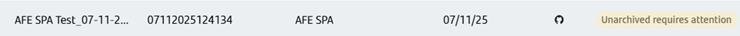

!!! info
    **A component will be rightly configured when all tools are rightly created and configured.**

## Archiving a component

This functionality allows you to archive a component, making it inactive and removing it from the active components list. Archiving a component is useful when you no longer need it in your application, but you want to keep its information for future reference.

When you archive a component:

- The component will not be associated with the APM application, and the source code repository will be archived. This means that the component will only be in read mode.
- There's an [impact into Gluon Release Management process](../release-management/oam/index.md#components). Components need to be removed from OAM definition file.
- This action can be reversed.

Preconditions to archive a component:

- The component must be in `Ready` status. Components in `Requires attention` or `In progress` status cannot be archived.
- Only components with scope different from `application` can be archived.

This functionality is only available to company owners, application owners or admins.

- **Locate the Component.** On the Components page, look for the search bar and type the name of your Component. Click in the row of the component to access to the component details page.
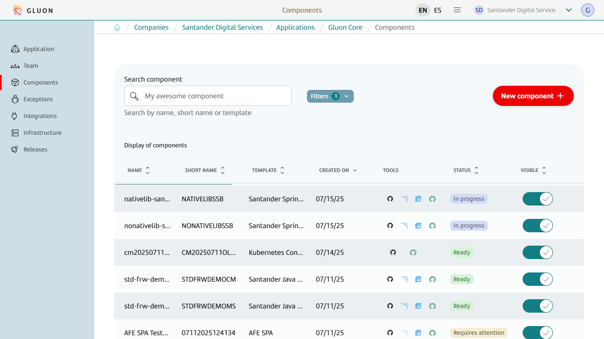

- **Archive the Component.** Click on the button to archive the component.
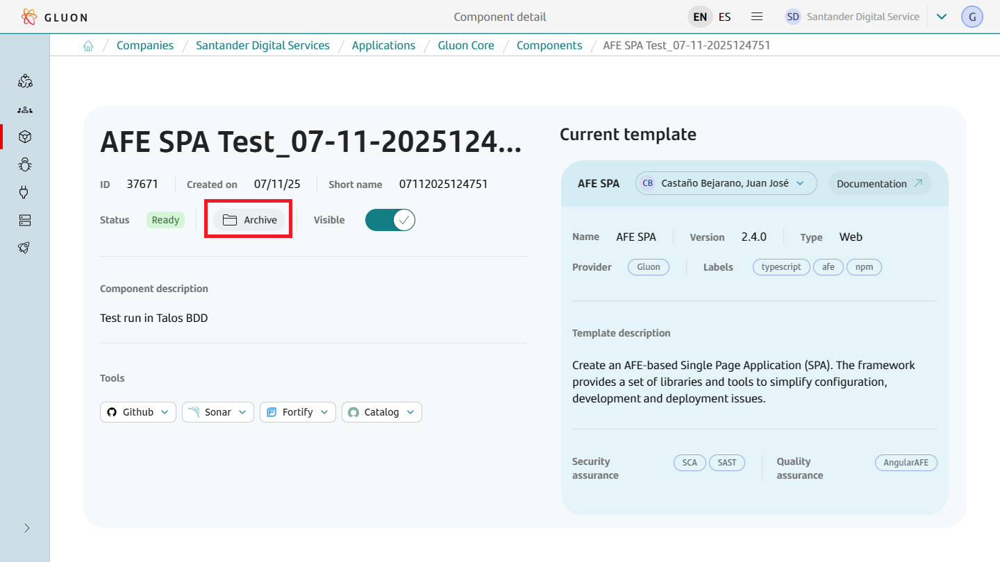

- **Display new status.** The component will be archived and the status will change to "Archived". The Sonar, Fortify and ITSM tools will be hidden from the component.
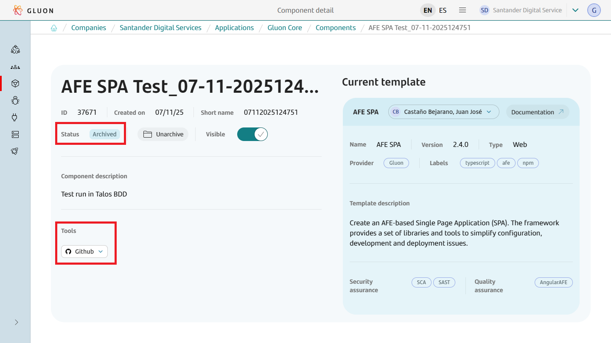

- **Display archived source code repository.** The source code repository will be archived and the link to the repository will be displayed in the component details page.
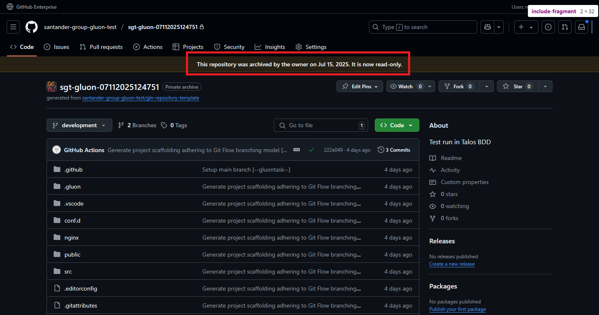
