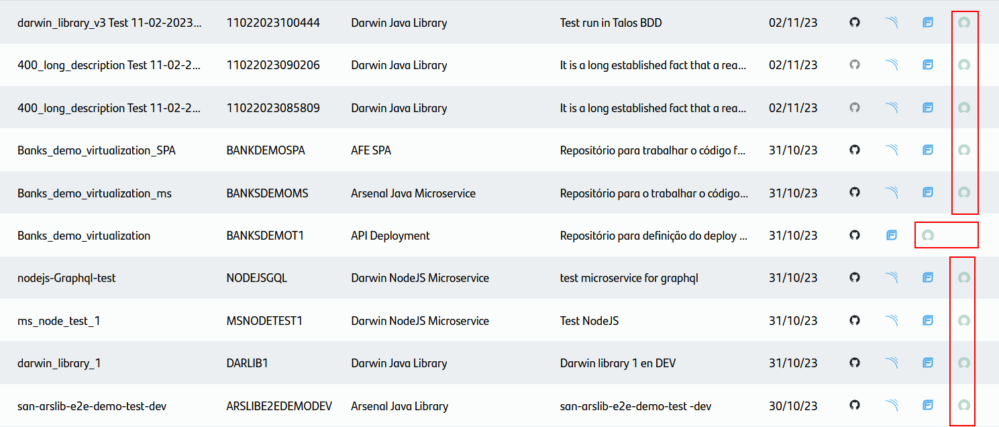
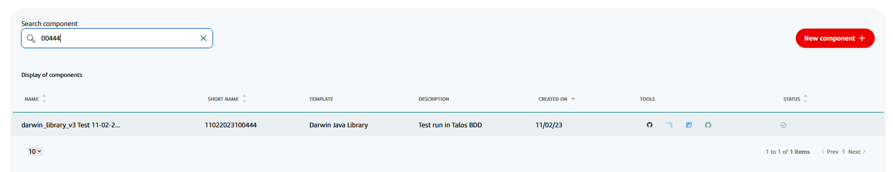
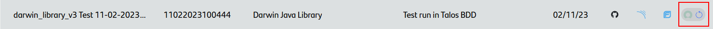
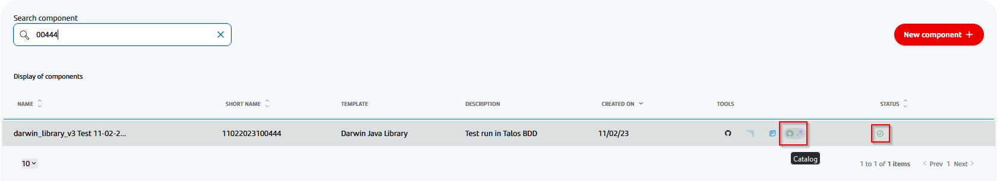
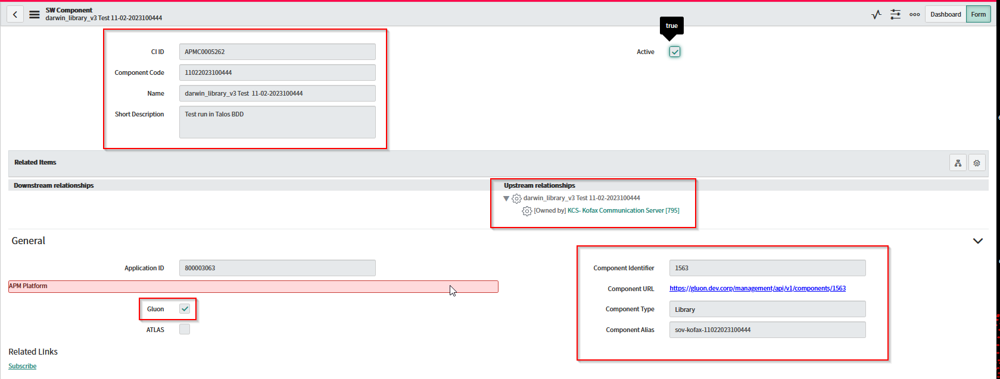

In Gluon 2.0 we've released a new functionality for the component catalog. All components that we'll create in Gluon must be cataloged in APM tool.

## Introduction

Before the release of Gluon 2.0, any component created in Gluon was automatically onboarded in the following tools:

- GitHub.
- Sonar.
- Fortify.

With the new release, it's added a new tool for the onboarding of components

- **APM**: All component created in Gluon must be cataloged in APM that it's the tool that we use for the catalog of the component.

The cataloguing of components is a best practice that aids us in providing several advantages within Gluon, thanks to its new automated component catalog functionality:

- __Complete visibility__: Gluon provides full visibility of all created components.
- __Traceability__: Each catalogued component is associated with its correct metadata, allowing us to have complete traceability for each component. We need to examine each component up to its application.
- __Release Capabilities__: With a complete catalog of all components, Gluon can facilitate efficient and effective release management capabilities.
- __Audit Compliance__: To be in compliance with the audit process group.

## Accessing the Components Management Page

With the new release any components with `ready` status will be automatically converted to `in progress` status, because `Ready` status means that all tools are rightly configured, and we need to do the onboarding in the APM tool.

!!! info "APM Catalog Component"
    All component created before the release of Gluon 2.0 will be onboarded in APM manually. For the components created after the release of Gluon 2.0, the component must catalog automatically the same way the other tools.

    It'll be responsibility the application owner to catalog the component in APM.

- **Select an Application.** From the Gluon home menu, navigate to the "Applications" section, and select the desired application from the list to proceed.
- **Navigate to the Components Section.** Inside the selected application, locate the left-side menu. Scroll through the menu options and find the "Components" item. Click on it to access the Components page.
- **Exploring the Components Page.** On the Components page, you will find a comprehensive listing of all the components associated with the application.

- **Search the Component that we want to catalog.** In the search box, we can search the component that we want to catalog. The search is done by the name of the component.

- **Catalog the component.** Once we've found the component that we want to catalog, we can click on the `Catalog` button to start the onboarding process.

At the end of the onboarding process, the component will be cataloged in APM and the status of the component will be `Ready`.

Once the component has been cataloged, we can access the ITSM link and review the component's information. The information is divided into:

- __Component Information__
    - _CI ID_: Component ID within ITSM Tool.
    - _Component Code_: Component code within ITSM Tool.
    - _Description_: The same description that the component was created with in Gluon.

- __Relations Information__
    - Application:  The application that the component belongs to.

- __General Information__
    - _Application Id_: APM Application Id.
    - _Gluon_: Check to identify components created with the Gluon application.
    - _Component Identifier_: Gluon component Id.
    - _Component URL_: URL Component inside Gluon to get the component information.
    - _Component type_: Identifies the type of component associated with the component.
    - _Component-Alias_: The key of the component used to identify it.

