## Introduction

The Components Management Page is your place for managing and expanding your project's components on Gluon. Discover and add new components with ease, elevating your project to new heights.

In this guide, we'll explore the key features of the Components Management Page. Navigate the component listing, search and filter by various criteria, and access detailed views revealing vital information like associated projects, dependencies, and licenses.

By the end, you will:

- Effortlessly navigate and comprehend the component listing.
- Master search and filtering for precise component discovery.
- Access detailed views with crucial project insights.

To get started, simply access the Gluon platform. Let's dive in and unleash the full potential of your project's components!

## Accessing the Components Management Page

- **Select an Application.** From the Gluon home menu, navigate to the "Applications" section, and select the desired application from the list to proceed.


- **Navigate to the Components Section.** Inside the selected application, locate the left-side menu. Scroll through the menu options and find the "Components" item. Click on it to access the Components page.


- **Exploring the Components Page.** On the Components page, you will find a comprehensive listing of all the components associated with the application.
Here you can search, filter, or add new components to your application.


The Components page is divided into two main sections:

- **Component Global**: Section that allows you to search for components by name or short name, and add new components to the application.
- **Components Listing**: The main section of the page is dedicated to the listing of components. Here you can find all the components associated with the application.

Each component created in Gluon shows information about the name, short name, template used for the creation of the component, its status, and the set of tools that we've configured on the component.

### Component Tools

On the right side of each component listed, a link is shown with access to the component tools.


Below, the set of tools associated to the component:

  {: style="float:left;vertical-align:bottom"} `GitHub`: Link to the GitHub repository.

  {: style="float:left;align:baseline"} `Sonar`: Link to the Sonar project.

  {: style="align:baseline;float:left"} `Fortify`: Link to the Fortify project.

  {: style="float:left"} `ITSM`: Link to the component Catalog.

!!! warning "Only ITSM and GitHub tools are mandatory"  
    All components created from a template have a SCM (GitHub) repository and all are catalogued in ITSM tool (ITSM).  
    Quality and security gates inclusion (Sonar and Fortify tools respectively) depends on the technical component definition.

    - For components from a template that has **quality gates** defined, Gluon creates a project into **Sonar**.  
    {: style="width:50%"}
    
    - For components from a template that has **security gates** defined, Gluon create a Project into  **Fortify**.  
    {: style="width:50%"}

### Component Status

The status of the component can be:

  - `In Progress`: At least one tool creation is still in progress, with no creation failures in the rest.
  
  - `Ready`: All tools are rightly configured.
      
      - GitHub repository created, team added and scaffolding done.
      - Sonar project created and teams added.
      - SECaaS project created and teams added.
      - APM Catalog component created and associated with the application.
  - `Requires attention`. At least one tools failed in the onboarding process.
      
  - `Archived`: The component is archived and no longer active.
      
  - `Archived requires attention`: The component is going to be archived but requires attention due to issues in the archived process.
      
  - `Unarchived requires attention`: The component is going to beunarchived but requires attention due to issues in the archived process.
      

!!! info
    **A component will be rightly configured when all tools are rightly created and configured.**

## Adding New Components to Your Application

- **Locate the Add New Component Button.** On the Components page, look for the "New Component" button located in the upper right corner. Click on the button to initiate the process of adding a new component.
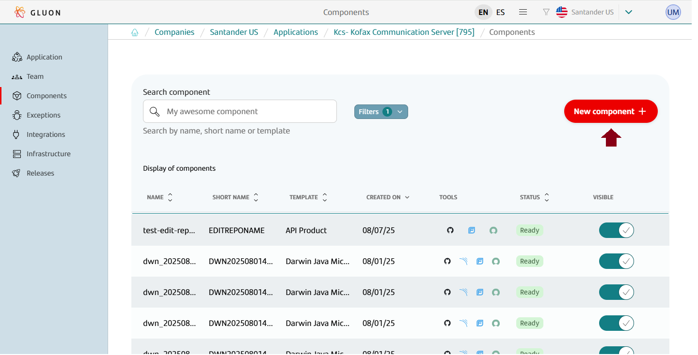

- **Explore Available Components and Apply Filters.** You will be presented with a list of available components on the platform. Use the search engine provided to filter components by name, language, framework, or build tool.
Once you have identified the desired component, click on it to start the process of adding it to your application.
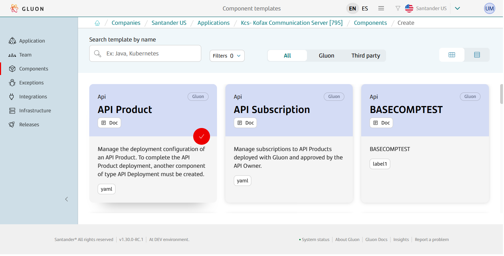

- **Provide Component Information.** On the following screen, provide the necessary information for the new component, such as the component name, short name, description, and repository name. Fill in the required fields and proceed to the next step.
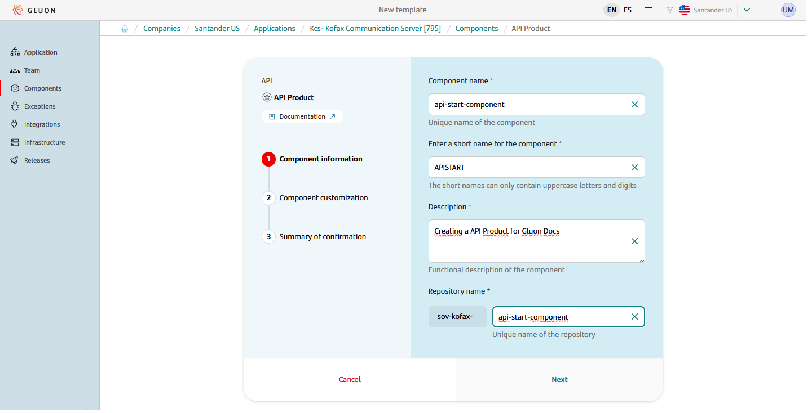

- **Customize Component Settings.** Customize the specific characteristics of the component based on your application's needs. This may include configuring settings, dependencies, or any other relevant options.
Make the necessary selections and adjustments before moving forward.
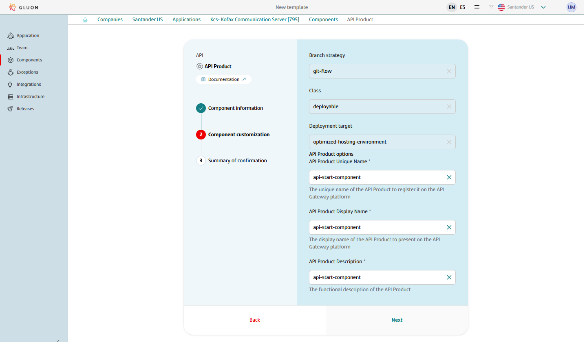

- **Confirm Component Creation.** Review the summary of the component details you have provided. Ensure all the information is accurate and meets your requirements. If everything is correct, click on the "Create Component" button to proceed.
Alternatively, you can use the "Back" button to make any necessary modifications.
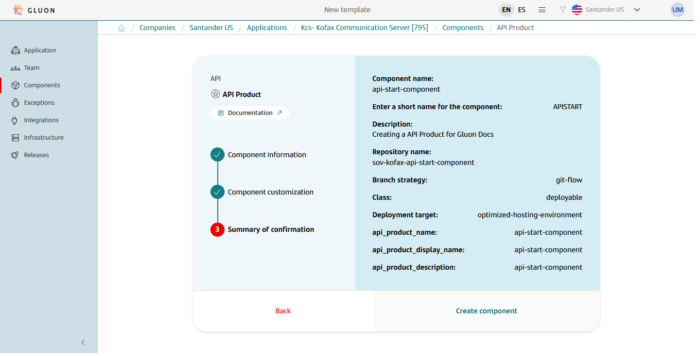

- **View Your Updated Components List.** After successfully creating the new component, you will be redirected to the Components page.
You will now see the list of components in your application, including the newly added component, which will be marked with a dot on the left side.
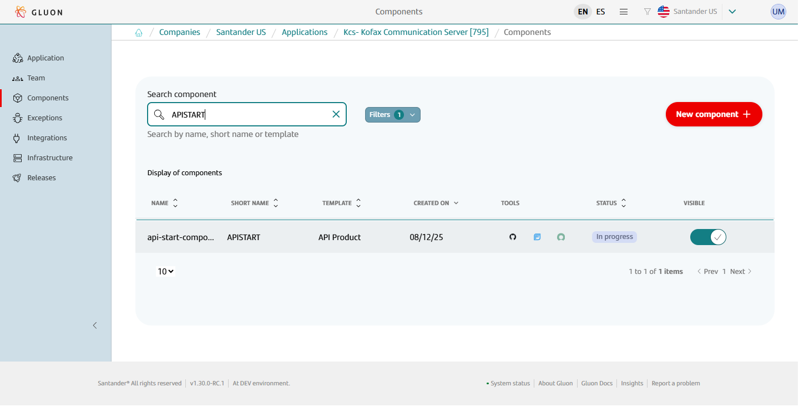

Congratulations! You have successfully added a new component to your application in Gluon. Explore the possibilities and continue enhancing your project with the power of new components.

If you had any issues during the process, remember that you can use the `retry functionality` for to retry each tool independently.

!!! info
    The retry functionality is only available for components with the status `Requires attention` or `pending`.

---

## Component ID

The **Component ID** is a unique code that identifies each component created in Gluon. You can find it on the component details screen, and it is also used to connect the component to its repository on GitHub.

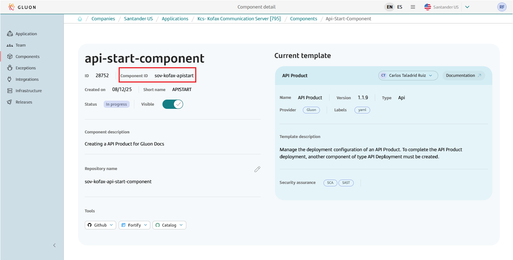

### How is the Component ID formed?

The Component ID follows this pattern:

<**acronym-company**>**-**<**acronym-application**>**-**<**short-name-component**>

For example:  
`sov-kofax-apistart`

- The first part represents the company.
- The second part represents the application.
- The third part is the short name of the component.

### What is it for?

The Component ID makes it easy to find and manage your components, ensuring everything is correctly connected between Gluon and GitHub.

---

## Retry Operation

The retry functionality has been created to launch each of the tools that have been configured in the component independently. Suppose we have a component with the status `Requires attention` in which the onboarding of the component in Fortify has not
been done correctly. To launch the Fortify onboarding again, we must follow the following steps:

- **Search the component.** On the Components page, look for the component with the status `Requires attention` and click on it to access the component details.
- **Retry Fortify.** On the component details page, locate the Fortify button and click on the "Retry" button to start the process of retrying the Fortify onboarding.
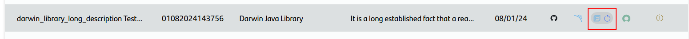

    When the retry operation is finished, the status of the component will be updated.
    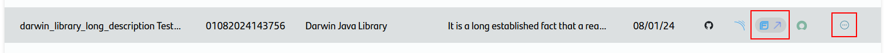

## Repository Naming Convention

When you create a component in the Gluon platform, a repository is automatically generated in GitHub following the naming convention below:

<**company-acronym**>**-**<**application-acronym**>**-**<**repository-name**>

- **Company acronym**: 3 characters, automatically filled from the company registration.
- **Application acronym**: 7 characters, provided during the application registration.
- **Repository name**: Defined by the user when creating the component, with up to 90 characters.

The full repository name must have a maximum of 100 characters and may contain letters, numbers, hyphens ("-"), underscores ("_"), and dots (".").

**Example:**  
`abc-abcdefg-my_repository-01`

This standardization helps with the identification and organization of repositories created on the platform.

- **short-name-component** Length of 16 characters, it will be requested when creating the component in Gluon.
    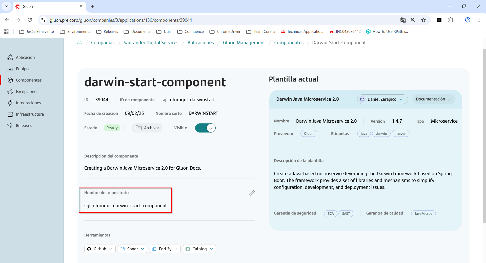

## Repository Naming Edition

You can edit a repository name from a component in Gluon following the next steps:

- **edit-button**: Click on the edit button in the component details page.
    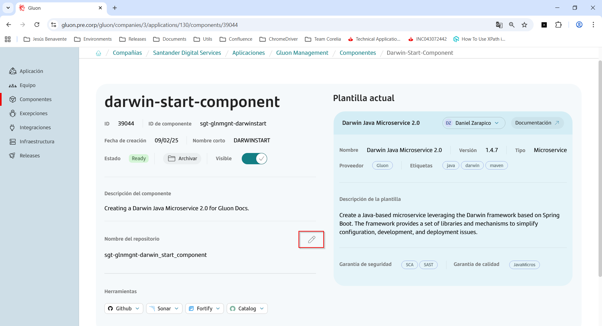

- **edit-component-repository**: Edit the field **repository-name** with a unique name.
    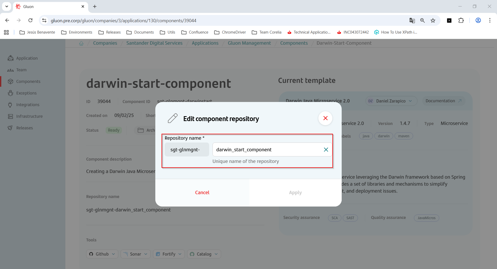

- **edit-component-repository-complete**: Press the button **Apply** to complete the edition of the repository name.
    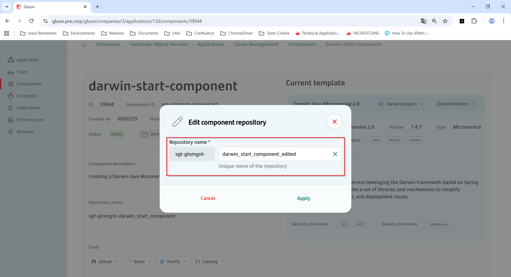

- **verify-component-repository-name**: After pressing the button **Apply** the new repository name will be shown in the component details page.
    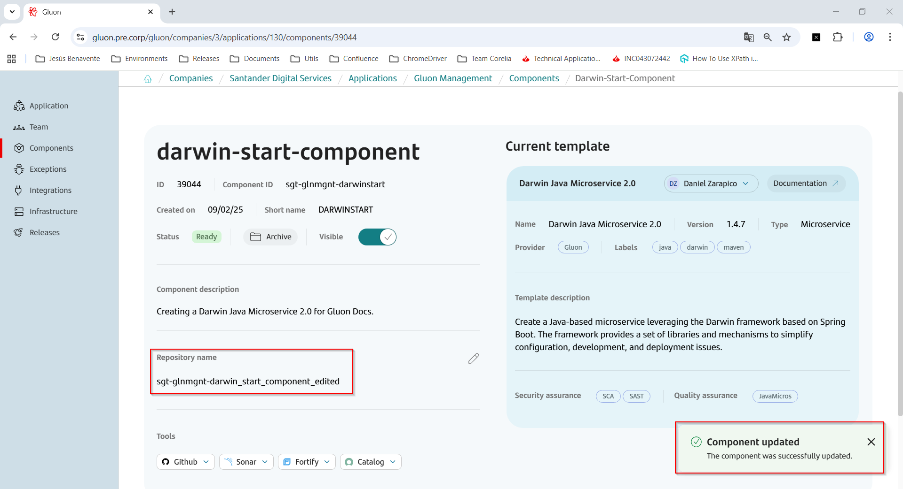

- **check-component-repository-name**: Check the new repository name in Github.
    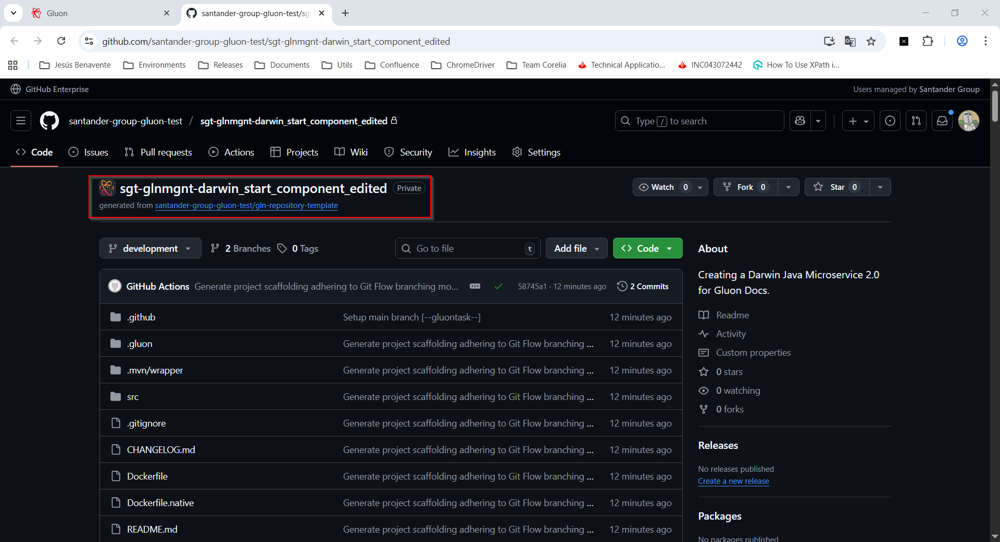

---

## Cloning a repository

Once the component has been created, a repository has been created in the [Santander Group Gluon](https://github.com/santander-group-gluon).

To access the Github repository that has been generated with the creation of the component, just search for the component and click on the GitHub icon in the links section.

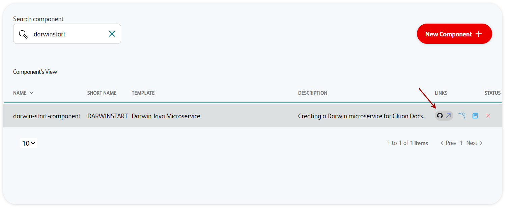

The next step is to clone the project locally, to do this, click on the "**Code**" button and copy the **URL** that appears in the **HTTPS** tag as shown in the image.

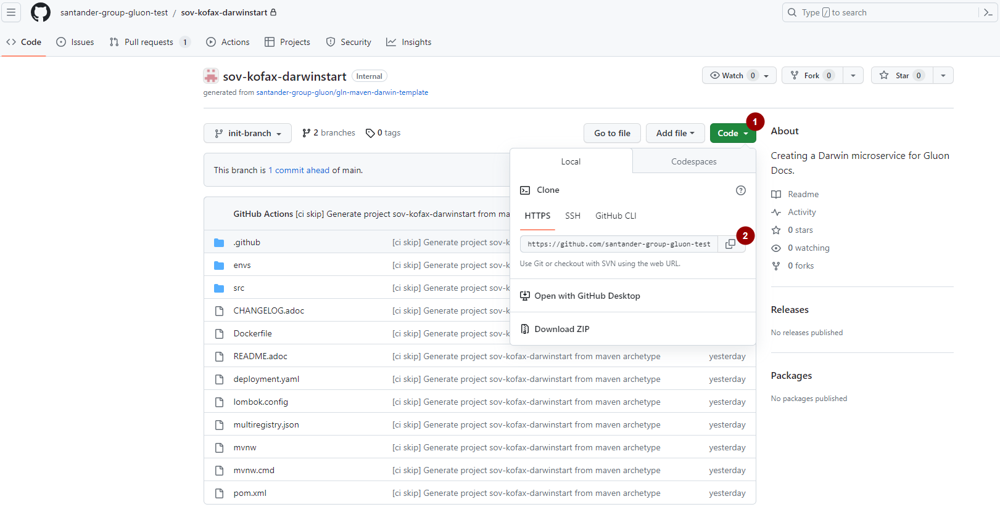

To clone the project it is necessary to execute the following command in a terminal in the path where we want the project to be located, replacing the section between <...> by the corresponding one.

``` { .bash .copy }

git clone https://github.com/santander-group-gluon/<...>.git

```

???+ info

    For more information on how to clone projects visit [GitHub: Cloning a repository](https://docs.github.com/en/repositories/creating-and-managing-repositories/cloning-a-repository).

After executing the command, the project should appear in the user's selected local directory.

<br>
