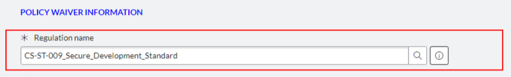
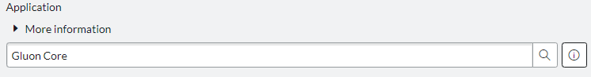

Security exceptions allow a team to deploy to production even if the security workflow portion of the CI/CD pipeline fails because of issues raised by automated security check solutions, such as Fortify or Sysdig.

Security exceptions must first be requested by creating a request on Service Now. In order to do so, you should navigate to the following section on Service Now:

TECHNICAL CATALOG -> Cybersecurity -> Audit & Compliance -> GRC Compliance -> Non-Compliance Cyber Requirements (Waivers/Exceptions)

On accessing this page, a form will be presented which needs to be filled. It is important to select *CS-ST-009_Secure_Development_Standard* as the regulation name:

It is also important to ensure that the "Application" field matches the name of your Technical Application.

If this field does not match, users will be unable to link the waiver to their application on Gluon, and will receive an error message stating the waiver application does not match.

If you want to go back to the Gluon Security Exception documentation, [click here](./security-exceptions.md).

## Additional notes

Security exceptions require approval by CISO, so it should be noted that some time will elapse between the waiver is requested and it is approved.
Even if a Service Now security exception is referenced in Gluon, if it is not yet approved, it will not prevent the deploy from failing.

Security exceptions are stored on Service Now, with only a reference to it on Gluon.
