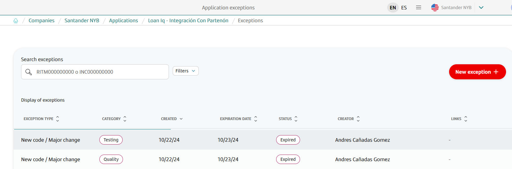
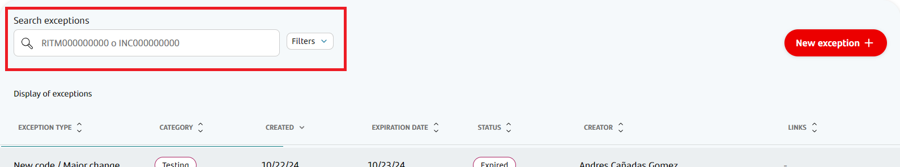
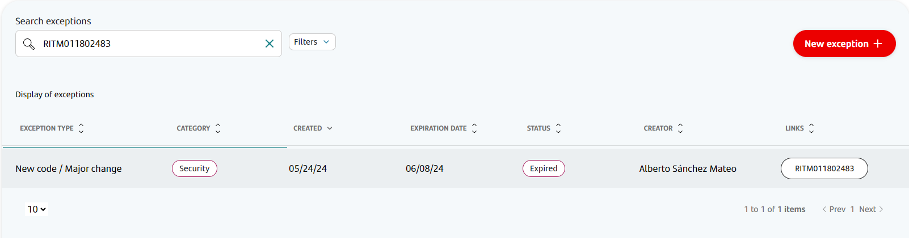
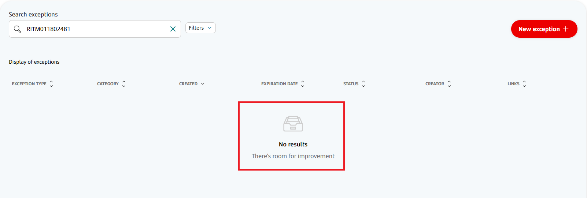
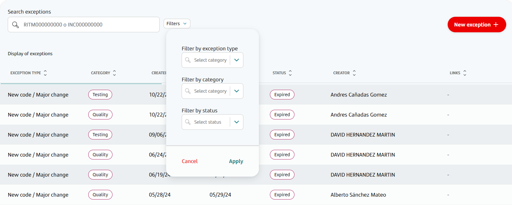
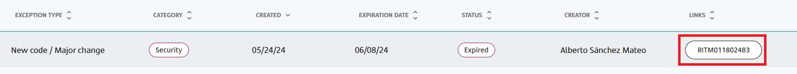

The main Exceptions screen consists of a list of all exceptions for a given application.

The table shows the type of exception (new code or incidence), its category (whether it applies for quality checks, security checks or both), its date of creation and expiration, the user who created the exception, and any related links if available.

For now, this list is only informative, and no action can be taken from it to modify current exceptions.

## Accessing the Exceptions screen

In order to access this screen, click on an application in Gluon to see its details, and then click on the Exceptions option on the left-hand menu.

## Searching by RITM or INC number

Since this screen has a paginated list of all exceptions for this application, it was necessary to include a search box and some filtering options, which can be seen on the top-left part of the table:

In the case of security exceptions and incidence exceptions, the user can search for a specific one by its associated RITM number (security exceptions) or INC number (incidence exceptions)

When a number is entered into the box, Gluon will automatically filter the list and leave only matching waivers:

In case there are no matching waivers, a message indicating so will be seen on the list itself:

## Filtering waivers

Another option for showing different subsets of existing exceptions is to use the provided filters:

Here you can select any combination of filtering criteria and then hit the "Apply" button to see the results. Available filters are:

- Exception type filter: Allows the user to select either "Security", "Testing" or "Quality" in order to see only one type of exception.

!!! info "Exception type filter with incidence exceptions"
    Incidence exceptions apply to the security, testing and quality pipeline checks, so selecting either option will still show the existing incidence exceptions.

- Category filter: Allows the user to select either "New code / Major change" or "Incidence". As the name implies, this allows you to show only incidence waivers or security / quality waivers.
- Status filter: Allows the user to select either "Expired" or "Active". The former will only show waivers that are expired, while the latter will only show waivers that are still current (not expired)

## Checking the underlying RITM or INC tickets in Service Now

In case you want to navigate to Service Now in order to see the RITM ticket for a security exception or the INC ticket for an incidence exception, a link is provided in the table when applicable:

Clicking on the link will open the ticket on Service Now in a new tab
