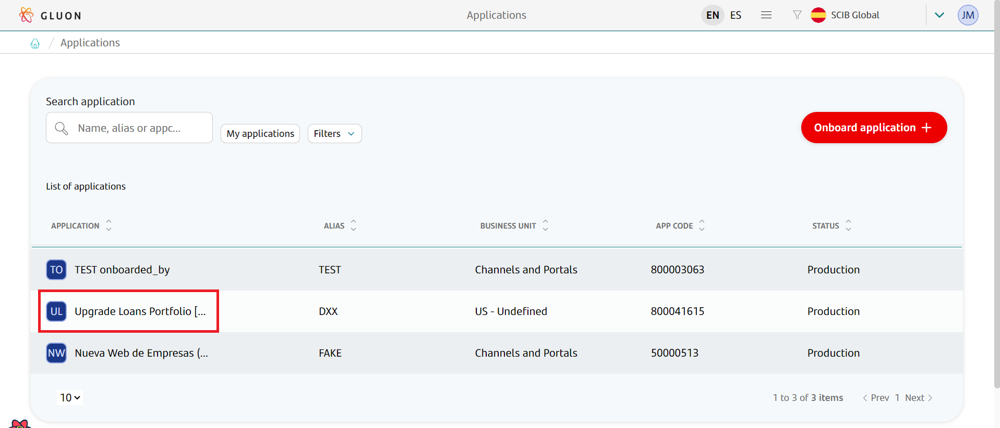
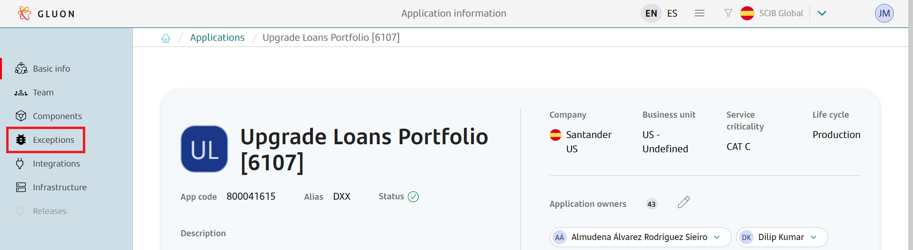
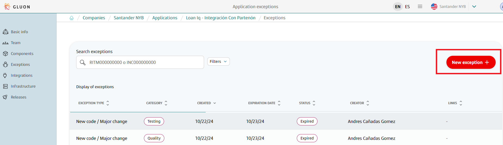
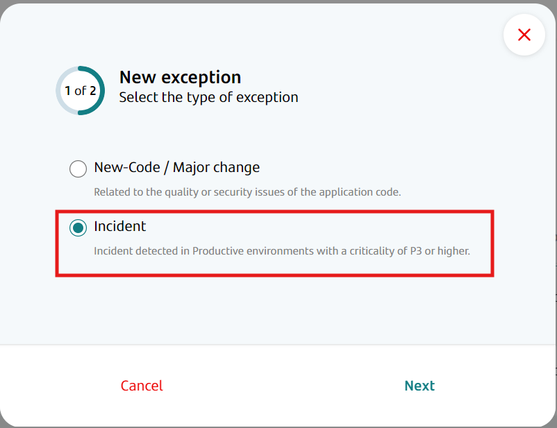
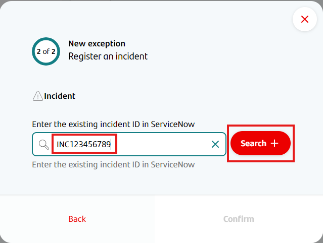
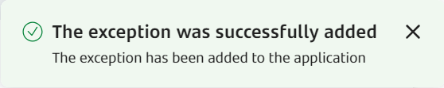

Incidence exceptions allow a team to deploy to production even if the security, integration testing or quality portions of the CI/CD pipeline fail.

Incidence exceptions can only be created by linking them to an active incidence registered on Service Now. Such incidence must be priority level P3 or higher (P3, P2 or P1).

Incidence exceptions do not require approval since they are already linked to a reported high-priority incidence.

## Registering an incidence exception for an existing Service Now incidence

!!! info "Incidence exception effect"
    Incidence exceptions allows a deploy to bypass the security and quality checks in the CI/CD pipeline, as well as integration testing.

Once a P3 or higher incidence is created on Service Now, the Application Owner can generate an exception for an application linking it to that incidence, in case the team needs to bypass the checks in order to deploy a fix.

!!! warning "Applicable incidences"
    Only open, P3-or-higher-priority incidences in Service Now can be used to create an incidence exception.

!!! warning "Limitations"
    Only one active exception can exist at any given time for each Service Now INC ticket, so if another application has used the ticket to create an exception, you will require a new INC ticket.

- In Gluon, access the application that requires the exception.  
    

- On the left-hand menu, click on the Exceptions option.  
    

- Now you will access the Exceptions section, where you can see a list of current, enabled exceptions for this application. For now, this list is only informative, and no action can be taken from it to modify current exceptions.
Click on the Add Exception option on the top right of the screen.  
    

- A modal will appear. Now you have to choose whether this exception will be for a) the deployment of a fix during an incidence, or b) the deployment of new code or a major change. In this case we select that this is for an incidence.  
    

- Incidence exceptions require you to provide the Service Now incident INC number. Enter it in the corresponding field. You must then click on the "Search" button in order to validate that the Service Now incident exists and is open.  
    

- Click on the Confirm button on the bottom right of the modal. If the exception is created successfully, a success toast will appear on the bottom right of the screen to inform that the operation was successful.  
    

Once created, failing CI/CD quality, security or integration testing steps will not prevent the application from deploying to the production environment, as long as the incident in Service Now remains open and the exception is still in effect.

!!! info "Incidence Waiver Duration"
    Incidence waivers are valid for 72 hours since the moment they were created. After those 72 hours, the waiver will no longer be in effect.
