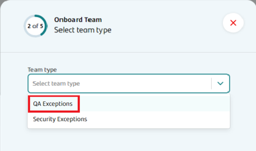
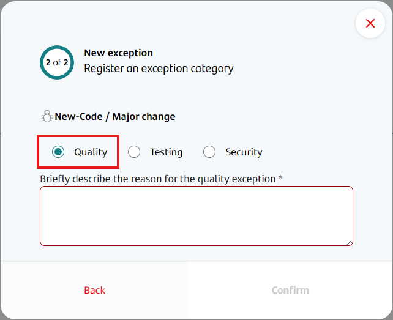
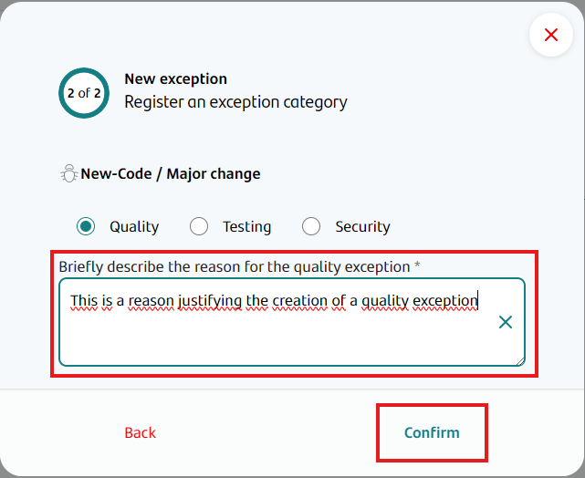

Quality exceptions allow a team to deploy to production even if the quality workflow portion of the CI/CD pipeline fails because of issues raised by automated quality check solutions, such as SonarQube.

Quality exceptions can only be created by the Application Owner. They are effective immediately, and do not require any other type of approval.

Quality exceptions are stored solely on Gluon, and do not have an associated Service Now ticket, issue or waiver.

Alternatively, quality exceptions can also be created by any member belonging to the QA Exception predefined team for the company to which the application belongs. If your company has no such team, it can be created following [these instructions](../../getting-started/company-management/company-teams-management/index.md#create-a-new-company-team).

When creating a predefined company team in that section, choose the following type:

## Creating a quality exception

!!! info "Creating exceptions for Quality, Testing and Security"
    For now, there is no option to create a "new code" exception that applies to quality, testing and security workflows at the same time. If you wish to achieve this effect, you will need to create a separate exception for each type.

Quality exceptions can be created by the Application Owner or a QA Exceptions team member from the Exceptions section, by following these steps:

- In Gluon, access the application that requires the exception.  
    

- On the left-hand menu, click on the Exceptions option.  

- Now you will access the Exceptions section, where you can see a list of current, enabled exceptions for this application. For now, this list is only informative, and no action can be taken from it to modify current exceptions.
Click on the Add Exception option on the top right of the screen.  
    

- A modal will appear. Now you have to choose whether this exception will be for a) the deployment of a fix during an incidence, or b) the deployment of new code or a major change. In this case we select that this is for new code or a major change.  
    

- Now you have to choose which kind of exception you want to create. In this case we select "Quality".  
    

- Quality exceptions require you to write a reason for requesting them. Both the reason and your user ID are stored with the new exception for auditing purposes. Then click on the "Confirm" button at the bottom right of the modal.  
    

- If the exception is created successfully, a success toast will appear on the bottom right of the screen to inform that the operation was successful.  
    

Once the exception is created, failing quality processes during CI/CD will not prevent the application from deploying to the production environment, as long as the exception is still valid.

!!! info "Quality Waiver Duration"
    Quality waivers are valid for 72 hours since the moment they were created. After those 72 hours, the waiver will no longer be in effect.
