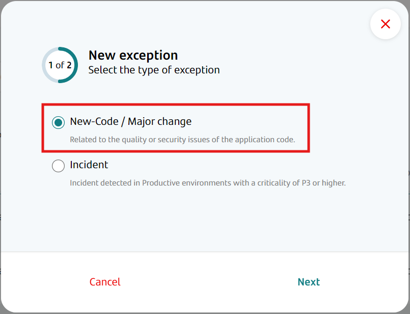
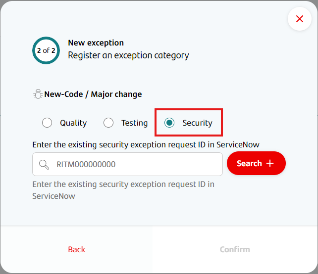
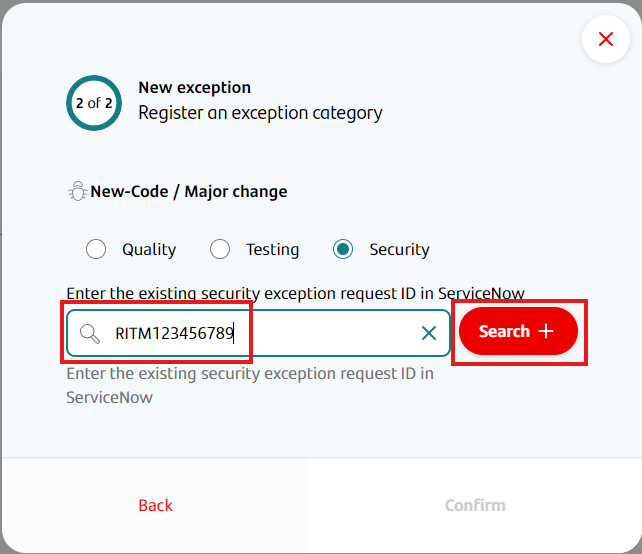

Security exceptions allow a team to deploy to production even if the security workflow portion of the CI/CD pipeline fails because of issues raised by automated security check solutions, such as Fortify or Sysdig.

Security exceptions must first be requested by creating a request on Service Now.
The REQ number of that request must then be entered into Gluon so that its status can be monitored and, once the waiver is approved, avoid the pipeline from being interrupted by security issues raised by the security workflow.

Security exceptions require approval by CISO, so it should be noted that some time will elapse between the waiver is requested and it is approved.
Even if a Service Now security exception is referenced in Gluon, if it is not yet approved, it will not prevent the deploy from failing.

Security exceptions are stored on Service Now, with only a reference to it on Gluon.

## Linking a Service Now waiver to your application as a security exception

!!! info "Creating exceptions for Quality, Testing and Security"
    For now, there is no option to create a "new code" exception that applies to quality, testing and security workflows at the same time. If you wish to achieve this effect, you will need to create a separate exception for each type.

The registration of a security waiver in Gluon first requires a security waiver to have been created and approved on Service Now.
In case you are unsure about that procedure, you can [find more information here](./create-security-waiver-itsm.md)

Once a security waiver has been created on Service Now, the Application Owner can link it to the corresponding application on Gluon by following these steps:

!!! warning "Linking Service Now security waivers"
    If a security waiver is created on Service Now but is not linked to the correct application in Gluon, it will have no effect on the CI/CD pipeline, even if the security waiver is active and has been approved.

- In Gluon, access the application that requires the exception.  
    

- On the left-hand menu, click on the Exceptions option.  
    

- Now you will access the Exceptions section, where you can see a list of current, enabled exceptions for this application. For now, this list is only informative, and no action can be taken from it to modify current exceptions.
Click on the Add Exception option on the top right of the screen.  
    

- A modal will appear. Now you have to choose whether this exception will be for a) the deployment of a fix during an incidence, or b) the deployment of new code or a major change. In this case we select that this is for new code or a major change.  
    

- Now you have to choose which kind of exception you want to create. In this case we select "Security".  
    

- Security exceptions require you to provide the Service Now security waiver RITM number. Enter it in the corresponding field. You must then click on the "Search" button in order to validate that the Service Now ticket exists.  
    

- Click on the Confirm button on the bottom right of the modal. If the exception is created successfully, a success toast will appear on the bottom right of the screen to inform that the operation was successful.  
    

Once the exception is created, failing security processes during CI/CD will not prevent the application from deploying to the production environment, as long as the security waiver in Service Now is current, is enabled and has been approved.
If the waiver has not still been approved, then it will have no effect until it is.
