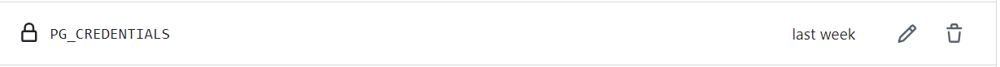
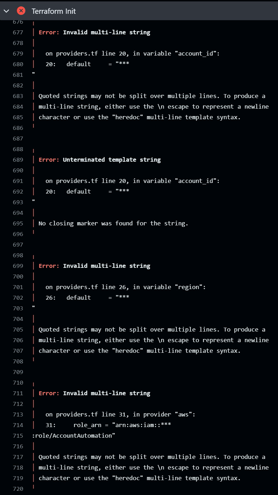
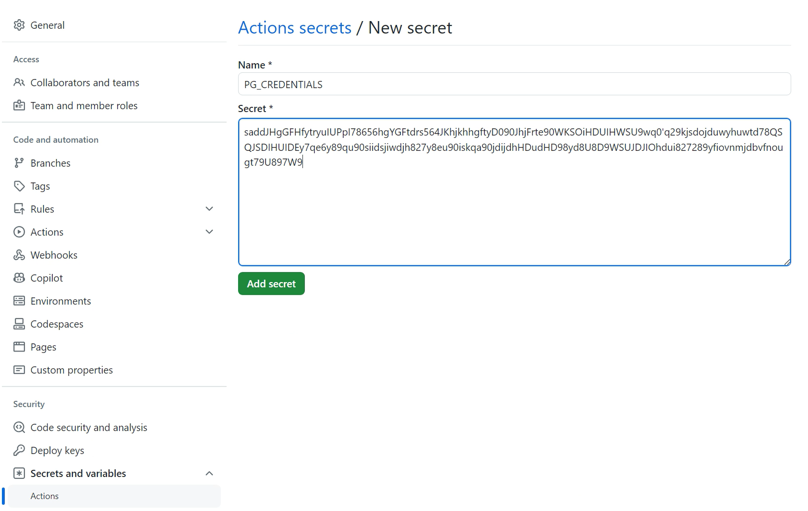
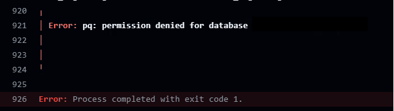
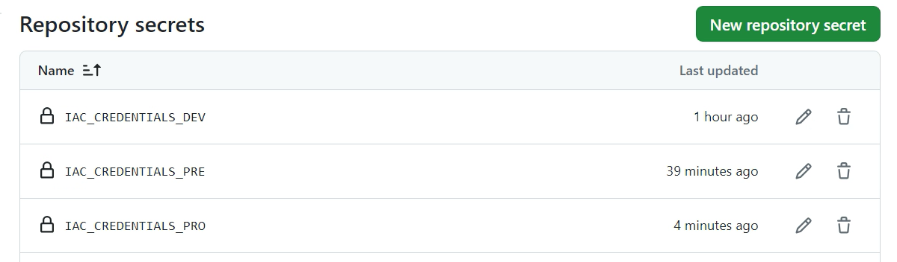
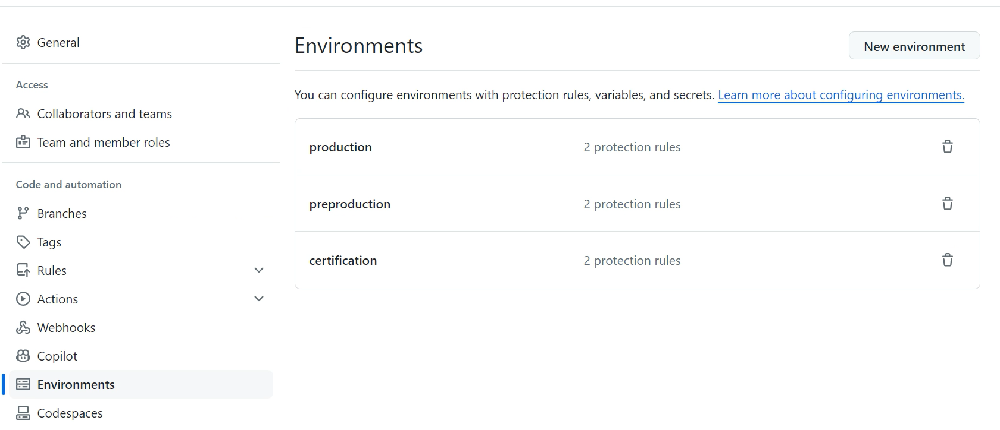
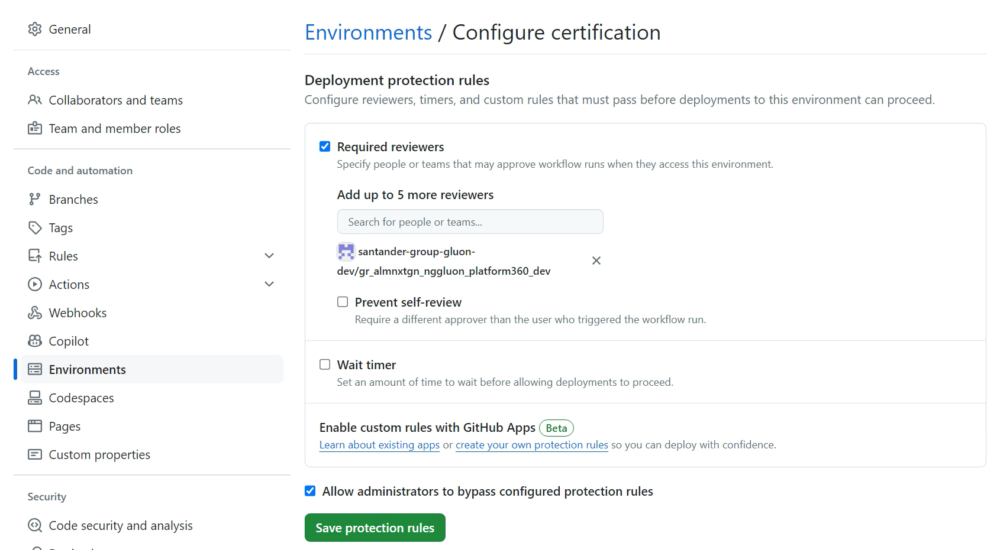

# Component Pre-requisites

## Introduction

This document provides a complete and detailed overview about how to set the required parameters that the IaC components need in order to make the Terraform Workflows work.

In summary, the following <u><strong>requirements</strong></u> (detailed in below sections) must be set to be able to use the Terraform Workflows in any component:

| [Github Organization Secrets](#org_secrets) | [Github Repository Secrets](#repo_secrets) | [Github Environment Protection Rules](#env_rules) |
|-----------------------------|---------------------------|------------------------------|
|<strong>PG_CREDENTIALS</strong>|<strong>IAC_CREDENTIALS_DEV</strong>,<br><strong>IAC_CREDENTIALS_PRE</strong>,<br><strong>IAC_CREDENTIALS_PRO</strong>,<br>depending on the environment that will be used to deploy the resources.|<strong>certification</strong><br><strong>preproduction</strong><br><strong>production</strong><br>|

!!! warning
    Please, note that this component pre-requisites must be done by your Gluon DevOps Team, since this team has always the required permissions to manage the repository configuration as described here.

<a name="org_secrets"></a>

## Organization secrets

These are the secrets that must be set at organization level of the Github repository for the IaC components in order to make the Terraform Workflows work.
Please, note that these are the standard secrets that all the IaC components need, this does not mean that these are the only ones required for certain components.
In case that the component that wants to be deployed needs more organization secrets, this can be found on the documentation for that component.

The tftstate of all the Terraform executions must always be securely stored in a PostgreSQL server. In order to meet this requirement, the following secret must be set at organization level of the Github repository for the IaC component:

 - <strong>PG_CREDENTIALS</strong>

    

!!! info
    In previous versions, this secret name was:<br>
    - <strong>PG_CREDENTIALS_<code>environment</code>:</strong> Where environment must be replaced by 'DEV', 'PRE' or 'PRO'.
    Therefore, in case that the three environments wants to be used, we should have the following entries within the Github organization secrets of the IaC component:
    <ul>
    <li>PG_CREDENTIALS_DEV
    <li>PG_CREDENTIALS_PRE
    <li>PG_CREDENTIALS_PRO
    </ul>
    This is still valid and can be used if the component is already set in this way, but the proper secret name and component configuration would be only one organization secret named <strong>PG_CREDENTIALS</strong> without the environment.

The content of this secret must be the result to encode in base64 a yaml file containing the following parameters required to connect to the PostgreSQL database and store the tfstate there:
<ul>
<li><strong>PG_CONN_STR:</strong> Postgres connection string; a postgres:// URL used to connect to the database.
<li><strong>PG_SCHEMA_NAME:</strong> Name of the automatically-managed Postgres schema, default to terraform_remote_state.
<li><strong>PGUSER:</strong> The user that is going to be used to connect to the database and store the tfstate there.
<li><strong>PGPASSWORD:</strong> The password for the above user.
</ul>

```yaml
PG_CONN_STR: "postgresql://x.x.x.x:5432/my_db"
PG_SCHEMA_NAME: "my_schema"
PGUSER: "User"
PGPASSWORD: "Password"
```

!!! info
     By default, the configuration parameters 'skip_schema_creation', 'skip_index_creation' and 'skip_table_creation' are set to 'true' and due to this, the Postgres schema, index and table must exist before using the Terraform workflows.
     If this behaviour wants to be changed, please
     refer to the [PG Parameters Advanced Settings](#pg_parameters_advanced_settings) section.

     We can create a new schema to store the Terraform tftstate using this command in the PostgreSQL client:

    ```yaml
        createdb terraform_backend
    ```

     Where 'terraform_backend' would be the name of the new database schema and can be customized to any other name.

     Once the schema is created, the table can also be created using this command:
     
    ```yaml
     CREATE TABLE states (
     id SERIAL,
     name TEXT,
     data TEXT,
     );
    ```

    The parameters used to create a table are:
    <ul>
    <li>A serial integer <code>id</code>, used as the key for advisory locks.
    <li>The workspace <code>name</code> key as text with a unique index.
    <li>The Terraform state <code>data</code> as text.
    </ul>

To encode this file in base64, we can use the following command:

```yaml
base64 -w 0 pg_cred.yml > pg_cred_result
```

Where 'pg_cred.yml' will be the file containing the previously listed parameters and 'pg_cred_result' will be the file containing the encoded result.
In case the result doesn't want to be saved in a file, this last part can be deleted and in this way the result will be shown directly on the CLI:

```yaml
base64 -w 0 pg_cred.yml
```

!!! warning
    It is very important to choose the proper line break format for the yaml file before encoding it, because if the wrong one is chosen, the line break will also be encoded and decoded and we will get errors during the workflow execution: <br>
    
    <br>Always use:
    <ul>
    <li>CRLF: For Windows OS systems.
    <li>LF: For Linux OS systems.
    </ul>

This would be an example of a base64 encoded yaml file result:

```yaml
saddJHgGFHfytryuIUPpI78656hgYGFtdrs564JKhjkhhgftyD090JhjFrte90WKSOiHDUIHWSU9wq0'q29kjsdojduwyhuwtd78QSQJSDIHUIDEy7qe6y89qu90siidsjiwdjh827y8eu90iskqa90jdijdhHDudHD98yd8U8D9WSUJDJIOhdui827289yfiovnmjdbvfnougt79U897W9
```

And now the only thing that needs to be done is to paste this content in the required <strong>'PG_CREDENTIALS'</strong> secret.
All the terraform workflows include the decoding of these secrets during the execution, so everything should work fine.


The tfsate will be stored in the PostgreSQL database using a name that follows the pattern:

```yaml
archetype-name-organization-name-component-name-environment
```

For example:

```yaml
gln-iac-terraform-objectstorage-archetype-santander-group-gluon-dev-sgt-icstord-test-dev
```

!!! warning
    If you are using the ephemeral runners from Gluon, it is possible that the communication with database fails due to firewall issues. Follow this guide for requesting the rules [Firewall-rules-request](./../../../getting-started/company-management/technical-requirements/firewall-rules.md).
    Use as source the IPs found in the section Firewall Rules IP List - Global Ephemeral runners range.

### <a name="pg_parameters_advanced_settings"></a> [PG Parameters Advanced Settings](#pg_parameters_advanced_settings)

In case it is needed that Terraform creates the required db schema, db table or db index for you, now it is possible by setting the 'skip_schema_creation', 'skip_index_creation' and 'skip_table_creation' Postgres configuration parameters to 'false'.
Please, be aware that to do this, you need to have permissions enough in the PostgreSQL database, otherwise a permission issue will be thrown.



In order to set any of these three parameters to 'false', it would be needed to add them as part of the organization secret <code>PG_CREDENTIALS</code> (explained in the previous section). Here below a configuration example is shown.
In this case, we're stating that we want Terraform to create the schema, db and index as well:

```yaml
PG_CONN_STR: "postgresql://x.x.x.x:5432/my_db"
PGUSER: "User"
PGPASSWORD: "Password"
PG_SKIP_SCHEMA_CREATION: false
PG_SKIP_TABLE_CREATION: false
PG_SKIP_INDEX_CREATION: false
```

In the case we only want that Terraform creates the table and the index, the following configuration would be the correct one:

```yaml
PG_CONN_STR: "postgresql://x.x.x.x:5432/my_db"
PG_SCHEMA_NAME: "my_schema"
PGUSER: "User"
PGPASSWORD: "Password"
PG_SKIP_TABLE_CREATION: false
PG_SKIP_INDEX_CREATION: false
```

Only the parameters that wanted to be handled by Terraform, must be included in this organization secret. The parameters that are not included in the organization secret <code>PG_CREDENTIALS</code> will be defaulted to 'true', and hence,
the creation of these elements through Terraform will always be skipped.

The names that Terraform Postgres backend gives by default to these elements are:

<ul>
<li><strong>schema:</strong> "terraform_remote_state".
<li><strong>Table:</strong> "states".
<li><strong>Index:</strong> "<code>workspace_name</code>" or "default", if workspaces are not in use.
</ul>

<a name="repo_secrets"></a>

## Repository secrets

These are the secrets that must be set at Github repository level for the IaC component in order to make the Terraform Workflows work:

- <strong>IAC_CREDENTIALS_<code>environment</code>:</strong> Where environment must be replaced by 'DEV', 'PRE' or 'PRO'.
    Therefore, in case that the three environments wants to be used, we must have the following entries within the Github repository secrets of the IaC component.
    It is not mandatory to set the three environments, only the ones that will be used must be set:
    - IAC_CREDENTIALS_DEV
    - IAC_CREDENTIALS_PRE
    - IAC_CREDENTIALS_PRO <br>
    

!!! info
    Please, consider the following correlation between Gluon standard environments and these environments:
    <ul>
    <li>certification is DEV.
    <li>preproduction is PRE.
    <li>production is PRO.
    </ul>

The content of these secrets depends on the component that wants to be deployed and the provider that wants to be used.
So, please note, that this guide will explain the standard parameters that all the components need in case the deployment wants to be done in the Azure and AWS providers, that are the most commonly used.
This does not mean that these are the only ones needed for certain components.
In case that the component that wants to be deployed needs other provider, it will need other secrets and this can be found on the documentation for that component.
Also note, that it is not mandatory to have always set the parameters for these two providers, only the parameters needed for the provider that wants to be used must be set.
In addition to this, the content of the 'IAC_CREDENTIALS_<code>environment</code>' secrets must also be the result to encode in base64 a yaml file containing the required parameters for that provider.

These would be the required parameters to deploy infrastructure using the Azure and AWS providers:
<ul>
<li><strong>AWS:</strong>
    <ul>
    <li><strong>AWS_ACCOUNT_ID:</strong> The AWS account ID that must be used for that environment.
    <li><strong>AWS_ACCESS_KEY_ID:</strong> The AWS access key ID that must be used for that environment.
    <li><strong>AWS_SECRET_ACCESS_KEY:</strong> The AWS secret that must be used for that  AWS Access Key ID.
    <li><strong>AWS_DEFAULT_REGION:</strong> The AWS default region to be used for that environment.
    <li><strong>AWS_ASSUME_ROLE:</strong> The AWS role name that will be assumed to deploy resources on the provided AWS account. If not provided, the default role name that will be used is 'AccountAutomation'.
    </ul>
<li><strong>Azure:</strong>
    <ul>
    <li><strong>ARM_TENANT_ID:</strong> The Azure tenant ID that must be used for that environment.
    <li><strong>ARM_SUBSCRIPTION_ID:</strong> The Azure subscription ID that must be used for that environment.
    <li><strong>ARM_CLIENT_ID:</strong> The Azure client ID that must be used for that environment.
    <li><strong>ARM_CLIENT_SECRET:</strong> The Azure secret that must be used for that client ID.
    </ul>
</ul>

!!! info
    If the AWS Role that must be assumed includes a path, this also needs to be specified in the <code>AWS_ASSUME_ROLE</code> field:

    ```yaml
        AWS_ASSUME_ROLE: "path/AccountAutomation"
    ```

    For example, for the role <code>arn:aws:iam::111111111111:role/path-to-role/MyRoleName</code>, the <code>AWS_ASSUME_ROLE</code> field would be:

    ```yaml
        AWS_ASSUME_ROLE: "path-to-role/MyRoleName"
    ```

Here below an example of how this yaml file would be using the above parameters can be found: <br>

```yaml
AWS_ACCOUNT_ID: "111111111111"
AWS_ACCESS_KEY_ID : "<AWS_ACCESS_KEY_ID>"
AWS_SECRET_ACCESS_KEY : "<AWS_SECRET_ACCESS_KEY>"
AWS_DEFAULT_REGION: "eu-west-1"
AWS_ASSUME_ROLE: "AccountAutomation"
ARM_TENANT_ID: "<ARM_TENANT_ID>"
ARM_SUBSCRIPTION_ID: "<ARM_SUBSCRIPTION_ID>"
ARM_CLIENT_ID: "<ARM_CLIENT_ID>"
ARM_CLIENT_SECRET: "<ARM_CLIENT_SECRET>"
```

So, we must follow the steps described in the previous section to encode this yaml file in base64 and, once done, paste the content in the required <strong>'IAC_CREDENTIALS_<code>environment</code>'</strong> secret.

<a name="env_rules"></a>

## Environment rules

In order to approve the workflows runs on each environment, the technical lead group of the Gluon application is added by default to the <code>Environmments</code> permissions of the Component repository.
In case, some other group or user should be added for this purpose, the next steps must be followed.

For this, we must go to the <code>Environments</code> section in the Settings tab.


Now the environment ('certification', 'preproduction' or 'production') that will be used for deployments must be chosen. As explained in previous sections, only the environments that will be used for deployments are required.
For example, if the 'production' environment will not be used for deployment, it is not needed to provide these permissions there. On the other hand, if all the environments will be used for deployment,
it would be required to provide these permissions for all of them.

Once the desired environment has been chosen, we must add the application group team that will use the IaC Component repository in the <code>Deployment protection rules</code> section, so that they can approve the workflows runs
on that environment for that Component repository.

