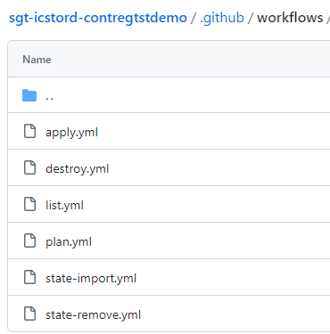

## Introduction

This page contains related information about how to use the different Terraform Workflows currently available on each IaC component.

## What is a Terraform Workflow?

A terraform workflow is intended to provide the ability to create, manage and destroy infrastructure as code using reusable workflows and github actions. These terraform workflows are automatically created as part of the IaC Gluon Component creation.
Please, note that to make the Terraform Workflows work, you need to check that you meet all the requirements listed in the [Component Pre-requisites](./component-prerequisites.md) section first.
The workflows currently available on each IaC Component repository are: 

- [Terraform plan](./terraform-plan.md): Used to create an execution plan, which allow to preview the changes that Terraform plans to make to the infrastructure. 
- [Terraform apply](./terraform-apply.md): Used to execute the actions proposed in the Terraform plan to create or update infrastructure. 
- [Terraform destroy](./terraform-destroy.md): Used to destroy all remote objects managed by a particular Terraform configuration. 
- [Terraform list](./terraform-list.md): Used to list all resources in the state file. 
- [Terraform state import](./terraform-state-import.md): Used to import existing resources to terraform state.
- [Terraform state remove](./terraform-state-remove.md): Used to remove resources from terraform state.

## Where are located Component Terraform Workflows?

All the terraform workflows are created by default as part of the Gluon IaC Component creation and they are located in the /.github/workflows/ folder of the repository:

 

- ### Terraform Plan

    ---

    This page contains a guide about how to use the Terraform Plan Workflow on an IaC Component.

     

    ---

    [:material-arrow-right: Terraform Plan](./terraform-plan.md){ .md-button }

- ### Terraform Apply

    ---

    This page contains a guide about how to use the Terraform Apply Workflow on an IaC Component.

     

    ---

    [:material-arrow-right: Terraform Apply](./terraform-apply.md){ .md-button }

- ### Terraform Destroy

    ---

    This page contains a guide about how to use the Terraform Destroy Workflow on an IaC Component.

     

    ---

    [:material-arrow-right: Terraform Destroy](./terraform-destroy.md){ .md-button }

- ### Terraform List

    ---

    This page contains a guide about how to use the Terraform List Workflow on an IaC Component.

     

    ---

    [:material-arrow-right: Terraform List](./terraform-list.md){ .md-button }

- ### Terraform State Import

    ---

    This page contains a guide about how to use the Terraform State Import Workflow on an IaC Component.

     

    ---

    [:material-arrow-right: Terraform State Import](./terraform-state-import.md){ .md-button }

- ### Terraform State Remove

    ---

    This page contains a guide about how to use the Terraform State Remove Workflow on an IaC Component.

     

    ---

    [:material-arrow-right: Terraform State Remove](./terraform-state-remove.md){ .md-button }

