# Terraform Apply

## Introduction

This document provides a complete and detailed overview about how to use the user Terraform Apply workflow.

## Workflow description

The Terraform Apply workflow is located in the `.github/workflows` folder of the Gluon IaC component. It can be identified as the `apply.yaml` file among the other possible workflows stored there.
This workflow is configured to be run on demand or once a push is done in the develop/development or main/master branches, as we can see in the `on` section of the workflow file.

```yaml
on:
  workflow_dispatch:
    inputs:
      runner:
        type: string
        description: Include the runner ('ansible-runner' by default)
        default: ansible-runner
      environment:
        type: choice
        description: Choose the environment
        options:
          - certification
          - preproduction
          - production
  push:
    branches:
      - main
      - develop
      - development
```

Once the input parameters are properly set, the workflow executes the terraform plan IaC reusable workflow with these parameters and, if the terraform plan is successful, the terraform apply IaC reusable workflow will
be also executed with the tfvars added into the Gluon IaC Component using the archetype hardcoded in the <code>archetype</code> variable (each Gluon IaC Component has its corresponding archetype hardcoded here).

!!! info
    If the organization is not provided as part of the hardcoded 'archetype' variable (only repository name), the organization will be defaulted to 'santander-group-shared-assets'.
    If another organization needs to be used, it must be indicated in this variable as follows:

    ```yaml
        archetype: org-example/repo-example
        archetype: santander-group-gluon/repo-name
    ```

```yaml
jobs:
  terraform_plan:
    name: Run terraform plan
    uses: santander-group-shared-assets/gln-iac-terraform-plan-workflow/.github/workflows/terraform-plan.yml@v1
    with:
      environment: ${{ github.event_name == 'push' && '' || inputs.environment }}
      runner: ${{ github.event_name == 'push' && 'ansible-runner' || inputs.runner }}
      archetype: gln-iac-terraform-objectstorage-archetype
    secrets: inherit

  terraform_apply:
    name: Run terraform apply
    needs: terraform_plan
    uses: santander-group-shared-assets/gln-iac-terraform-apply-workflow/.github/workflows/terraform-apply.yml@v1
    with:
      archetype: gln-iac-terraform-objectstorage-archetype
      environment: ${{ github.event_name == 'push' && '' || inputs.environment }}
      runner: ${{ github.event_name == 'workflow_dispatch' && inputs.runner || 'ansible-runner' }}
    secrets: inherit
```

## Input parameters

This workflow is configured to receive the following input parameters:
<ul>
  <li><strong>Version:</strong> The archetype version that must be used to run the workflow. This parameter is required. The archetype version must be in the '.gluon/cd/<code>environment</code>/config.yml' file,
  where <code>environment</code> must be 'dev', 'pre' or 'pro', as 'archetype-name_arch_version'.
  This file is created pointing to the latest version of the archetype by default, but this version can be changed in case this is not the version that wants to be used for the Terraform Workflow.
  If this file is deleted and is not present in the '.gluon/cd/<code>environment</code>' path, the archetype version to be used will also be the latest released version of the archetype.
  In addition to this, a message will appear during the execution of the Terraform workflows to warn the user about this situation. Here below we can see an example of 'config.yml' file content:
</ul>
```yaml
objectstorage_arch_version: "v1.0.0"
```
or
```yaml
objectstorage_arch_version: "develop"
```
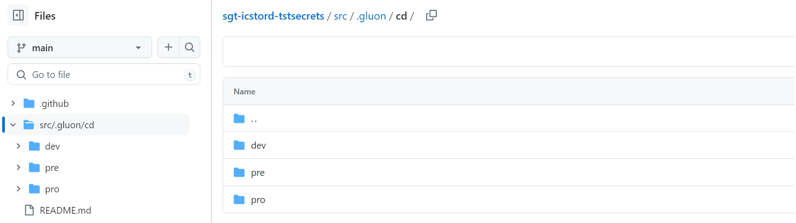
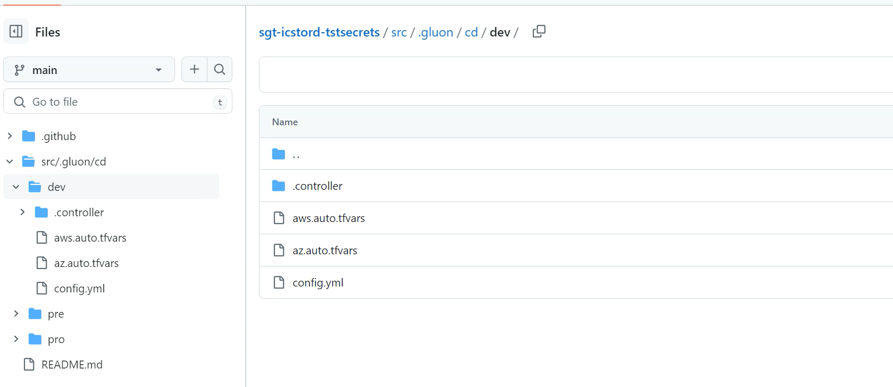
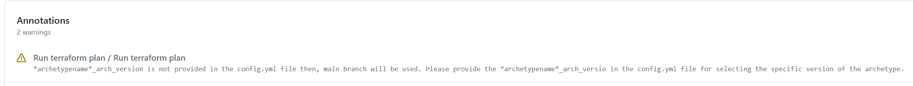
<ul>
    <li><strong>Branch:</strong> The IaC Component repository branch that must be used to run the workflow. This parameter is required.
    <li><strong>Runner:</strong> The runner that will be used to run the workflow. By default, the "ansible-runner" is used.
    Please, keep in  mind that the runners used must have terraform and ansible installed on it, as well as connectivity with the PostgreSQL database that will store the tfstate generated during the deployment.
    <li><strong>Environment:</strong> Parameter provided to identify the environment to be used to run the workflow, including the configuration files. This parameter is required. You can choose between 'certification' ('dev'), 'preproduction' ('pre')
    and 'production' ('pro') environments.
    In 'on push' executions, the environment is automatically set depending on the branch where the push was done:
        <ul>
            <li>If the push was done to the develop/development branch, the environment is set to 'certification'.
            <li>If the push was done to the main/master branch, the environment is set to 'preproduction'.
        </ul>
    In 'on demand' executions, you must manually set the environment taking into account the following considerations:
        <ul>
            <li>If the workflow is run in the develop/development branch, the environment must be set to 'certification'.
            <li>If the workflow is run in the main/master branch, the environment must be set to 'preproduction' or 'production.
        </ul>
    Otherwise, the workflow will end up with the following error:
```yaml
"There was an error in the Terraform apply step. Environment should match branch [ certification = develop/development branch -- preproduction/production = main/master branch]"
```
</ul>

## Workflow execution

In order to use this workflow on demand to deploy IaC infrastructure, you must follow the steps below in the Gluon IaC Component repository:

<div class="steps" markdown>

* From the **Actions** tab of the Gluon IaC Component repository, select the workflow **Terraform apply**.<br>
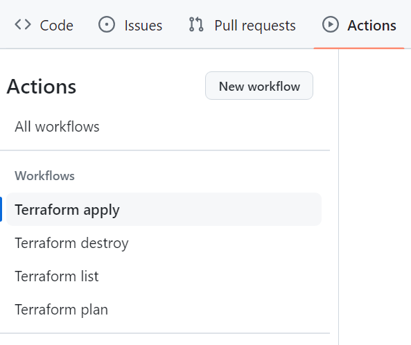

* On the right side of the screen, click on **Run workflow**.
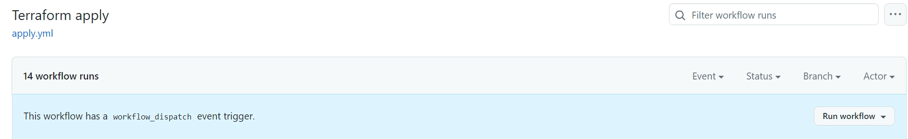

* You will be asked to provide three different inputs:
    * **The branch**: The branch that will be used to run the workflow.
    * **The environment**: The environment where the desired configuration files must be located and the infrastructure must be deployed.
    As explained in the previous section, this can be 'certification', 'preproduction' or 'production' and there is a direct relationship between this attribute and the branch chosen to run the workflow.
    * **The runner**: The runner that will be used to deploy the infrastructure.<br>
    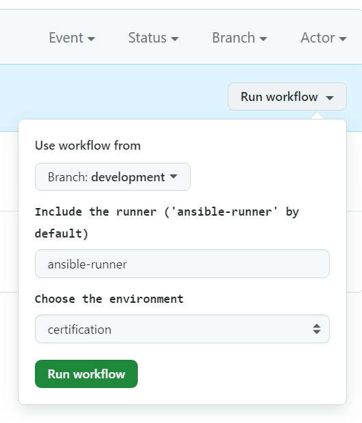
* Once all these input parameters are provided, click on the 'Run workflow' button. The workflow will start running and the execution will be shown in the github console.
Click on the workflow run to see the details of the execution. You will see the different steps executed by the workflow and the corresponding logs.
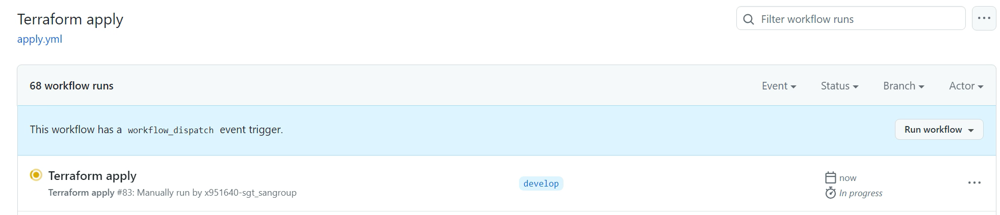
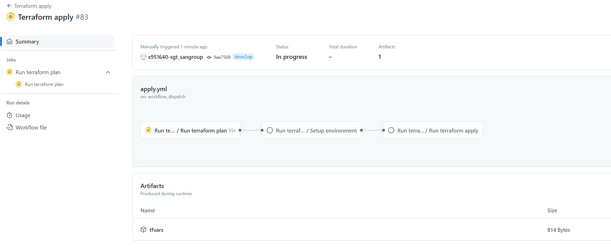
* If the previous terraform plan and setup environment jobs are successful, then the workflow will ask for authorization to finally run the Terraform Apply:
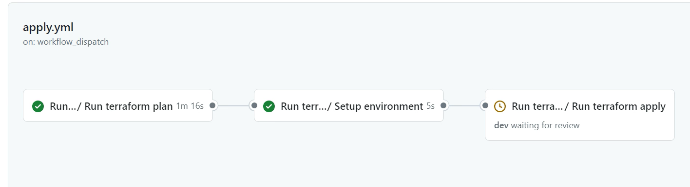
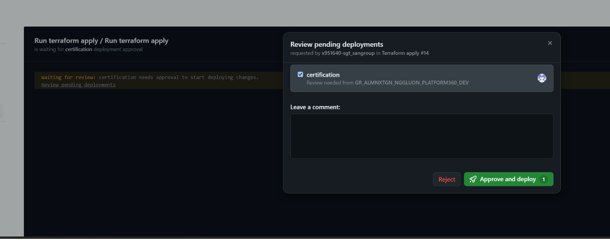
<br>

Click on 'Approve and deploy', checking that the environment is the correct one and the terraform apply will start.

## Output parameters

The Terraform Apply workflow generates several Github artifacts associated with each run. The following artifacts can be found on each Terraform Apply workflow execution:
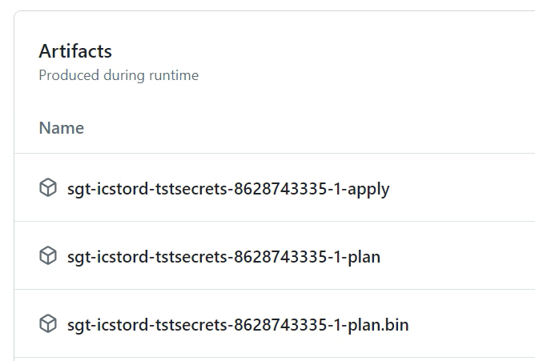
<ul>
    <li><strong><code>repository_name</code>-<code>github_run_ID</code>-apply:</strong> The logs of the Terraform Apply execution in human-readable format.
    <li><strong><code>repository_name</code>-<code>github_run_ID</code>-plan:</strong> The logs of the Terraform Plan execution in human-readable format.
    <li><strong><code>repository_name</code>-<code>github_run_ID</code>-plan.bin:</strong> The logs of the Terraform Plan execution in binary format. This is the Terraform plan binary file that will be used in the Terraform apply.
</ul>

## Workflow results

The workflow results are shown during the execution, all the jobs results are shown in the github action console:
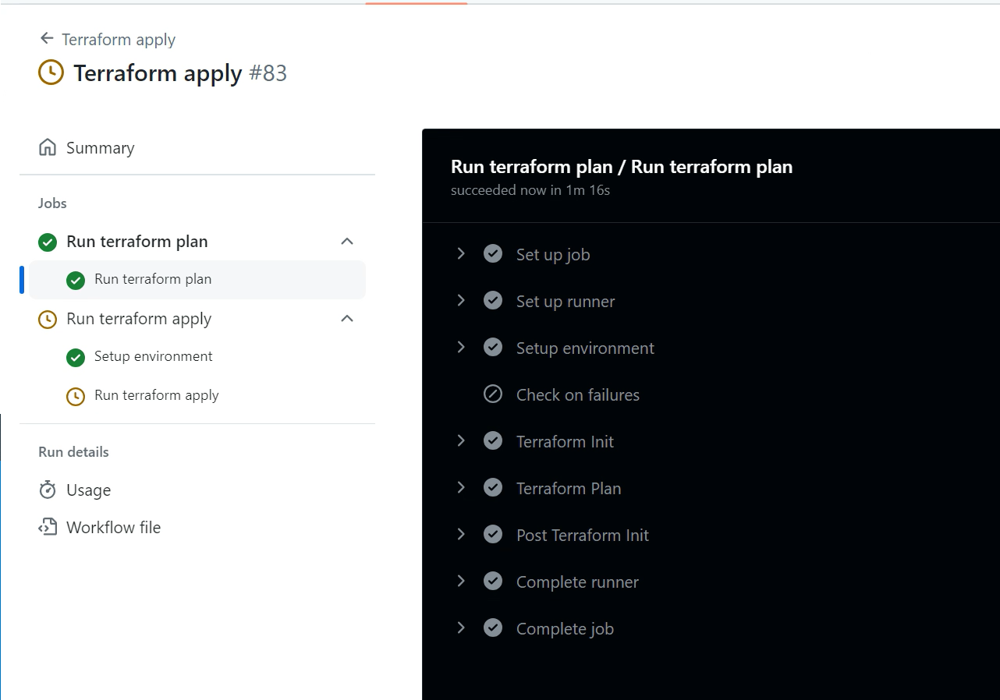<br>
If all the jobs that are part of the workflow are successful, the execution will be marked as successful and the green check will be shown, otherwise, the execution will be marked as failed and the red check will be shown:
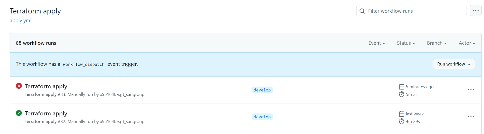

</div>
