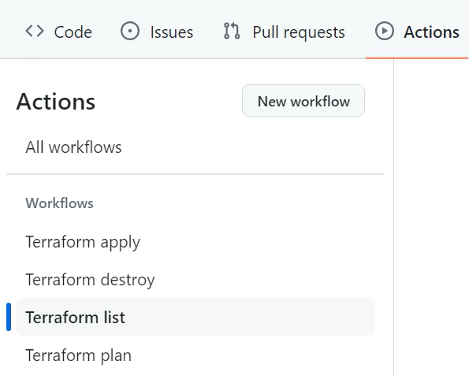
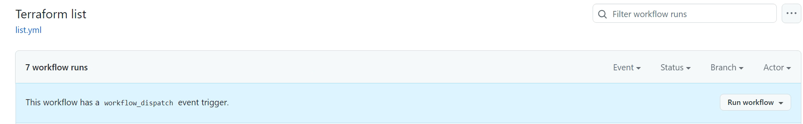
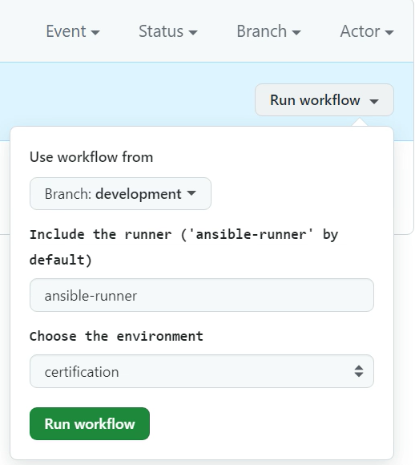
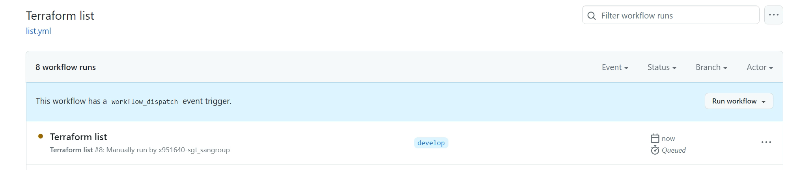
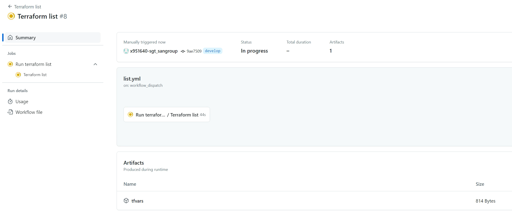
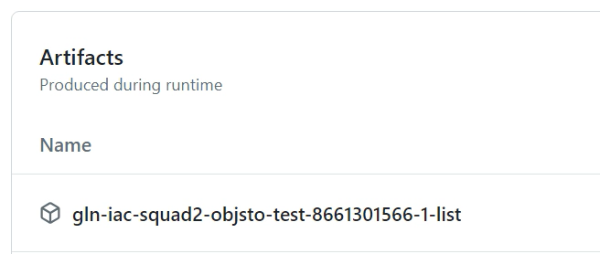
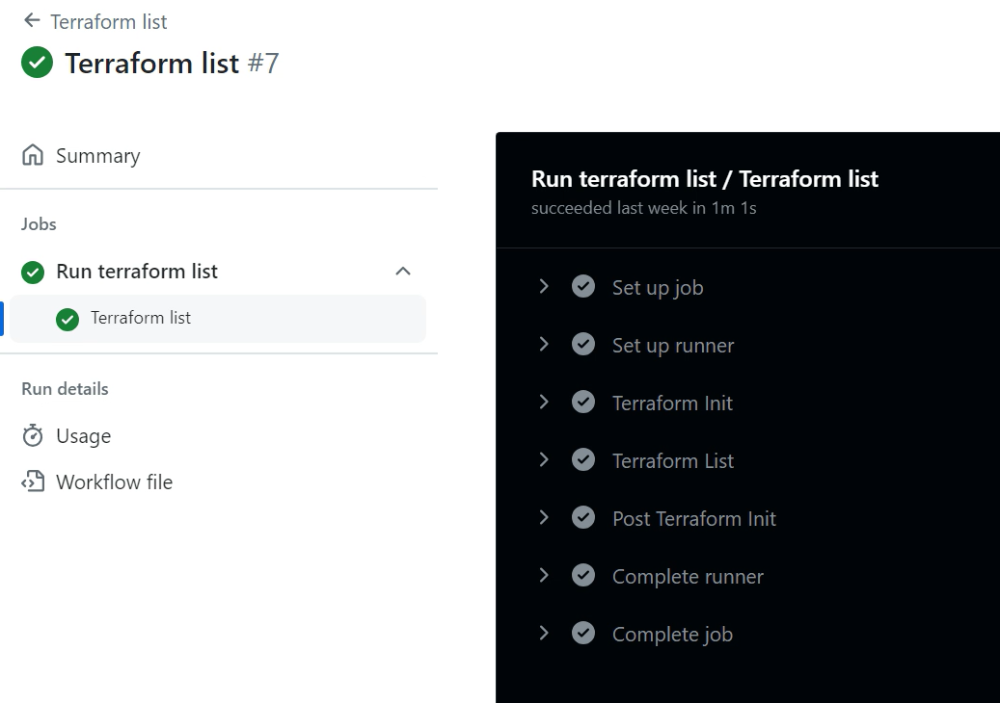
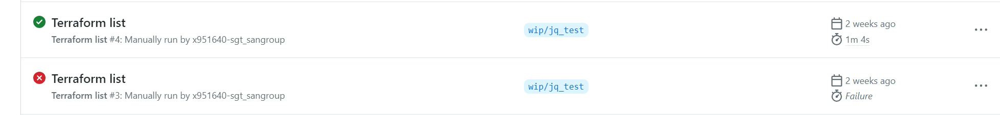

# Terraform List

## Introduction

This document provides a complete and detailed overview about how to use the user Terraform List workflow.

## Workflow description

The Terraform list workflow is located in the `.github/workflows` folder of the Gluon IaC component. It can be identified as the `list.yaml` file among the other possible workflows stored there.
This workflow is configured to be run on demand, as we can see in the `on` section of the workflow file.

```yaml
on:
  workflow_dispatch:
    inputs:
      runner:
        type: string
        description: Include the runner ('ansible-runner' by default)
        default: ansible-runner
      environment:
        type: choice
        description: Choose the environment
        options:
          - certification
          - preproduction
          - production

```

Once the input parameters are properly set, the workflow executes the terraform list IaC reusable workflow with these parameters and the tfstate for the Gluon IaC Component stored into the PostgreSQL database using the
archetype hardcoded in the <code>archetype</code> variable (each Gluon IaC Component has its corresponding archetype hardcoded here).

!!! info
    If the organization is not provided as part of the hardcoded 'archetype' variable (only repository name), the organization will be defaulted to 'santander-group-shared-assets'.
    If another organization needs to be used, it must be indicated in this variable as follows:

    ```yaml
        archetype: org-example/repo-example
        archetype: santander-group-gluon/repo-name
    ```

```yaml
jobs:
jobs:
  terraform_list:
    name: Run terraform list
    uses: santander-group-shared-assets/gln-iac-terraform-list-workflow/.github/workflows/terraform-list.yml@v1
    with:
      archetype: gln-iac-terraform-objectstorage-archetype
      environment: ${{ inputs.environment }}
      runner: ${{ inputs.runner }}
    secrets: inherit
```

## Input parameters

This workflow is configured to receive the following input parameters:
<ul>
  <li><strong>Version:</strong> The archetype version that must be used to run the workflow. This parameter is required. The archetype version must be in the '.gluon/cd/<code>environment</code>/config.yml' file,
  where <code>environment</code> must be 'dev', 'pre' or 'pro', as 'archetype-name_arch_version'.
  This file is created pointing to the latest version of the archetype by default, but this version can be changed in case this is not the version that wants to be used for the Terraform Workflow.
  If this file is deleted and is not present in the '.gluon/cd/<code>environment</code>' path, the archetype version to be used will also be the latest released version of the archetype.
  In addition to this, a message will appear during the execution of the Terraform workflows to warn the user about this situation. Here below we can see an example of 'config.yml' file content:
</ul>
```yaml
objectstorage_arch_version: "v1.0.0"
```
or
```yaml
objectstorage_arch_version: "develop"
```


<ul>
    <li><strong>Branch:</strong> The IaC Component repository branch that must be used to run the workflow. This parameter is required.
    <li><strong>Runner:</strong> The runner that will be used to run the workflow. By default, the "ansible-runner" is used.
    Please, keep in  mind that the runners used must have terraform and ansible installed on it, as well as connectivity with the PostgreSQL database that will store the tfstate generated during the deployment.
    <li><strong>Environment:</strong> Parameter provided to identify the environment to be used to run the workflow, including the configuration files. This parameter is required. You can choose between 'certification' ('dev'), 'preproduction' ('pre')
    and 'production' ('pro') environments.
</ul>

## Workflow execution

In order to use this workflow on demand to make a Terraform state list, you must follow the steps below in the Gluon IaC Component repository:

<div class="steps" markdown>

* From the **Actions** tab of the Gluon IaC Component repository, select the workflow **Terraform list**.<br>


* On the right side of the screen, click on **Run workflow**.


* You will be asked to provide three different inputs:
    <ul>
    <li><strong>The branch:</strong> The branch that will be used to run the workflow.
    <li><strong>The environment:</strong> The environment where the desired configuration files must be located and the infrastructure is deployed.
    <li><strong>The runner:</strong> The runner that will be used to make the terraform state list.
    </ul>
    
* Once all these input parameters are provided, click on the 'Run workflow' button. The workflow will start running and the execution will be shown in the github console.
Click on the workflow run to see the details of the execution. You will see the different steps executed by the workflow and the corresponding logs.



## Output parameters

The Terraform list workflow generates several Github artifacts associated with each run. The following artifacts can be found on each Terraform list workflow execution:

<ul>
    <li><strong><code>repository_name</code>-<code>github_run_ID</code>-list:</strong> The result of the terraform state list in human-readable format.
</ul>

## Workflow results

The workflow results are shown during the execution, all the jobs results are shown in the github action console:
<br>
If all the jobs that are part of the workflow are successful, the execution will be marked as successful and the green check will be shown, otherwise, the execution will be marked as failed and the red check will be shown:


</div>
