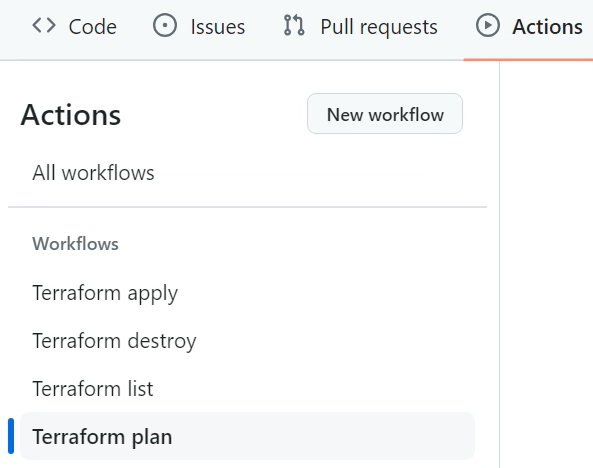
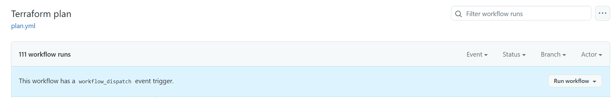
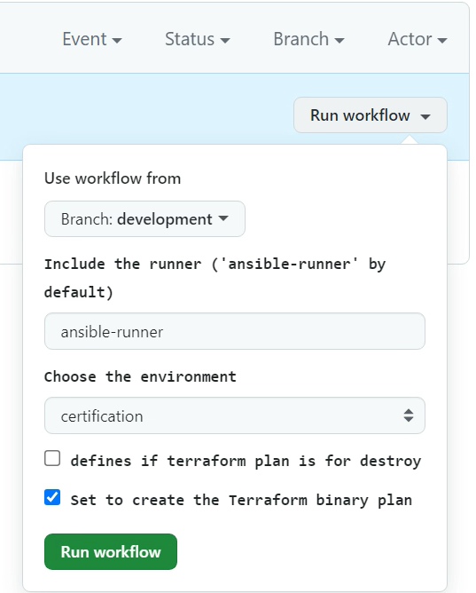
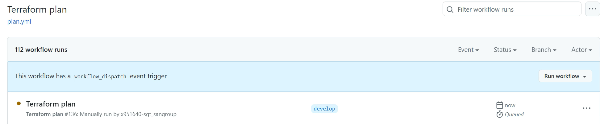
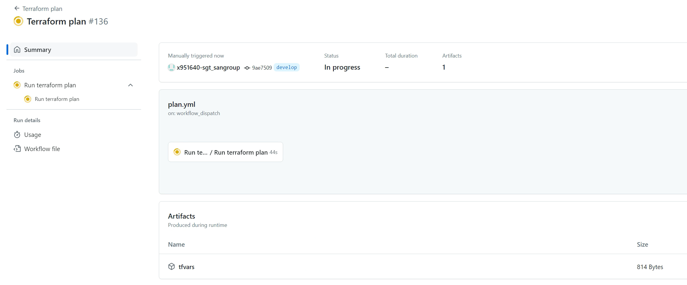
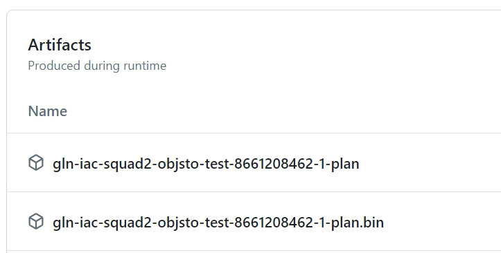
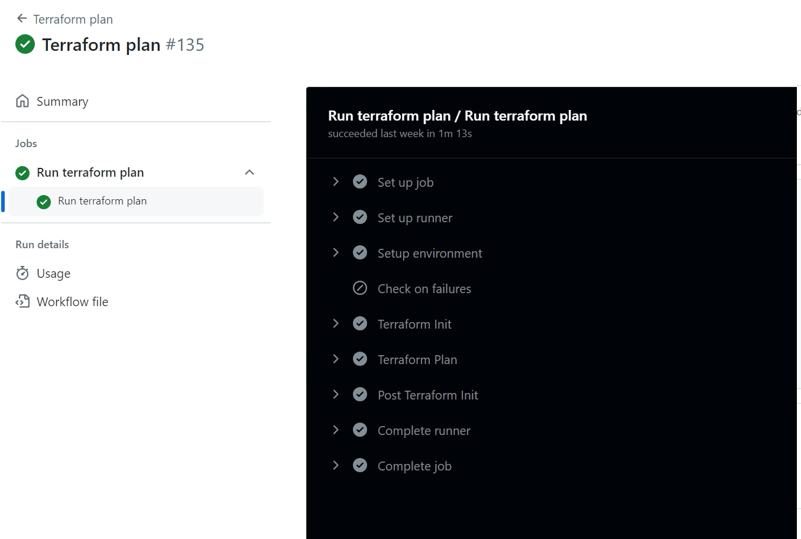
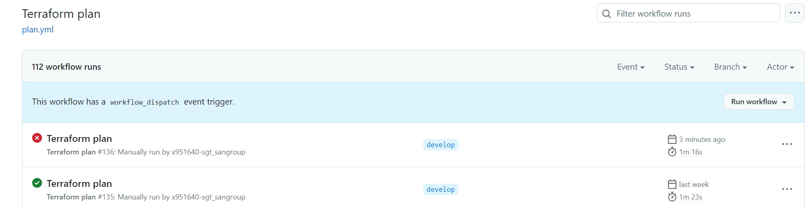

# Terraform Plan

## Introduction

This document provides a complete and detailed overview about how to use the user Terraform Plan workflow.

## Workflow description

The Terraform Plan workflow is located in the `.github/workflows` folder of the Gluon IaC component. It can be identified as the `plan.yaml` file among the other possible workflows stored there.
This workflow is configured to be run on demand or once a pull request is done in the develop/development or main/master branches, as we can see in the `on` section of the workflow file.

```yaml
on:
  workflow_dispatch:
    inputs:
      runner:
        type: string
        description: Include the runner ('ansible-runner' by default)
        default: ansible-runner
      environment:
        type: choice
        description: Choose the environment
        options:
          - certification
          - preproduction
          - production
      destroy:
        type: boolean
        description: defines if terraform plan is for destroy
        default: false
      generate_binary:
        description: "Set to create the Terraform binary plan"
        type: boolean
        default: true
  pull_request:
    types: opened
    branches:
      - main
      - develop
      - development
```

Once the input parameters are properly set, the workflow executes the terraform plan IaC reusable workflow with these parameters and the tfvars added into the Gluon IaC Component using the archetype hardcoded in
the <code>archetype</code> variable (each Gluon IaC Component has its corresponding archetype hardcoded here).

!!! info
    If the organization is not provided as part of the hardcoded 'archetype' variable (only repository name), the organization will be defaulted to 'santander-group-shared-assets'.
    If another organization needs to be used, it must be indicated in this variable as follows:

    ```yaml
        archetype: org-example/repo-example
        archetype: santander-group-gluon/repo-name
    ```

```yaml
jobs:
  terraform_plan:
    name: Run terraform plan
    uses: santander-group-shared-assets/gln-iac-terraform-plan-workflow/.github/workflows/terraform-plan.yml@v1
    with:
      archetype: gln-iac-terraform-objectstorage-archetype
      environment: ${{ github.event_name == 'pull_request' && '' || inputs.environment }}
      runner: ${{ github.event_name == 'pull_request' && 'ansible-runner' || inputs.runner }}
      destroy: ${{ github.event_name == 'workflow_dispatch' && inputs.destroy }}
      generate_binary: ${{ github.event_name == 'workflow_dispatch' && inputs.generate_binary }}
    secrets: inherit
```

## Input parameters

This workflow is configured to receive the following input parameters:
<ul>
  <li><strong>Version:</strong> The archetype version that must be used to run the workflow. This parameter is required. The archetype version must be in the '.gluon/cd/<code>environment</code>/config.yml' file,
  where <code>environment</code> must be 'dev', 'pre' or 'pro', as 'archetype-name_arch_version'.
  This file is created pointing to the latest version of the archetype by default, but this version can be changed in case this is not the version that wants to be used for the Terraform Workflow.
  If this file is deleted and is not present in the '.gluon/cd/<code>environment</code>' path, the archetype version to be used will also be the latest released version of the archetype.
  In addition to this, a message will appear during the execution of the Terraform workflows to warn the user about this situation. Here below we can see an example of 'config.yml' file content:
</ul>
```yaml
objectstorage_arch_version: "v1.0.0"
```
or
```yaml
objectstorage_arch_version: "develop"
```


<ul>
    <li><strong>Branch:</strong> The IaC Component repository branch that must be used to run the workflow. This parameter is required.
    <li><strong>Runner:</strong> The runner that will be used to run the workflow. By default, the "ansible-runner" is used.
     Please, keep in  mind that the runners used must have terraform and ansible installed on it, as well as connectivity with the PostgreSQL database that will store the tfstate generated during the deployment.
    <li><strong>Environment:</strong> Parameter provided to identify the environment to be used to run the workflow, including the configuration files. This parameter is required. You can choose between 'certification' ('dev'),
    'preproduction' ('pre') and 'production' ('pro') environments.
    In 'on pull_request' executions, the environment is automatically set depending on the branch where the pull request was done:
        <ul>
            <li>If the pull request was done to the develop/development branch, the environment is set to 'certification'.
            <li>If the pull request was done to the main/master branch, the environment is set to 'preproduction'.
        </ul>
    In 'on demand' executions, you must manually set the environment taking into account the following considerations:
        <ul>
            <li>If the workflow is run in the develop/development branch, the environment must be set to 'certification'.
            <li>If the workflow is run in the main/master branch, the environment must be set to 'preproduction' or 'production.
        </ul>
    Otherwise, the workflow will end up with the following error:
```yaml
"There was an error in the Terraform plan step. Plan for 'preproduction'/'production' could only be run from main branch and plan for 'certification' should be run from any brach different that main."
```
</ul>

## Workflow execution

In order to use this workflow on demand to make a Terraform plan, you must follow the steps below in the Gluon IaC Component repository:

<div class="steps" markdown>

* From the **Actions** tab of the Gluon IaC Component repository, select the workflow **Terraform plan**.<br>


* On the right side of the screen, click on **Run workflow**.


* You will be asked to provide three different inputs:
    <ul>
    <li><strong>The branch:</strong> The branch that will be used to run the workflow.
    <li><strong>The environment:</strong> The environment where the desired configuration files must be located and the infrastructure must be deployed.
    As explained in the previous section, this can be 'certification', 'preproduction' or 'production' and there is a direct relationship between this attribute and the branch chosen to run the workflow.
    <li><strong>The runner:</strong> The runner that will be used to deploy the infrastructure.
    </ul>
    Apart of these three inputs, two options can be checked/unchecked:
    <ul>
    <li><strong>defines if terraform plan is for destroy:</strong> This option is used to confirm that the Terraform plan will be used in a Terraform destroy, in this way the plan will show the destroy of the resources contained in the tfstate,
    instead of showing the creation/modification of new/existing ones (Terraform apply). This option is disabled by default, which means that a Terraform plan for a Terraform apply is done by default.
    <li><strong>Set to create the terraform binary plan:</strong> This option is used to confirm the Github artifact creation with the logs of the terraform plan, in binary format, to be used in a later Terraform apply.
    This option is enabled by default, which means that this Github artifact is created by default.
    </ul>
    
* Once all these input parameters are provided, click on the 'Run workflow' button. The workflow will start running and the execution will be shown in the github console. Click on the workflow run to see the details of the execution.
You will see the different steps executed by the workflow and the corresponding logs.



## Output parameters

The Terraform plan workflow generates several Github artifacts associated with each run. The following artifacts can be found on each Terraform Plan workflow execution:

<ul>
    <li><strong><code>repository_name</code>-<code>github_run_ID</code>-plan:</strong> The logs of the Terraform Plan execution in human-readable format.
    <li><strong><code>repository_name</code>-<code>github_run_ID</code>-plan.bin:</strong> The logs of the Terraform Plan execution in binary format. This is the Terraform plan binary file that can be used in a later Terraform apply/destroy.
</ul>

## Workflow results

The workflow results are shown during the execution, all the jobs results are shown in the github action console:
<br>
If all the jobs that are part of the workflow are successful, the execution will be marked as successful and the green check will be shown, otherwise, the execution will be marked as failed and the red check will be shown:


</div>
