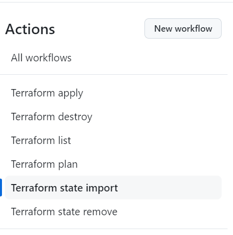
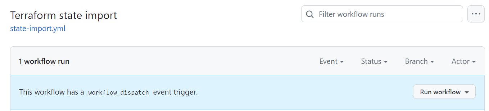
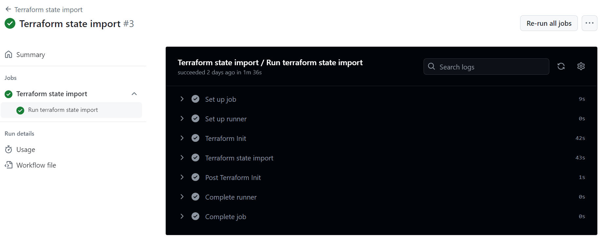
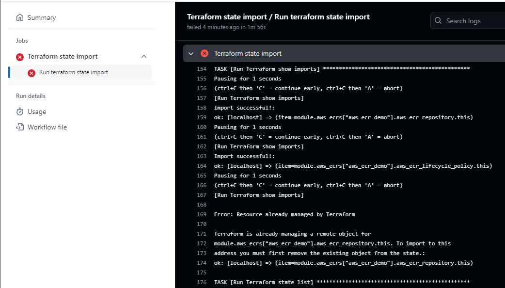

# Terraform State Import

## Introduction

This document provides a complete and detailed overview about how to use the Terraform state import workflow. More information about terraform import can be found in [official terraform documentation](https://developer.hashicorp.com/terraform/cli/import).

## Workflow description

The Terraform import workflow is located in the `.github/workflows` folder of the Gluon IaC component. It can be identified as the `state-import.yaml` file among the other possible workflows stored there.
This workflow is configured to be run on demand, as we can see in the `on` section of the workflow file.

```yaml
on:
  workflow_dispatch:
    inputs:
      runner:
        type: string
        description: Include the runner ('ansible-runner' by default)
        default: ansible-runner
      environment:
        type: choice
        description: Choose the environment
        options:
          - certification
          - preproduction
          - production
        default: certification

```

Once the input parameters are properly set, the workflow executes the terraform state import IaC reusable workflow with these parameters and uses the same tfstate created earlier
with [Terraform apply](./terraform-apply.md) workflow and stored into the PostgreSQL database and the archetype hardcoded in the <code>archetype</code> variable (each Gluon IaC Component has its corresponding archetype hardcoded here).

!!! info
    If the organization is not provided as part of the hardcoded 'archetype' variable (only repository name), the organization will be defaulted to 'santander-group-shared-assets'.
    If another organization needs to be used, it must be indicated in this variable as follows:

    ```yaml
        archetype: org-example/repo-example
        archetype: santander-group-gluon/repo-name
    ```

```yaml
jobs:
    terraform_state_import:
        name: Terraform state import
        uses: santander-group-shared-assets/gln-iac-terraform-import-workflow/.github/workflows/terraform-import.yml@v1
        secrets: inherit
        with:
            environment: ${{ inputs.environment }}
            runner: ${{ inputs.runner }}
            repository: ${{ github.repository }}
            archetype: gln-iac-terraform-containerregistry-archetype
```

## Input parameters

This workflow is used to import to terraform state resources to be managed/updated later with [Terraform apply](./terraform-apply.md) or [Terraform destroy](./terraform-destroy.md) workflows.
It uses the same input parameters as terraform apply/destroy workflows:

<ul>
  <li><strong>Version:</strong> The archetype version that must be used to run the workflow. This parameter is required. The archetype version must be in the '.gluon/cd/<code>environment</code>/config.yml' file,
  where <code>environment</code> must be 'dev', 'pre' or 'pro', as 'archetype-name_arch_version'.
  <li><strong>Branch:</strong> The IaC Component repository branch that must be used to run the workflow. This parameter is required.
  <li><strong>Runner:</strong> The runner that will be used to run the workflow. By default, the "ansible-runner" is used.
  Please, keep in  mind that the runners used must have terraform and ansible installed on it, as well as connectivity with the PostgreSQL database where tfstate is stored.
  <li><strong>Environment:</strong> Parameter provided to identify the environment to be used to run the workflow, including the configuration files. This parameter is required. You can choose between 'certification' ('dev'), 'preproduction' ('pre')
  and 'production' ('pro') environments.
</ul>

And needs these additional configuration files to work:

<ul>
  <li><strong>import.yml:</strong> This file must be added in the '.gluon/cd/<code>environment</code>/import.yml' component repository path. It contains the list of the resources that want to be imported. The format expected would be:
</ul>

```yaml
imports:
  "main_resource_id001":
    - tf_resource: 'resource_address001'
      cloud_id: 'resource_id001'
    - tf_resource: 'resource_address002'
      cloud_id: 'resource_id002'
     - tf_resource: 'resource_address003'
      cloud_id: 'resource_id003'
  "main_resource_id002":
    - tf_resource: 'resource_address001'
      cloud_id: 'resource_id001'
```

Here below an example of this import.yml file is shown:

```yaml
imports:
    "aws_containerregistry_demo":
        - tf_resource: 'module.aws_containerregistry["aws_containerregistry_demo"].aws_containerregistry_repository.this'
          cloud_id: 'demo_17june'
        - tf_resource: 'module.aws_containerregistry["aws_containerregistry_demo"].aws_containerregistry_lifecycle_policy.this'
          cloud_id: 'demo_17june'
```

<ul>
  <li><strong>tfvars:</strong>  This file is located in the '.gluon/cd/<code>environment</code>/<code>aws/az</code>.auto.tfvars.tfvars' component repository path.
  It must be updated to contain the existing configuration of the resources that want to be imported.
</ul>

  Following the previous example ('import.yaml' file), where a resource with the key 'aws_containerregistry_demo' wanted to be imported, find here below the tfvar example that may be used to import these resources:

```yaml
aws_containerregistry = {
  "aws_containerregistry_1" = {...}

  "aws_containerregistry_demo" = {
    # Naming
    name = "demo_17june"

    # Tagging
    tags = {
      test_tag    = "demo"
      environment = "dev"
      product     = "Gluon ECR"
    }

    #   Security Level
    security_level             = "sa"
    repository_encryption_type = "KMS"
    #repository_kms_key         = ""
  }
  
}
```


<!-- !!! info
    All the configuration parameters that can be used for each component, as well as some tfvars examples can be found in the [Component](../../../components/configuration/iac/index.md) section. -->

## Workflow execution

In order to use this workflow on demand to make a Terraform state import, you must follow the steps below in the Gluon IaC Component repository:

<div class="steps" markdown>

* From the **Actions** tab of the Gluon IaC Component repository, select the workflow **Terraform state import**.<br>


* On the right side of the screen, click on **Run workflow**.


* You will be asked to provide three different inputs:
    <ul>
    <li><strong>The branch:</strong> The branch that will be used to run the workflow.
    <li><strong>The environment:</strong> The environment where the desired configuration files must be located and the infrastructure is deployed.
    <li><strong>The runner:</strong> The runner that will be used to make the terraform state import.
    </ul>
    
* Once all these input parameters are provided, click on the 'Run workflow' button. The workflow will start running and the execution will be shown in the github console.
Click on the workflow run to see the details of the execution. You will see the different steps executed by the workflow and the corresponding logs.

## Output parameters

The Terraform State Import workflow doesn't generate any Github output artifacts.

## Workflow results

The workflow results are shown during the execution, all the jobs results are shown in the github action console:


The execution will be marked as failed and the red check will be shown if at least one resource import operation failed.


</div>
