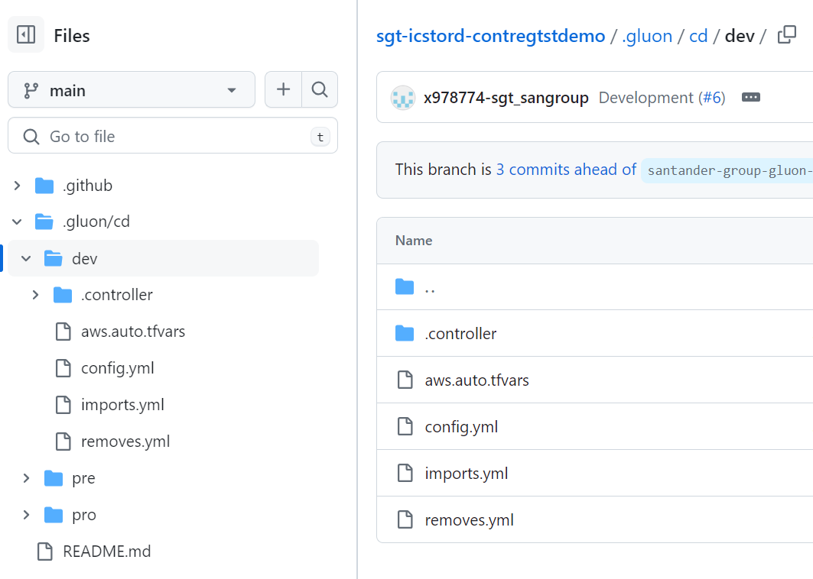
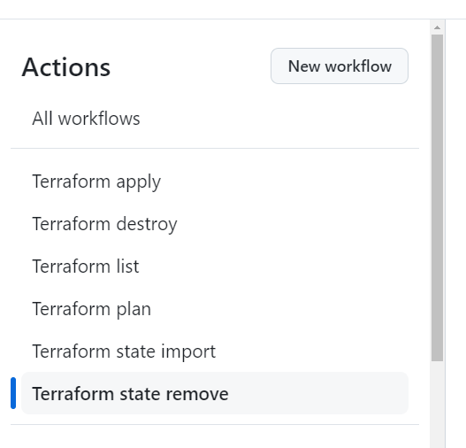
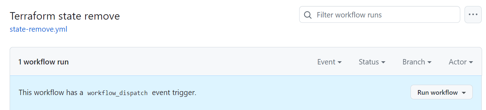
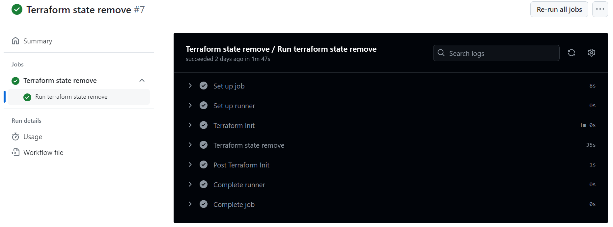
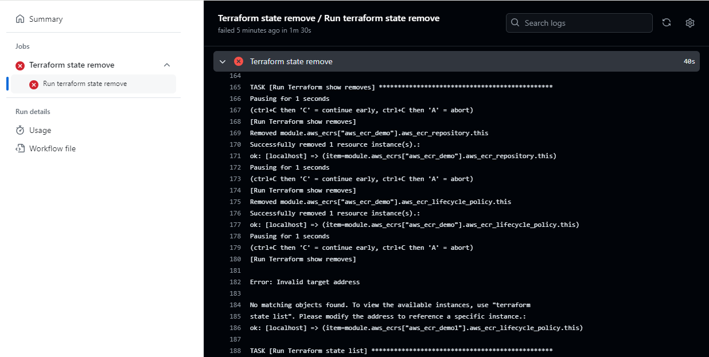

# Terraform State Remove

## Introduction

This document provides a complete and detailed overview about how to use the user Terraform state remove workflow.
More information about terraform remove can be found in [official terraform documentation](https://developer.hashicorp.com/terraform/cli/commands/state/rm).

## Workflow description

The Terraform state remove workflow is located in the `.github/workflows` folder of the Gluon IaC component. It can be identified as the `state-remove.yaml` file among the other possible workflows stored there.
This workflow is configured to be run on demand, as we can see in the `on` section of the workflow file.

```yaml
on:
  workflow_dispatch:
    inputs:
      runner:
        type: string
        description: Include the runner ('ansible-runner' by default)
        default: ansible-runner
      environment:
        type: choice
        description: Choose the environment
        options:
          - certification
          - preproduction
          - production

```

Once the input parameters are properly set, the workflow executes the terraform state remove IaC reusable workflow with these parameters
and uses the same tfstate created earlier with [Terraform apply](./terraform-apply.md) workflow
and stored into the PostgreSQL database and the archetype hardcoded in the <code>archetype</code> variable (each Gluon IaC Component has its corresponding archetype hardcoded here).

!!! info
    If the organization is not provided as part of the hardcoded 'archetype' variable (only repository name), the organization will be defaulted to 'santander-group-shared-assets'.
    If another organization needs to be used, it must be indicated in this variable as follows:

    ```yaml
        archetype: org-example/repo-example
        archetype: santander-group-gluon/repo-name
    ```

```yaml
jobs:
    terraform_state_remove:
        name: Terraform state remove
        uses: santander-group-shared-assets/gln-iac-terraform-remove-workflow/.github/workflows/terraform-state-remove.yml@v1
        secrets: inherit
        with:
            environment: ${{ inputs.environment }}
            runner: ${{ inputs.runner }}
            repository: ${{ github.repository }}
            archetype: gln-iac-terraform-containerregistry-archetype
```

## Input parameters

This workflow is used to remove from terraform state resources deployed with [Terraform apply](./terraform-apply.md).
It uses the same input parameters as terraform apply workflow:

<ul>
  <li><strong>Version:</strong> The archetype version that must be used to run the workflow. This parameter is required. The archetype version must be in the '.gluon/cd/<code>environment</code>/config.yml' file,
  where <code>environment</code> must be 'dev', 'pre' or 'pro', as 'archetype-name_arch_version'.
  <li><strong>Branch:</strong> The IaC Component repository branch that must be used to run the workflow. This parameter is required.
  <li><strong>Runner:</strong> The runner that will be used to run the workflow. By default, the "ansible-runner" is used.
  Please, keep in  mind that the runners used must have terraform and ansible installed on it, as well as connectivity with the PostgreSQL database where tfstate is stored.
  <li><strong>Environment:</strong> Parameter provided to identify the environment to be used to run the workflow, including the configuration files. This parameter is required. You can choose between 'certification' ('dev'), 'preproduction' ('pre')
  and 'production' ('pro') environments.
</ul>

And needs these additional configuration files to work:

<ul>
  <li><strong>removes.yml:</strong> This file must be added in the '.gluon/cd/<code>environment</code>/removes.yml' component repository path. It contains the list of the resources that want to be removed from the tfstate. The format expected would be:
</ul>

```yaml
removes:
    - module.az/aws_module-name["resource_key"].resource-address001
    - module.az/aws_module-name["resource_key"].resource-address002
```

Here below an example of this removes.yml file is shown:

```yaml
removes:
    - 'module.aws_containerregistry["aws_containerregistry_dev"].aws_containerregistry_repository.this'
    - 'module.aws_containerregistry["aws_containerregistry_dev"].aws_containerregistry_lifecycle_policy.this'
```



!!! info
    The resource definitions can be found and copied from the output of [Terraform list](./terraform-list.md) workflow.

## Workflow execution

In order to use this workflow on demand to make a Terraform state remove, you must follow the steps below in the Gluon IaC Component repository:

<div class="steps" markdown>

* From the **Actions** tab of the Gluon IaC Component repository, select the workflow **Terraform state remove**.<br>


* On the right side of the screen, click on **Run workflow**.


* You will be asked to provide three different inputs:
    <ul>
    <li><strong>The branch:</strong> The branch that will be used to run the workflow.
    <li><strong>The environment:</strong> The environment where the desired configuration files must be located and the infrastructure is deployed.
    <li><strong>The runner:</strong> The runner that will be used to make the terraform state remove.
    </ul>
    
* Once all these input parameters are provided, click on the 'Run workflow' button. The workflow will start running and the execution will be shown in the github console.
Click on the workflow run to see the details of the execution. You will see the different steps executed by the workflow and the corresponding logs.

## Output parameters

The Terraform State Remove workflow doesn't generate any Github output artifacts.

## Workflow results

The workflow results are shown during the execution, all the jobs results are shown in the github action console:
<br>

The execution will be marked as failed and the red check will be shown if at least one resource remove operation failed.
<br>

</div>
