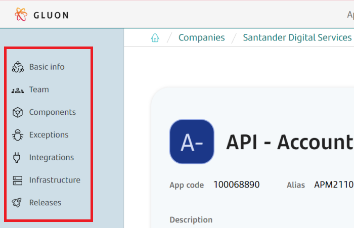

---
hide:
  - toc
  - navigation
title: Gluon Applications
---

**Gluon Applications** is a set of components that need to be released together to provide business value.

This section provides information about the services offered by Gluon Platform to create and deliver **Gluon Applications Cycle**:

{: style="width:70%;align:center"}

1. An **application** is created with the required information.
2. **Teams and users** are onboarded with permissions to work into it.
3. Application **Components** are created to develop and deploy the application.
4. Eventually, **exceptions** are requested to skip a defined control.
5. APIs and external services are **integrated** with the application.
6. **Infrastructure** is required to deploy the application.
7. A Production **Release** is created to deliver Gluon application to the end user.

## **Gluon Platform Application Services**

- ### [:material-toolbox: **Application Management**](./application-management/index.md)

    ---

    How to create and onboard Gluon Applications.

- ### [:fontawesome-solid-people-group: **Users and Teams**](./users-teams/index.md)

    ---

    Manage users, teams, roles and permissions.

- ### [:material-cube-outline: **Components**](./component-management/index.md)

    ---

    Create and add Application Components.

- ### [:material-power-plug-outline: **Exceptions**](./exceptions-management/index.md)

    ---

    Integrate with other APIs.

- ### [:material-server-outline: **Infrastructure as Service**](./iac/index.md)

    ---

    Manage Infrastructure with beauty and happiness.

- ### [:octicons-rocket-16: **Releases**](./release-management/index.md)

    ---

    Manage Application Releases. Explore Zero Touch strategy.

- ### [:simple-githubactions: **CI/CD**](./ci-cd/index.md)

    ---

    Gluon Continuous Integration and Deployment setup.

- ### [:material-check-all: **QA & Testing**](./qatesting/index.md)

    ---

    Gluon Testing services provided.

- ### [:material-security: **Security**](./security/index.md)

    ---

    Gluon Application Security service and practices.

- ### [:material-view-dashboard: **Observability and Insights**](./observability-insights/index.md)

    ---

    Gain insights into your application performance.

