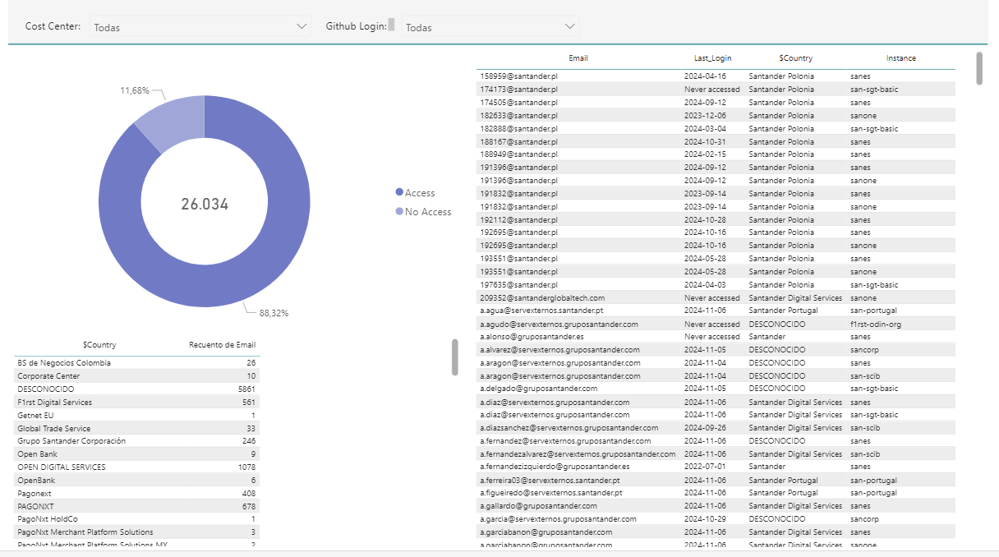

# Atlassian Information

Gluon insights provides the functionality to analyze Atlassian usage, there are two tabs showing the same format, one with Jira usage data and one with Confluence usage data.

On these screens you can see 3 different groups of visualizations:

- A donut chart showing the percentage of users who have accessed the tool, in the center the total number of users is shown.
- A table showing access number by country.
- A table showing the details of all accesses, indicating the user's email, country, last login and Atlassian instance.

 
