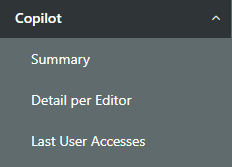
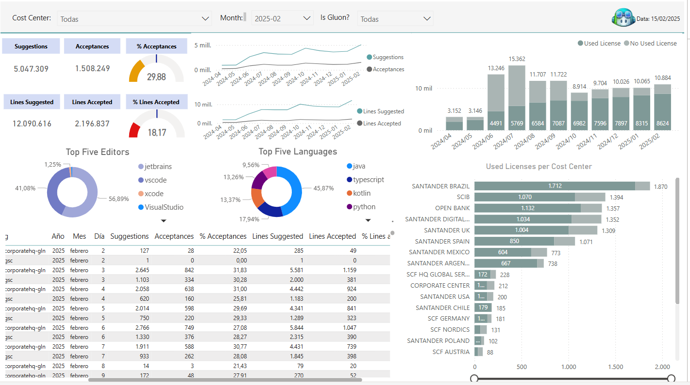
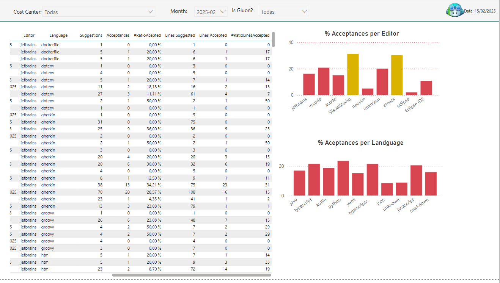
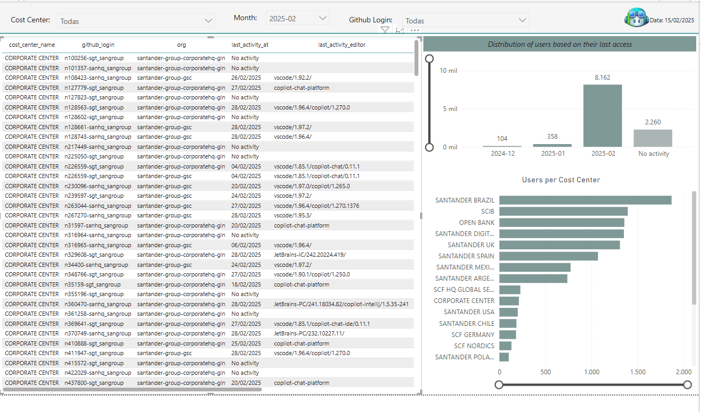

# Copilot Information

Gluon insights provides the functionality to analyze Github Copilot usage, there are three different views, This information is updated weekly. This information is distributed in three tabs, as indicated below

## Summary

In this submenu, the user will be able to consult a summary of the most important values, with the possibility of filtering by cost center and month. The user will also be able to filter by Gluon users.

The information is displayed in different cards, graphs and a summary table

### Cards area

There are six cards with different metrics:

- **Suggestions**: The total number of Copilot code completion suggestions shown to users.
- **Acceptances**: The total number of Copilot code completion suggestions accepted by users.
- **Lines Suggested**: The total number of lines of code completions suggested by Copilot.
- **Lines Accepted**: The total number of lines of code completions accepted by users.
- **% Acceptances**: Acceptances/Suggestions.
- **% Lines Accepted**: Lines Accepted/Lines suggested.

### Graphs area

Additionally, there is a graph area that shows:

- A bar chart with the number of users who have used copilot.
- A bar chart with the number of users who have used copilot per cost center.
- Two line charts showing Suggestion Vs. Acceptances and Lines Suggested Vs. Lines Accepted.
- Two donut charts with suggestions by language and suggestions by editor.

### Table

Finally, to reinforce the information in this tab, a table is shown with all the indicators mentioned above by cost center, organization and date.

Please note that the number of users cannot be aggregated since the same user may have logged in for several days or may have used copilot from multiple organizations.

## Detail per editor

This submenu is reserved for copilot use by editor and by language, with the possibility of filtering by cost center and month. The user will also be able to filter by Gluon users:

- A table with the number of accepted and suggestions by date, cost center, organization, editor and language.

- Two bar chart with the % of acceptances by editor and language.

### Users Last Access

In this tab you can see all licensed users and their last access. If the user has never logged in, they will be marked as "No Activity".

The information is displayed in:

- A table where the user login, cost center, organization and last access date are shown, as well as the last editor used.
- A bar graph with Monthly distribution of license consumption at the selected month.
- A bar graph showing the number of accesses for each cost center.

 
