# Gates Compliance Information

The dashboard Gates Compliance provides information that meets Audit demands for the life cycle (E2E) of deployment and DAST information.

The data is obtained from data sent to Opensearch by the CI/CDs workflows.

You can access it through Gluon Insights Menu.

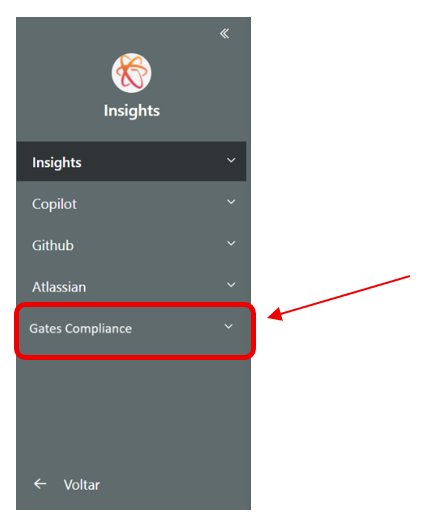

The dashboard is divided into three views: DAST view, Component Version Gates and Application Components Gates.

## Components Version Gates View

Component Version Gates View is divided into three parts: Filters, Graph and Table.

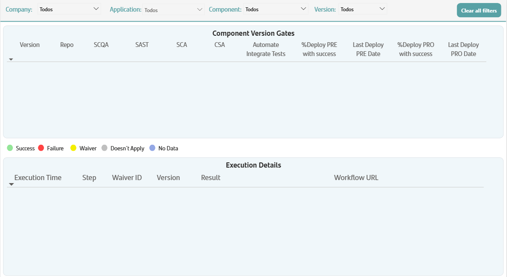

### Filters

In the filter part you must choose Company, Application and Component. Version is optional.

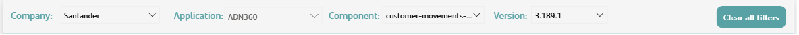

The View initially appears without any filter applied. You must choose a Company, Application and Component to obtain a result. Simply choosing Company and Application don't yield results in the search.

You should use the button Clear All Filters to clear all applied filters before starting a new inquiry.

Note: only components with version sent in the deployment workflows to Opensearch will be presented.

### Graph

The Graph part presents information about all component versions or a specific version as defined in the filter.

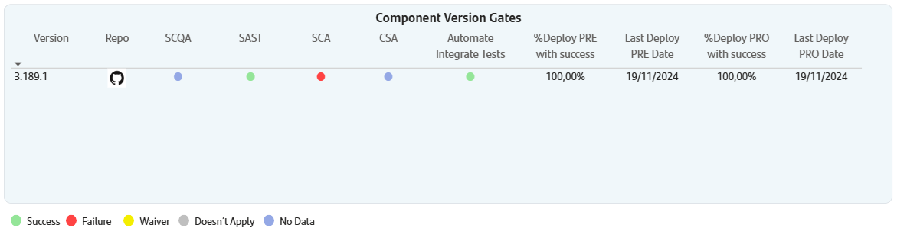

For each version it presents:

- Repo - GITHUB Repository URL
- SCQA (Static Code Quality Analysis) status – consider the status of the latest SCQA execution for the specific version.
- SAST (Static Application Quality Analysis) status - consider the status of the latest SAST execution for the specific version.
- SCA (Software Composition Analysis) status - consider the status of the latest SCA execution for the specific version.
- CSA (Container Security Analysis) status - consider the status of the latest CSA execution for the specific version.
- Automated Integrate Tests - consider the status of the latest execution for the specific version.
- %Deploy PRE with success - consider all deployments in PRE execute for the specific version and their success rate.
- Last Deploy PRE date
- %Deploy PRO with success - consider all deployments in PRE execute for the specific version and their success rate.
- Last Deploy PRO date

### Table

The table part presents all data used in the calculation for the chosen Company/Application/Component/Version.

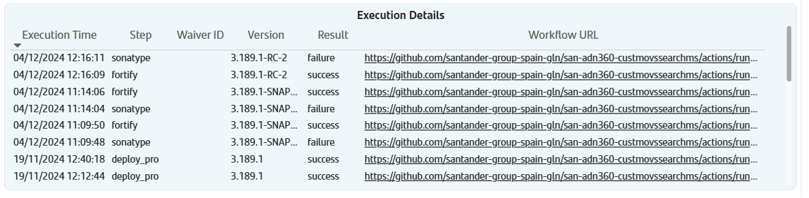

It presents the following data: Execution Time, Step, Waiver ID (if it has a Waiver), Version, Result, Workflow URL (Execution Workflow URL).

### Components Version Gates View Examples

Below is an example of an inquiry without choosing a version.

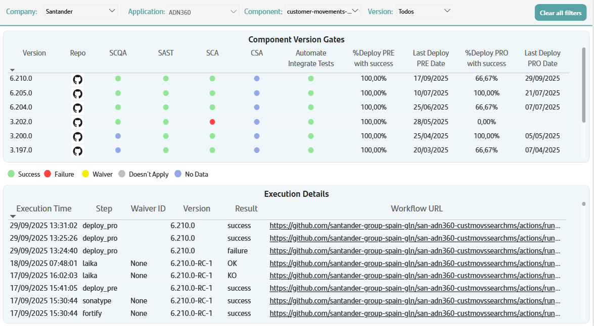

Below is an example of an inquiry choosing a version.

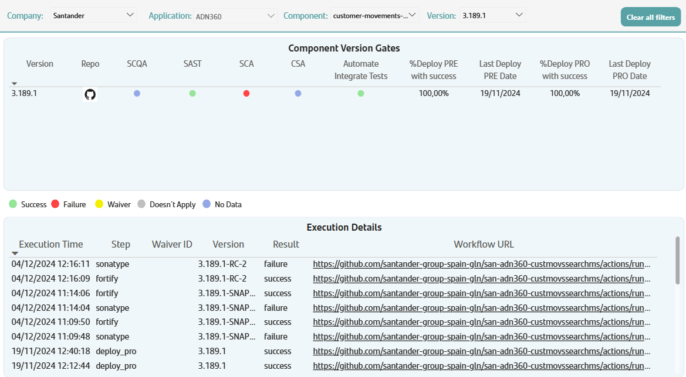

## Application Components Gates View

Component Version Gates View is divided into three parts: Filters, Graphs and Table.

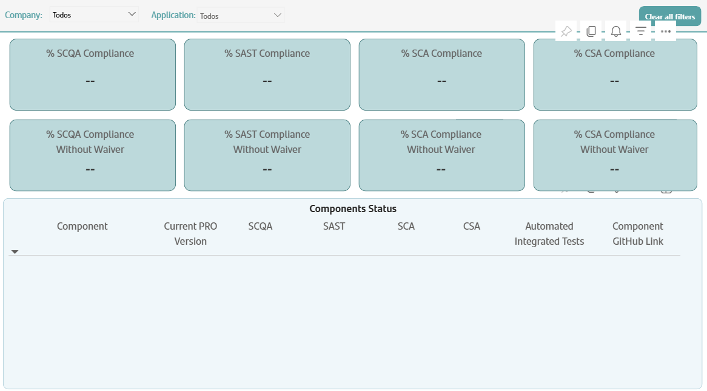

### Filters

In the filter part you must choose Company and Application.

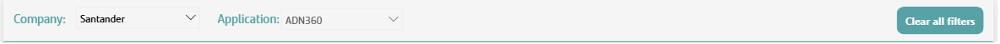

The View initially appears without any filter applied. You must choose a Company and Application to obtain a result. Simply choosing Company doesn't yield results in the search.

You should use the button Clear All Filters to clear all applied filters before starting a new inquiry.

Note: only components with version sent in the deployment workflows to Opensearch will be presented.

### Graphs

The Graphs part presents information about all components of the chosen Application as defined in the filter.

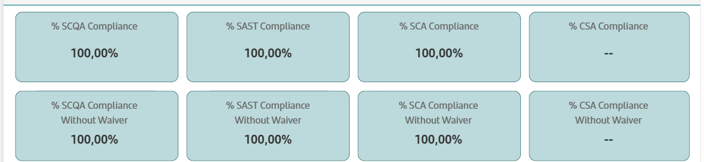

It presents four types of data: % SCQA Compliance, % SAST Compliance, % SCA Compliance and % CSA Compliance.

The calculation considers the last version deployed in PRO of all components of the application and the result of the last execution of the gates for this version.
The percentage is calculated by dividing the total number of components with gate with successful result by the total number of components of the application.

Note: -- indicate that there is no register to this gate in Opensearch for the components of the application.

### Table

The analytic part presents all data used in the calculation for the chosen Company/Application.

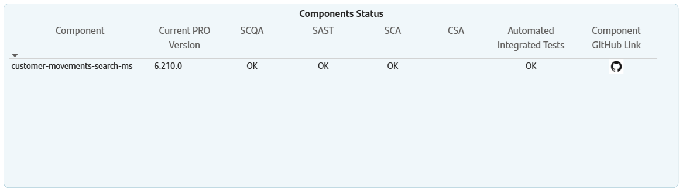

It presents the following data:

- Component
- Current PRO Version – current version in PRO for the component
- SCQA – latest status of the gate for the component/version.
- SAST – latest status of the gate for the component/version.
- SCA – latest status of the gate for the component/version.
- CSA – latest status of the gate for the component/version.
- Automated Integrated Tests - latest status of the gate for the component/version.
- Component GITHUB Link – link for Component GITHUB repository

Note: If any gate is empty, it means the component didn´t have register for this gate in the specified version.

### Application Components Gates View Example

Below is an example of an inquiry.

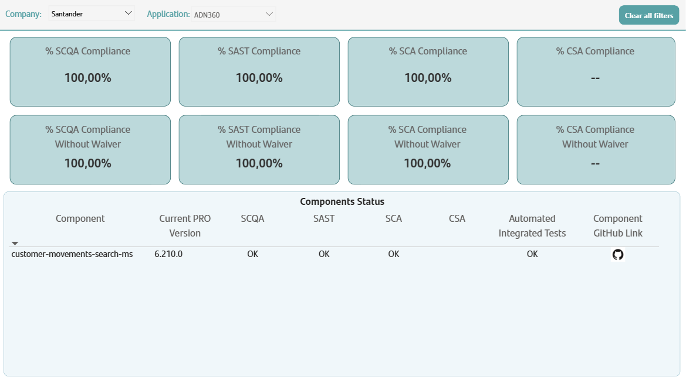

## DAST View

DAST view is divided into three parts: Filters, Graphs and Table.

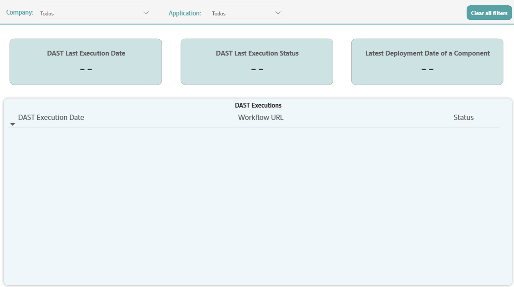

### Filters

In the filter part you must choose Company and Application.

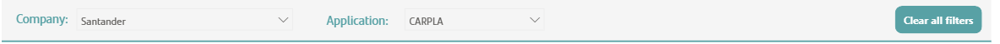

The View initially appears without any filter applied. You must choose a Company and Application to obtain a result. Simply choosing a company doesn't yield results in the search.
You have the button Clear All Filters to clear all applied filters.

### Graphs

The Graphs part is divided into three parts: DAST Last Execution, DAST Last Execution Status and Latest Deployment Date of a Component.

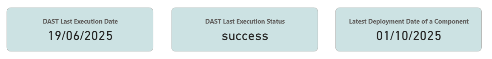

- DAST Last Execution presents the latest execution of DAST for the chosen Company/Application.
- DAST Last Execution Status presents the status of the latest execution of DAST for the chosen Company/Application.
- Latest Deployment Date of a Component presents the latest deployment date of a component for the chosen Company/Application.

### Table

The table part presents the execution history of DAST for the chosen Company/Application.

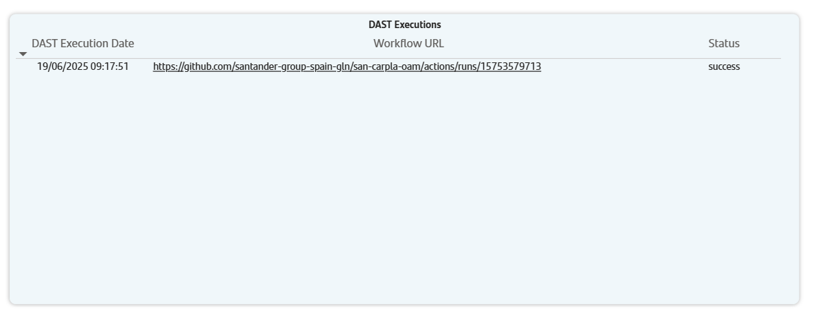

It presents the following data: DAST Execution Date, Workflow URL (Execution Workflow URL) and Status.

### DAST View Example

Below is an example of an inquiry.

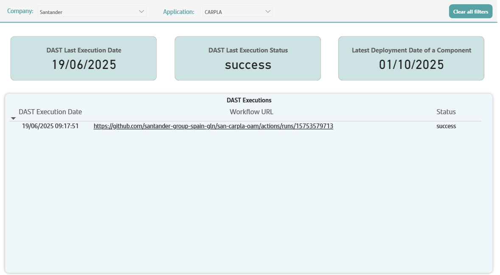

 
