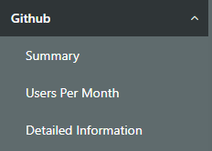
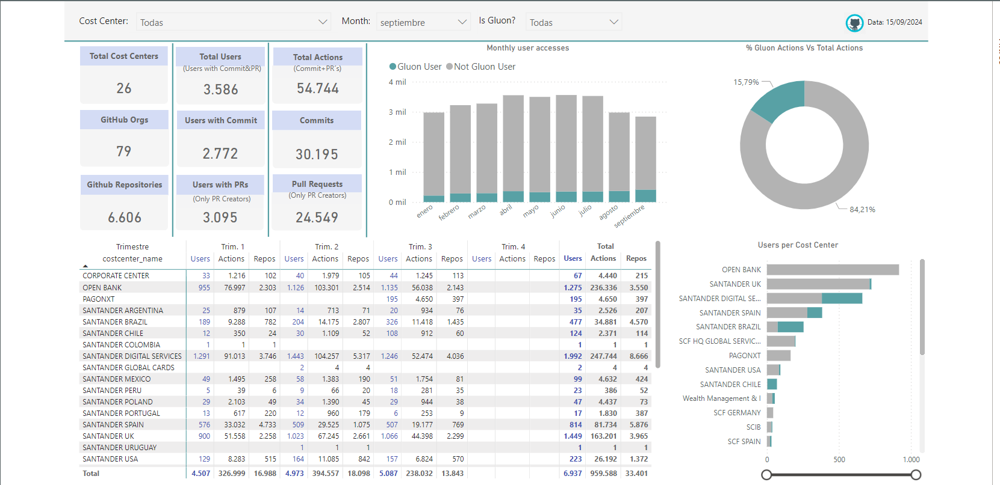
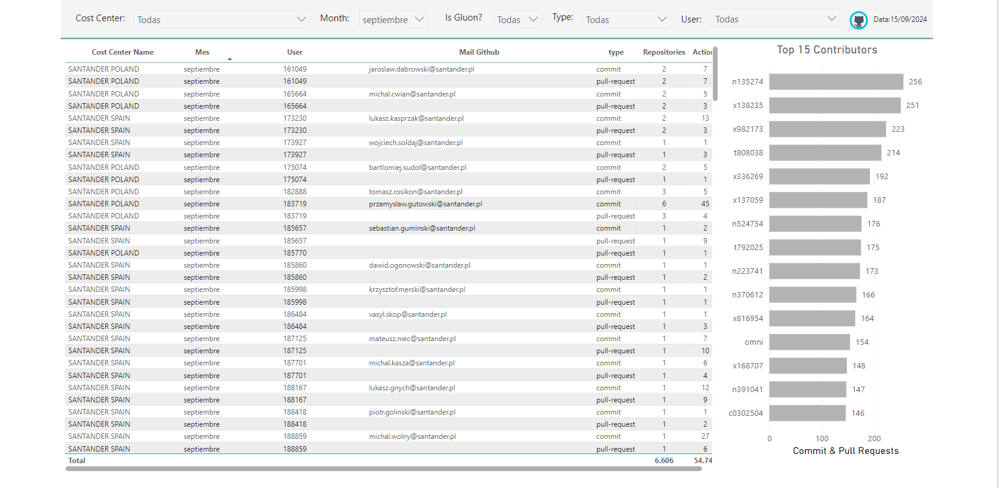
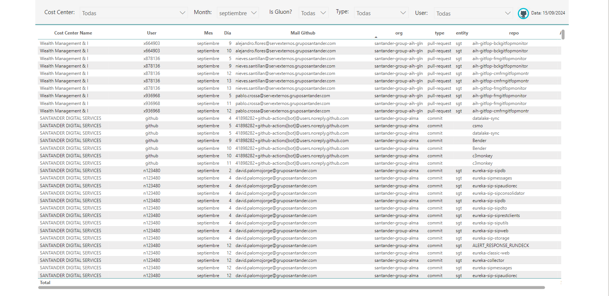

# Copilot Information

In Gluon Insights it is possible to analyze data from users who have made a commit or pull-request (active users).
In this section you can filter by cost center, month, type of action (commit or pull-request) or user, there will be also the possibility to filter by Gluon/non Gluon users.
At the moment, pull-request reviewers are not being counted, only those who send pull-requests for approval, there are three different views.

## Summary

In this submenu, the user will be able to consult a summary of the most important values, with the possibility of filtering by cost center and month. The user will also be able to filter by Gluon users.

### Cards

An area is shown with cards containing the most important indicators.

- **Total Cost Centers** with active users in Github.
- **Total active users in Github** further separating them into committers and pull-requests senders.
- **Number of Actions in Github** further separating them into commits and users with pull-requests.
- **Total organizations** with active users at Github.
- **Total repositories** with active users at Github.

### Graphs

The summary menu shows three graphs that help analyze Github consumption data

- Bar graph with monthly active users, indicating Gluon users in green
- Donut chart comparing actions taken by Gluon users versus the total.
- Bar chart showing active users by cost center, indicating Gluon users in green.

### Table

To reinforce the information, a dynamic table is shown with the number of active users, number of actions and number of repositories with activity per cost center in the rows and quarter in the columns.

## Users per Month

In the users by month submenu you can consult a table showing the cost center, access method, the user's code and email, the type of access (commit or pull-request), the number of actions performed and the number of repositories on which it has acted.
Additionally, a bar graph is shown with the fifteen users who have contributed the most in the selected period.

## Detailed Information

In the "detailed information" submenu you can consult information in table format detailing the actions performed by a user.
Showing the email and name of the user, the cost center, the access date, the type of action, the organization, the entity, the repository and the number of actions performed.

 
