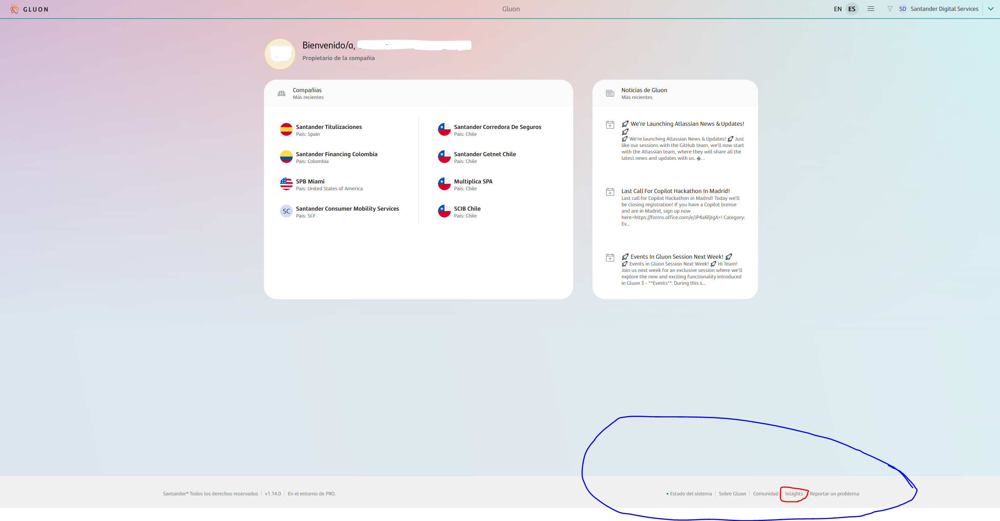
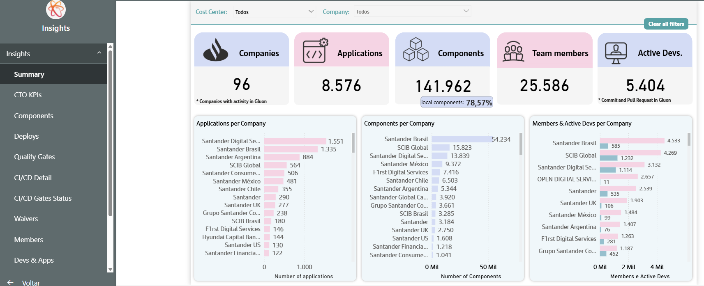
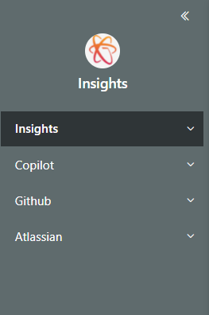
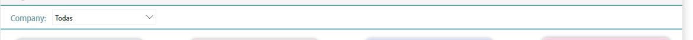

# Gluon Insights Metrics

Welcome to Gluon Insights Metrics Documentation.
Insight dashboard provide information about Gluon consume, performance and other metrics about Gluon.

## Why Metrics Matter

As every organization has been accelerating digital transformation to increasing demand for digital services, the brunt of that effort, of course, falls on engineering teams.

To succeed in this environment, engineering leaders need to replace gut instinct with a data-driven approach to improve efficiency.

The engineering leaders need more actionable metrics to effectively track the productivity of their teams and provide predictability for the business.

## Accessing Gluon Insights Dashboard

It is necessary to have a PowerBI Professional license to access Gluon.

To access Gluon Insights it will be necessary to follow the "Insights" link at the bottom of the Gluon portal:

Once in Gluon dashboard, the user will be able to access Insights main kpi´s sheet.

## Gluon Insights Dashboard Information

In the dashboard you will see:

- A menu on the left with the different sections to navigate
- The content area where by default the first visualization will appear, the summary.

The menu categorizes Insights information into two levels of depth which are currently.

1. **Insights**: Where activity and volume data is consulted and analyzed within Gluon
2. **Copilot**: With analysis of the activity in Github Copilot
3. **GitHub**: With analysis of commit and pull-request in GitHub

In the content area each selected menu item will display a visualization.
Each visualization will have different filters that will allow different filters to be made for analysis.

Most of the information contained in Gluon Insights is updated daily (at approximately 8:30 am) although there is information on a weekly basis.

- Copilot information
- Github information (Included "Active Devs" Metric)

 
