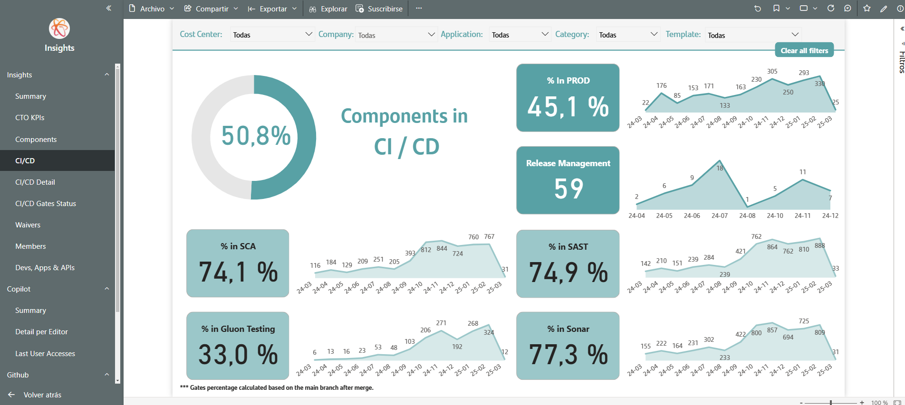
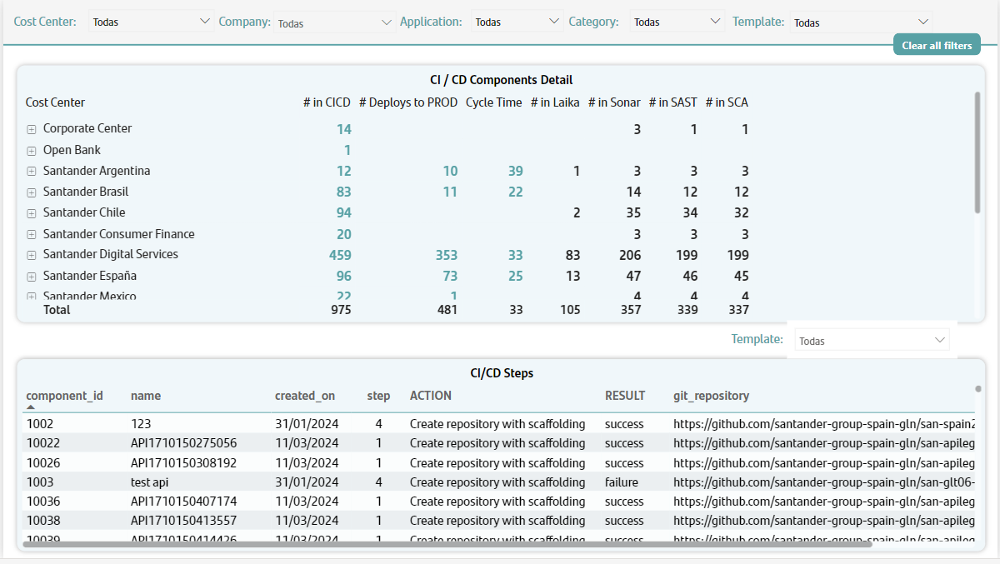
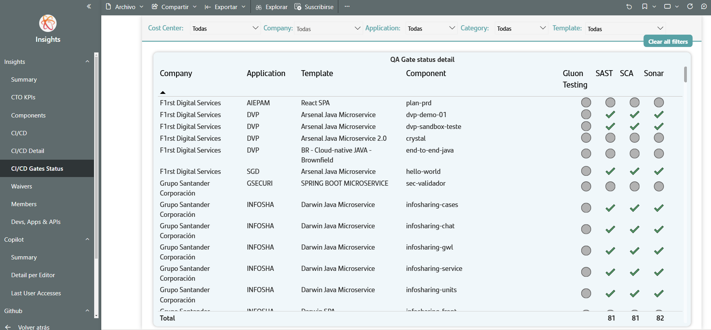

# CICD Aggregate Information

In the CICD submenus provides aggregated information on the different steps of the java-maven type components in the life cycle until the delivery of value.

## CI/CD

This first tab provides the following information as a summary:

- A graphic card with the percentage of components that have some flow in CICD
- A label with the percentage of the components with flow in CICD deployed in production. This label is accompanied by a line chart showing the number of deployments in production per month.
- A label with the percentage of the components with flow in CICD deployed in production. This label is accompanied by a line chart showing the number of deployments in production per month.
- A label with the releases created in Gluon. This label is accompanied by a line chart showing monthly evolution of releases.
- A label with the percentage of the components with flow in CICD with SCA test passed in preproduction. This label is accompanied by a line chart showing the number of SCA test per month.
- A label with the percentage of the components with flow in CICD with SAST test passed in preproduction. This label is accompanied by a line chart showing the number of SAST test passed in preproduction per month.
- A label with the percentage of the components with flow in CICD with Gluon Testing test passed in preproduction. This label is accompanied by a line chart showing the number of Gluon Testing test passed in preproduction per month.
- A label with the percentage of the components with flow in CICD with Sonar test passed in preproduction. This label is accompanied by a line chart showing the number of Sonar test passed in preproduction per month.

The filters that can be applied in this tab are, cost center, entity, application, component category, and template.

## CI/CD Detail

In this tab, the user will be able to perform analysis of the different steps carried out in CICD.

The information is shown in two different tables, the first (above) shows the numbers indicated above, allowing you to display by entity, application and component.

The second shows a flat table with all the actions recorded by the component in CICD. The fields that can be seen in this table are those related to the component, the action date, the step, the  action description, the result and the Git repository.

The first table above acts as an additional filter in the table below

The filters that can be applied in this tab are, cost center, entity, application, component category, template, action and result.

## CI/CD Gates Status

In this submenu, the user will be able to see information on the different components that have reached production and have not passed any test.

The filters that can be applied in this tab are, cost center, entity, application, component category, and template.

 
