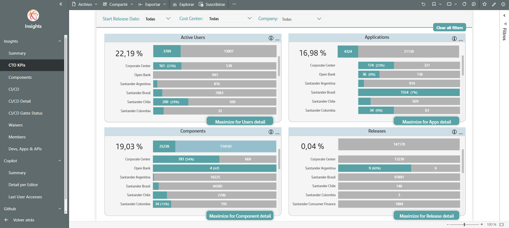

# TOP Metrics information

This submenu is reserved to show metrics that actually are goal for different countries.

All information in this tab are grouped and filtered by organizations, a grouping of different Gluon companies. To view the companies contained at each organization its possible to maintain this filter at other tabs and look them at Company filter.
At each graph of this screen it will possible to to see the detailed data by expanding "Maximize" button

Information in this submenu consist in four KPI´s that are provided in bar charts as a percent.

The list of KPI´s are:

- Active users: Gluon users that made commit or pull-request vs developers declared by each cost center.
- Applications: Gluon applications vs APM Applications. Note that only next APM applications will count at denominator kpi.

1. Production, pre-production, development or friends&family environment status
2. Owner Scope
3. Neither "Gluon Training" nor "End User Computing" catalog.

- Components: Gluon components vs components declared by each cost center.
- Releases: Releases created in Gluon vs releases of Gluon Applications created out of Gluon.

 
