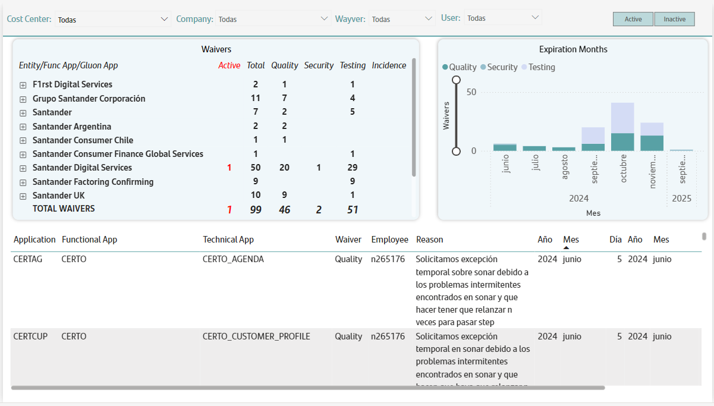

# Exceptions Information

This submenu displays information about the different waivers requested by the user in Gluon, showing in red those whose validity date/time is still pending.

The information is displayed in three sections:
A drop-down table showing the number of active waivers, total waivers, and different types of waivers. This table can be displayed by entity, Gluon application, and functional application.

A bar graph indicating the number of waivers per validity date.

A flat table with the details of the waivers requested. indicating the application data, type of waiver, user who requested it, the reason for the request and the dates of creation and validity.
This table is filtered based on what is selected in the drop-down tableThis table is filtered based on what is selected in the drop-down table.

The filters that can be used in this tab are cost center, company, waiver type, user, and the ability to filter by active or inactive waivers.

 
