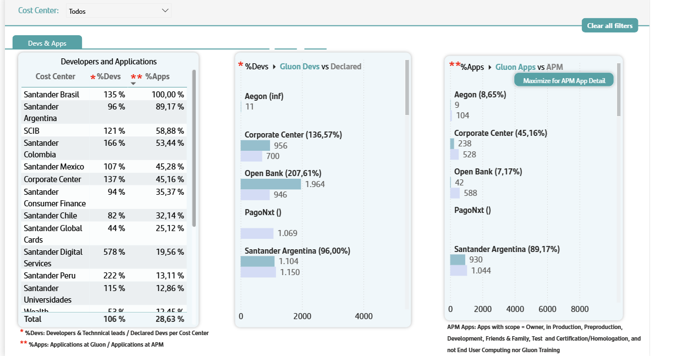
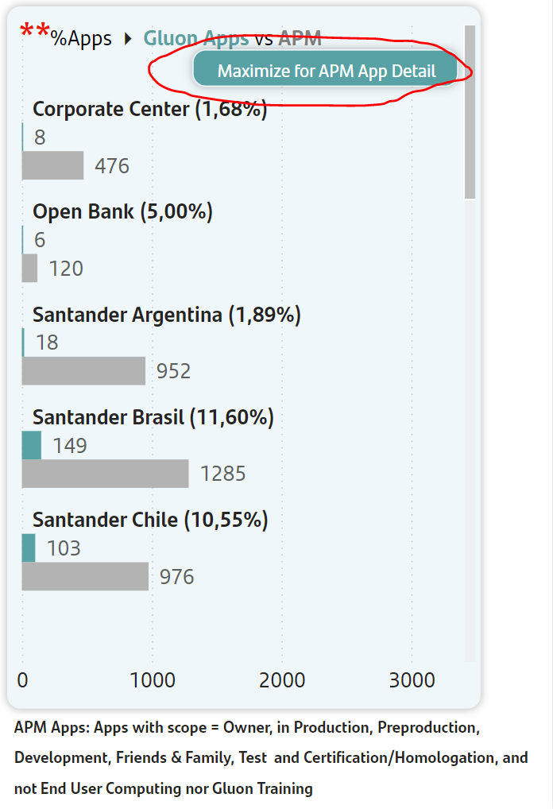

# TOP Metrics information

This submenu is reserved to show TOP metrics that actually are goal for different countries.

All information in this tab are grouped and filtered by organizations, a grouping of different Gluon companies. To view the companies contained at each organization its possible to maintain this filter at other tabs and look them at Company filter.
Please note that when moving between different tabs you will need to reapply the desired filters.

## Developers and Applications

In this tab you can consult information about developers and applications in a table that groups the two indicators and a specific bar graph for each indicator:

### Gluon Devs Vs Declared

Percentage of Gluon developers (members with technical lead or Developer role at Gluon) vs. the total developers indicated for each country. It´s important to notify that Application Owners are considered as developers.

To see the list of developers by country, you can go to the "Members" submenu in the users table. Using the "dev/tech lead" filter.

### Gluon Apps Vs APM

Percentage of Gluon applications vs. the total indicated in apm. Only active applications with:

1. Production, pre-production, development or friends&family environment status
2. Owner Scope
3. Neither "Gluon Training" nor "End User Computing" catalog.

To see the list of Gluon Applications you can go to "Component" submenu in the applications table.
It´s possible to to see the list of APM applications by expanding "Maximize for APM App detail" button.

 
