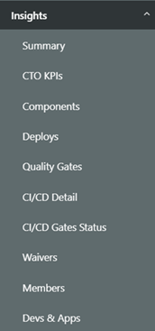
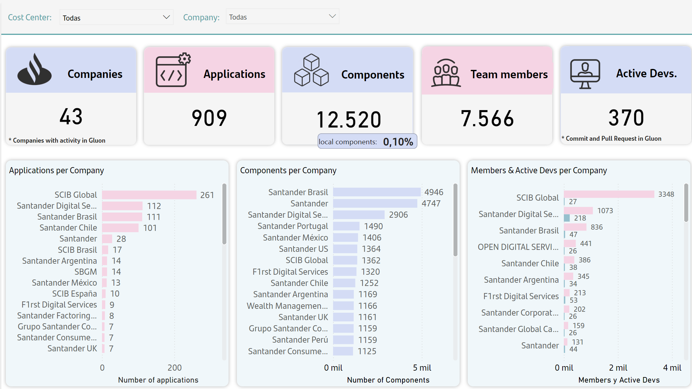
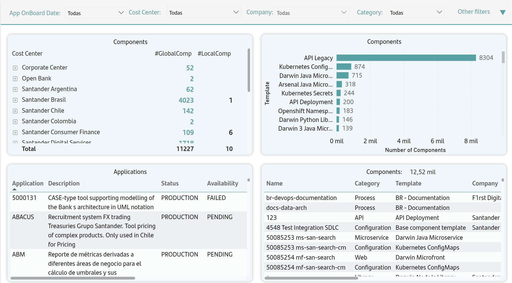
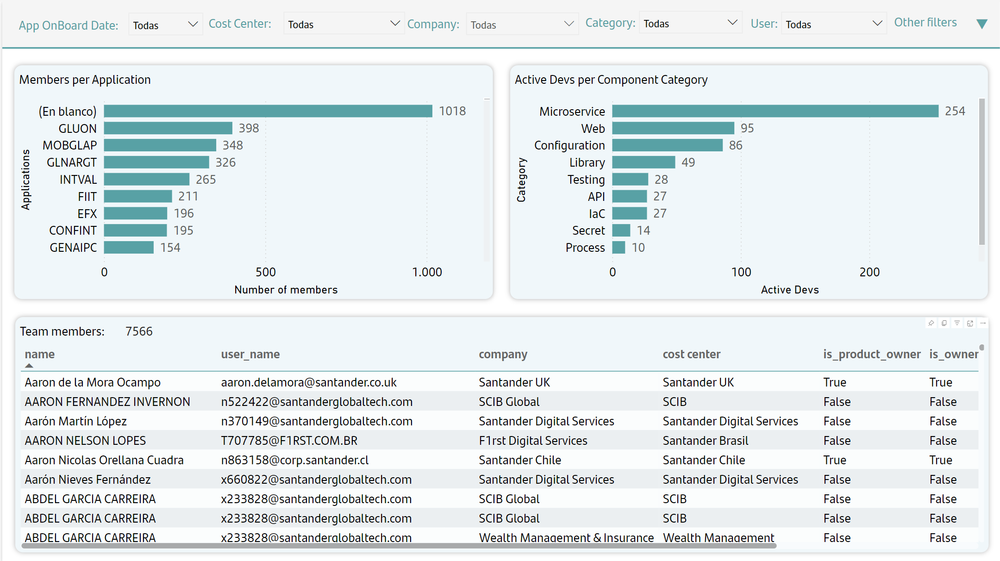

# Insights Metrics

Insights provides relevant information about Gluon activity and usage.

## Summary

The main metrics of Gluon usage are displayed in the summary submenu.
These are shown with the possibility of selecting one or more entities in the filter bar. Instead is possible to filter one or more Cost Centers (entity groupers).
In this visualization the content is separated into two parts, cards with the main metrics and visual graphs that show this information by company:
The cards contain following metrics.

- **Number of Companies with activity in Gluon**: Be aware that only companies with at least, an application and one member onboarded, will be released at Insights Dashboard.
- **Number of Applications onboarded in Gluon**: To recover applications their status in APM is taken into account, only the following are recovered:
    - They are in production, pre-production, development or friends&family environment.
    - Scope is Owner.
    - The application is not cataloged in APM as "Gluon Training" or "End User Computing".
- **Number of Components created in Gluon**: A smaller box indicates the percentage of local components (created from third-party component templates).
- **Number of users onboarded in Gluon**: This indicator shows the number of users onboarded on Gluon regardless of their role.
- **Number of Active Users in Gluon**: This indicator shows number of users that made commits or pull-requests.

Additionally, graphs are included that add information to this summary tab, these are:

- Bar chart of applications by company.
- Bar chart of components by company.
- Bar chart of members and active users by company.

## Components

In the Components submenu you can consult data related to the main Gluon unit.
In this screen you can filter by application onboarding date, cost center, company, template category, short name of the Gluon application, application status, component name and component owner.
Information is distributed as follows:

- Table showing the number of global and local components (created from third-party component templates) per cost center, the cost center is also deployed to obtain the same information by entity and application.
- Bar chart showing the number of components per template category, it is also possible to drill down from here to the template and the name of the component.
- Table showing application information, code, description, status, availability, company to which they belong as well as their functional and technical name.
- Table showing components information, component name, template category, template, company, owner (field that indicates whether the component was created from a Gluon template or a third-party template), description and class.

## Members

In the Members submenu you can analyze the information of users registered with Gluon.
In this visualization you can filter by user registration date, cost center, company, template category, user, application and application status, You can also filter by the possible roles they have in Gluon.
Information is distributed as follows:

- Bar chart showing the number of users onboarded per template application.
- Bar chart showing the number of active users (users that made commit or pull-request) per template category, it is also possible to drill down to the template, component name and the users id (corpaliaslocal which is the one used for onboarding in Gluon).
- Table showing users information, user name, user mail, company, cost center and different flags about roles played at Gluon. The last flag "is_dev/techlead" is the one that marks whether the user is counted in "devs, Apps & APIs" submenu.

## Other Insights Information

Additionally, in the Insights menu there are three submenus that, due to their importance and amount of content, have a special section within Insights help. These are:

- **Top Metrics**: High-level information on Gluon consumption.
- **Deploys**: Detailed information about deployments in Gluon.
- **Quality and Security**: Detailed information about testing processes at Gluon.

 
