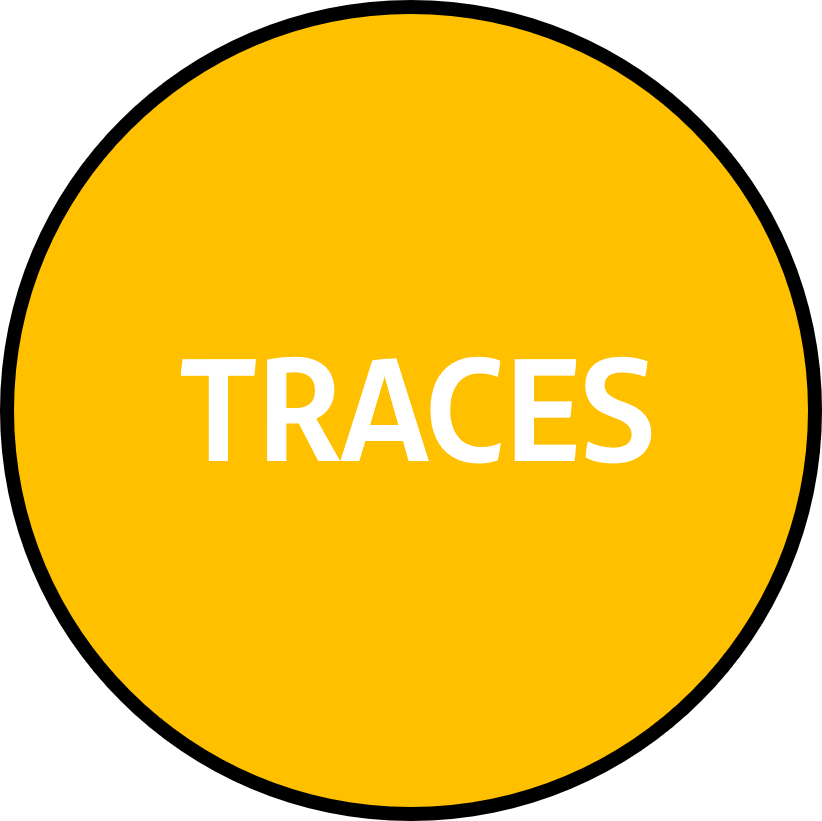
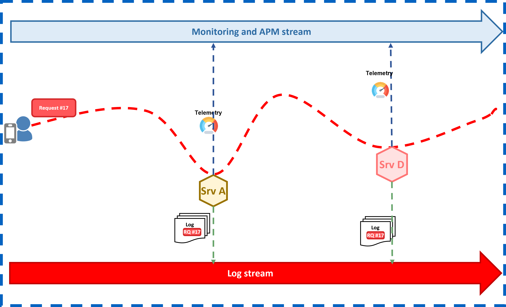

# Observability foundations

## Overview

The observability foundational concept is easy: it contextualizes and puts to
work together the following insights:

- {width="33%" align="left"} [Log events](./logs/index.md) represent events that happen within the component, and its internal status.
It is mainly used for having a real-time statistical view of your business and systems, for diagnostics, or to extend the E2E tracing, among others use cases.

- {width="33%" align="left"} [Traces](./tracing/index.md) allow to correlate every request that belongs to the same transaction,
making it possible to have an end-to-end view of the transaction. In addition, they contextualize metrics and log events, linking them whenever is possible.

With these three insights, we can contextualize any request, as we can see in the following picture. A request is generated in the mobile device, and go through different software components.
These components generate and send correlated log events to the log layer, while the attached agent to the component generates and sends the W3C traces and telemetry to the APM layer.

<figure markdown>
  
</figure>

## Gluon mission related to the observability foundations

> To provide a standardized definition of the observability insights.

To have a common observability foundations is key to get an effective observability, and to ease and extend the interoperability along the Group Santander platforms.
The observability product defines this common foundations, what will be extended at different levels: product level, and use case level.

### Product level

The different Gluon product will extend these foundations, in order to contextualize and make meaningful the generated insights.
What for an API may be important -e.g., include the product and catalog names within the log, or the accesses to the API-, may not be for microservices.

### Use case level

Not all use cases are created equal: A payments use case is quite different from a user onboarding use case. To make the observability meaningful, it is necessary to contextualize the different insights.
In addition, these insighs should be useful for the operation of the component. Technical and functional insights should be added to the foundational ones.

## What we learn here

You can find here:

- A common observability foundations definition for each insight.
- A guide to know what should be extend by the different levels.
