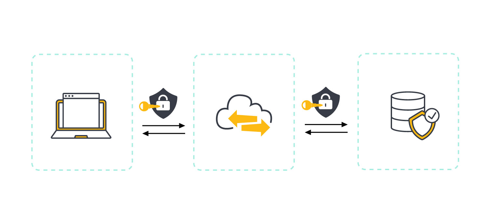
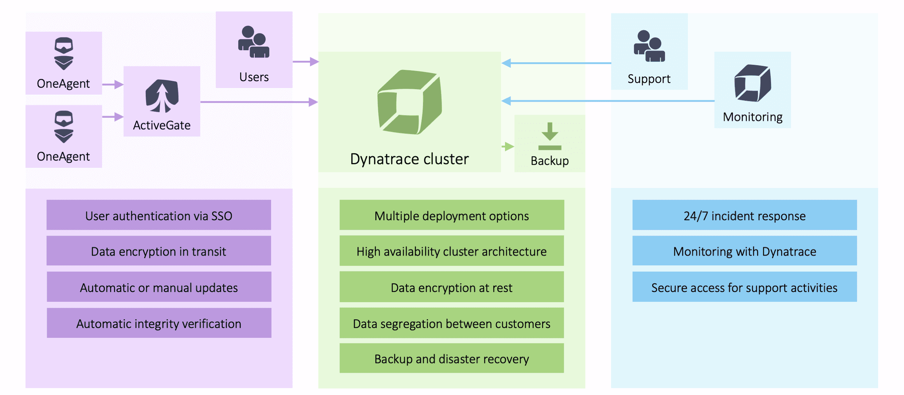

# What is Data Obfuscation?

{align=left width=50%}
​​Data obfuscation is the process of disguising confidential or sensitive data to protect it from unauthorized access. Data obfuscation tactics can include masking, encryption, tokenization, and data reduction.

In observability, logging can retrieve confidential information that can or will appear in databases, so, to mask this data is crucial to keep the data secured even if a cyber attack occurs.

## Why we need to hash the data?

{align=right; width="40%"}

Personal data began to be a concern to corporate as sensiive information can be used for malicious purposes. To address this situation, regulatory laws about data were created to standardize how the data is manipulated, stored and used.

In Brazil we have the LGPD (Lei Geral de Proteção de Dados) which provides regulatory laws for data usage. In Europe, the GDPR (General Data Protection Regulation) works the same way. To know more about these, follow the links below:

[LGPD](https://www.planalto.gov.br/ccivil_03/_ato2015-2018/2018/lei/l13709.html) & [GDPR](https://gdpr-info.eu/)

The data hashing or encryprtion is not an obligation in the laws we mentioned before, but is highly recommended to add this layer of protection. As mentioned in the GDPR page:

*The GDPR does not explicitly require the use of encryption to protect personal data, but it does state that data controllers and processors must implement appropriate technological and organizational measures to secure personal data.*

*Encryption is one such measure that can help businesses meet their GDPR compliance objectives.*

*Encryption is the best way to protect data, provided it's used as part of a secure system.Encryption technology is widely available and relatively inexpensive, making it an accessible option for businesses of all sizes.*

## How can we achieve a data obsfucation?

We recommend a technique known as data hashing.

Hashing is simply passing some data through a formula that produces a result, called a hash. That hash is usually a string of characters and the hashes generated by a formula are always the same length, regardless of how much data you feed into it.

For example, the MD5 formula always produces 32 character-long hashes. Regardless of whether you feed in the entire text of MOBY DICK or just the letter C, you’ll always get 32 characters back.

We will use SHA-256 to be one of the most secure hashing algorithms today. it is resilient avoiding hashing collisions. This means that two separate inputs cannot produce an identical hash.

Here are some of the traits that SHA-256 possess:

- **Determinism** — A hash algorithm should be deterministic, meaning that it always gives you an output of identical size regardless of the size of the input you started with.

- **Pre-Image Resistance** — it’s infeasible to reverse a hash value to recover the original input plaintext message. Hence, the concept of hashes being irreversible, one-way functions.

- **Collision Resistance** — If two unique samples of input data result in identical outputs, it’s known as a collision. The randomness of the hash creation reduce the chance of it occurring.

- **Avalanche Effect** — What this means is that any change made to an input, no matter how small, will result in a massive change in the output. Essentially, a small change (such as adding a comma) snowballs into something much larger.

### Hashing snippets example

- In Python we can use th [hashlib library](https://docs.python.org/3/library/hashlib.html), which automatically hashes the content

```python
#Python
from hashlib import sha256

input_ = input('Enter something: ')
print(sha256(input_.encode('utf-8')).hexdigest())
```

- In Javascript, we have the [Web Cripto API](https://developer.mozilla.org/en-US/docs/Web/API/SubtleCrypto/digest)

```javascript
// Javascript
async function sha256(message) {
    // encode as UTF-8
    const msgBuffer = new TextEncoder().encode(message);

    // hash the message
    const hashBuffer = await crypto.subtle.digest('SHA-256', msgBuffer);

    // convert ArrayBuffer to Array
    const hashArray = Array.from(new Uint8Array(hashBuffer));

    // convert bytes to hex string
    const hashHex = hashArray.map(b => b.toString(16).padStart(2, '0')).join('');
    return hashHex;
}
```

- In Java we have the MessageDigest

```java
// import statements
import java.security.NoSuchAlgorithmException;
import java.math.BigInteger;
import java.security.MessageDigest;
import java.nio.charset.StandardCharsets;

// A Java program to find the SHA-256 hash value
public class SHAExample
{
public static byte[] obtainSHA(String s) throws NoSuchAlgorithmException
{
// Static getInstance() method is invoked with the hashing SHA-256
MessageDigest msgDgst = MessageDigest.getInstance("SHA-256");

// the digest() method is invoked
// to compute the message digest of the input
// and returns an array of byte
return msgDgst.digest(s.getBytes(StandardCharsets.UTF_8));
}

public static String toHexStr(byte[] hash)
{
// Converting the byte array in the signum representation
BigInteger no = new BigInteger(1, hash);

// Converting the message digest into the hex value
StringBuilder hexStr = new StringBuilder(no.toString(16));

// Padding with tbe leading zeros
while (hexStr.length() < 32)
{
hexStr.insert(0, '0');
}

return hexStr.toString();
}

// main method
public static void main(String argvs[])
{
try
{
System.out.println("The HashCode produced by SHA-256 algorithm for strings: ");

String str = "Java";
String hash = toHexStr(obtainSHA(str));
System.out.println("\n" + str + " : " + hash);

str = "India is a great country.";
hash = toHexStr(obtainSHA(str));
System.out.println("\n" + str + " : " + hash);
}
// handling exception
// usually raised when some absurd algorithm is used for doing the hash work
catch (NoSuchAlgorithmException obj)
{
System.out.println("An exception is generated for the incorrect algorithm: " + obj);
}
}
}
```

## Where the data obsfucation occurs in observability platforms?

### Dynatrace

- In Dynatrace environments, the data is encrypted end-to-end



[Documentation](https://docs.dynatrace.com/docs/manage/data-privacy-and-security/data-security/data-security-controls)

### Logstash

- Using the fingerprint plugin we can implement our hashing for our desired fields and in our desired format. Please, refer to the documentation below for more information

[Documentation](https://www.elastic.co/guide/en/logstash/current/plugins-filters-fingerprint.html)
