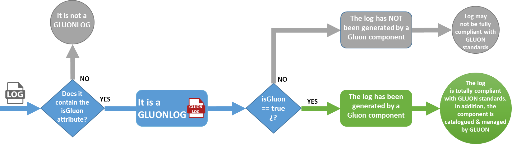

# Attributes description GLUONLOG v1

GLUONLOG 1.0 is based on GLOBALOG 2.0. The common GLUONLOG 1.0 attributes are
 shown below, both for the common part and for each log types.

## Changelog

GLUONLOG includes the following changes regarding to GLOBALOG:

1. The *value* column has been updated with the origin of the value.
2. A new *Set at* column has been added, with two possible values: *RT (runtime)*, *SDLC (Software Development Life Cycle)*.
3. Some attributes to allow contextualizing the log with the CMDB tree. This ease operational task, like the insights correlation or the impact analysis in case of incident. A brief summary of the new and removed attributes is provided below.

    
New attributes in GLUONLOG

    <table>
        <thead>
            <tr>
                <th>Attribute</th>
                <th>Source for Gluon components</th>
                <th>Source for non-Gluon components</th>
            </tr>
        </thead>
        <tbody>
            <tr>
                <td>company</td>
                <td>The company code in Gluon. Previously, this attribute was named as "entity".</td>
                <td>The company code in the CMDB. Previously, this attribute was named as "entity".</td>
            </tr>
            <tr>
                <td>componentName</td>
                <td>The component short_name in Gluon.</td>
                <td>This attribute does not exist in the CMDB. So, the PO component should be give a name for it.</td>
            </tr>
            <tr>
                <td>componentId</td>
                <td>The component ID in Gluon.</td>
                <td>This attribute does not exist in the CMDB. Then, it can be left empty until it exists.</td>
            </tr>
            <tr>
                <td>componentType</td>
                <td>The type of component in Gluon.</td>
                <td>This attribute does not exist in the CMDB. So, the PO component should be give a type for it.</td>
            </tr>
            <tr>
                <td>componentVersion</td>
                <td>The version of the component in Gluon.</td>
                <td>This attribute does not exist in the CMDB. So, the PO component should be give a version for it.</td>
            </tr>
            <tr>
                <td>appName</td>
                <td>The technical application short name in Gluon.</td>
                <td>Intuitively, the technical application short name in the CMDB. Keep in mind the pattern: ^([A-Z\d]){1,7}$</td>
            </tr>
            <tr>
                <td>appId</td>
                <td>The ID of the technical application in Gluon.</td>
                <td>The technical application ID in the CMDB. If it is not catalogued in CMDB, and  there is no ID, it can be empty.</td>
            </tr>
            <tr>
                <td>isGluon</td>
                <td>Check the isGluon section.</td>
                <td>Check the isGluon section.</td>
            </tr>
            <tr>
                <td>logVersion</td>
                <td>The version of GLUONLOG implemented. SemVer as versioning pattern.</td>
                <td>The version of GLUONLOG implemented. SemVer as versioning pattern.</td>
            </tr>
            </tbody>
    </table>

    
Deprecated attributes in GLUONLOG

    Deprecated attributes are inherited from GLOBALOG and they will not be part of the GLUONLOG structure definition in
    future releases. Meanwhile, they can still be used. <b>Regarding removed attributes,
    any entity or project/platform that needs to include them can do so by
    extending the customLog</b>:

    <table>
    <thead>
    <tr>
        <th>Attribute</th>
        <th>Comments</th>
    </tr>
    </thead>

    <tbody>
    <tr>
        <td>region</td>
        <td>Deprecated. For this version is optional.</td>
    </tr>
    <tr>
        <td>appKey</td>
        <td>Deprecated. For this version is optional.</td>
    </tr>
    <tr>
        <td>serviceName</td>
        <td>Deprecated. For this version is optional.</td>
    </tr>
    <tr>
        <td>platform</td>
        <td>Deprecated. For this version is optional.</td>
    </tr>
    <tr>
        <td>entity</td>
        <td>It has been renamed as "company"</td>
    </tr>
    </tbody>
    </table>

## General note

!!! warning "Pay attention: *No Silver Bullet* software principle"

    Complying with the defined attributes in the log structure -and setting a value for them- guarantees a correct implementation of GLUONLOG and makes it easier to have the exploitation of the logs, in the expected way.

    But in the end, we cannot forget that there are countless use cases, each with its own characteristics and technologies. Maybe, some of them need their own format and/or logging pipeline. **Not every use cases can be solved by a logging structure definition**.

    **So please, always try complying with the defined log structure. Generate logs with all mandatory attributes, regardless of whether they have an assigned value. If you have doubts about where to extract the value, check the FAQs section or ask your Observability Architecture Department.**

    Likewise, share doubts, opinions, and specific cases with the community!!! They are valuable for reach the best possible log definition 🙂

## Common attributes

These attributes are the common basic ones for every log event.
**All the attributes must be set in lowerCamelCase**,
except for attributes derived from the W3C Trace Context attributes.

Abbreviations:

1. Mand -> Mandatory.
2. RT -> Runtime.
3. SDLC -> Software Development Life-Cycle.

| Attribute                               | Description                                                                              | Values                                                                                              | **Mand**                                               | **Set at** | **Comments**                                                                                                                                                                                    |
|-----------------------------------------|------------------------------------------------------------------------------------------|-----------------------------------------------------------------------------------------------------|----------------------------------------------------|--------|---------------------------------------------------------------------------------------------------------------------------------------------------------------------------------------------|
| timestamp                               | String with the date and time of the record generation in (ISO8601).                     | {yyyy-MM-dd'T'HH: mm:ss.SSS}{GMT+0}Z                                                                | YES, strict. Also, the value must always be set.   | RT     |                                                                                                                                                                                             |
| company                                 | String with the Santander company whose component is generating the logs.                | Maps to the company code in Gluon.                                                                  | YES                                                | SDLC   | In GLOBALOG 2.0, this attribute was named "entity".                                                                                                                                         |
| environment                             | String with the environment where the component is running.                              | {DEV, CERT, TEST, PRE, PRO}                                                                         | YES                                                | SDLC   |                                                                                                                                                                                             |
| logLevel                                | String with the log trace level.                                                         | {TRACE, DEBUG, INFO, WARN, ERROR, FATAL, OFF, ALL}                                                  | YES                                                | RT     | ALL, OFF and DEBUG values must generate alerts about it use.                                                                                                                                |
| componentName                           | String with the name of the component that generates the log.                            | Maps to the short-name of the component in Gluon. Pattern for this attribute: ^[\w\d]{1,16}$        | YES                                                | SDLC   | For non-Gluon components, the PO should give a name.                                                                                                                                        |
| componentId                             | String with the identifier of the component that generates the log.                      | Maps to the ID of the component in Gluon.                                                           | YES.                                               | SDLC   | For non-Gluon components it can be left empty until it exists in the CMDB.                                                                                                                  |
| componentType                           | String with the type of the Gluon component (e.g., microservice, API...)                 | Maps to the component type in Gluon.                                                                | YES                                                | SDLC   | For non-gluon components, the PO must give a type. It is recommended it match those defined in Gluon.                                                                                       |
| componentVersion                        | String with the version of the Gluon component                                           | Maps to the version of the component in Gluon.                                                      | YES                                                | SDLC   |                                                                                                                                                                                             |
| appName                                 | String with the technical application name                                               | Maps to the short-name of the application in Gluon. Pattern for this attribute: ^([A-Z\d]){1,7}$    | YES                                                | SDLC   | The value is unique across the applications within the onboarded company in Gluon.                                                                                                          |
| appId                                   | String with the identifier of the application of the component that generates the log.   | Maps to the technical application ID in Gluon.                                                      | YES                                                | SDLC   | The ID of the onboarded application in Gluon.                                                                                                                                               |
| log                                     | String with the execution log message                                                    | N/A                                                                                                 | YES                                                | RT     | The whole log message. For example, the stacktrace in case of error.                                                                                                                        |
| logType                                 | String with the typology of the trace                                                    | One of the following set of values: ACTIVITY, TECHNICAL, FUNCTIONAL, SECURITY                       | YES                                                | RT     | These are the basic common log types. Additional values can be added previous analysis                                                                                                      |
| parentSpanId                            | String with the B3 ParentSpanId traceability header                                      | B3 16 HEXADEC LOW CAMELCASE                                                                         | YES                                                | RT     | Based on the X-B3 OpenZipkin specification                                                                                                                                                  |
| traceId                                 | String with the B3 TraceId tracing traceability header                                   | B3 16 HEXADEC LOW CAMELCASE                                                                         | YES                                                | RT     | Based on the X-B3 OpenZipkin specification                                                                                                                                                  |
| spanid                                  | String with the B3 SpanId tracing traceability header                                    | B3 16 HEXADEC LOW CAMELCASE                                                                         | YES                                                | RT     | Based on the X-B3 OpenZipkin specification                                                                                                                                                  |
| trace_id                                | String with the W3C trace_id traceability header                                         | W3C Trace Context - 32 HEXADEC LOWER CAMELCASE                                                       | YES                                                | RT     | Based on the W3C Trace Context specification. It is usually extracted from the traceparent header.                                                                                          |
| span_id                                 | String with the W3C span_id traceability header                                          | W3C Trace Context - 16 HEXADEC LOWER CAMELCASE                                                       | YES                                                | RT     | Based on the W3C Trace Context specification. In agent-based instrumentation, it is usual that this fields will be null (in this case, the value still being null)                          |
| parent_id                               | String with the W3C parent_id traceability header                                        | W3C Trace Context - 16 HEXADEC LOWER CAMELCASE. It is usually extracted from the traceparent header. | YES                                                | RT     | Based on the W3C Trace Context specification.                                                                                                                                               |
| tracestate                              | String with the W3C tracestate request attribute (for APM linkage)                       | W3C Trace Context                                                                                   | YES                                                | RT     | Based on the W3C Trace Context specification. Free content header, the value depends on the APM or the framework used.                                                                      |
| error                                   | Boolean that indicates if the log event is related to an error (true or false)           | {true, false}                                                                                       | YES                                                | RT     | This value indicates if the log is related to an error (technical, logical, communication). Think that the value might be "true", but the return code might not be from the 4xx/5xx family. |
| isGluon                                 | Boolean that indicates that the log has been generated by a Gluon-built component.       | true                                                                                                | YES                                                | RT     | For more details, please check the "isGluon" section.                                                                                                                                       |
| logVersion                              | The version of GLUONLOG implemented                                                      | [SemVer](https://semver.org/) as versioning pattern.                                                | YES                                                | SLDC   |                                                                                                                                                                                             |
| appKey                                  | String with the identifier for the project generating logs (adn360, enquilake, journal…) |                                                                                                     | NO                                                 | SLDC   | Deprecated. It will be removed from GLUONLOG in future releases.                                                                                                                            |
| serviceName                             | String with the name of K8s service of the application that generates logs               |                                                                                                     | NO                                                 | SDLC   | Deprecated. It will be removed from GLUONLOG in future releases.                                                                                                                            |
| platform                                | STring with the platform where the component is deployed.                                |                                                                                                     | NO                                                 | SDLC   | Deprecated. It will be removed from GLUONLOG in future releases.                                                                                                                            |
| region                                  | String with the region on which the application is deployed                              | Private & Public Cloud regions                                                                      | NO                                                 | SDLC   | Deprecated. It will be removed from GLUONLOG in future releases.                                                                                                                            |
| customLog (custom field for all traces) | A custom field that extends this basic format and will appear in all traces              | N/A                                                                                                 | NO, if there is noy any attribute within the node. | RT     | It will be defined if there is information that must go for all types of logs for a specific use case (e.g., "paymentId mandatory for all payment operations").                             |

----------

## Activity specific fields

This attributes extend the previously mentioned at "common fields" table.
**All the attributes must be set in lowerCamelCase.**

| Attribute                              | Description                                                                                                                                                           | Values                                                                                                                                        | Mand | Set at    | Comments                                                                                                                        |
|----------------------------------------|-----------------------------------------------------------------------------------------------------------------------------------------------------------------------|-----------------------------------------------------------------------------------------------------------------------------------------------|------|-----------|---------------------------------------------------------------------------------------------------------------------------------|
| inputTimestamp                         | Time when the component receives the request (ISO8601).                                                                                                               | {yyyy-MM-dd'T'HH: mm:ss.SSS}{GMT+0}Z                                                                                                           | YES  | RT        |                                                                                                                                 |
| method                                 | HTTP verb for REST communications or the operation name for messaging communications (GET, POST... or for messaging SEND, RECEIVE…).                                  | HTTP communications: {GET, POST, PUT, DELETE, PATCH} // BBDD operations: {CREATE, READ, UDATE, DELETE} // Messaging: {SEND, RECEIVE, PROCESS} | YES  | RT        | These values are for HTTP and message communications. Other use cases must be analyzed.                                         |
| returnCode                             | String with the return code of the request.                                                                                                                           | N/A                                                                                                                                           | YES  | RT        | It can be from HTTP codes, to codes provided by the SGDB. It will be necessary to define for each technology.                   |
| url                                    | String with endpoint of the component that is being invoked.                                                                                                          | N/A                                                                                                                                           | YES  | RT        | Examples: URL of the µService or API; URL of the message broker, for events communications; jdbc:// for DB communications; etc. |
| customLog.(your activity custom field) | Free-content custom node, oriented to extend the common log, with meaningful attributes that ease the understanding of the activity of the service and its operation. | N/A                                                                                                                                           | NO   | RT & SDLC | The defined attributes within the customLog in the common definition are inherited for this logType.                            |

----------

## Technical specific fields

This attributes extend the previously mentioned at "common fields" table.
**All the attributes must be set in lowerCamelCase.**

| Attribute                                | Description                                                                                                                                  | Values                    | Mand | Set at         | Comments                                                                                             |
|------------------------------------------|----------------------------------------------------------------------------------------------------------------------------------------------|---------------------------|------|----------------|------------------------------------------------------------------------------------------------------|
| customLog.(your technical custom fields) | JSON node oriented to extend the common log, with meaningful technical attributes that ease the understanding the service and its operation. | Free-content custom node. | NO   | Runtime & SDLC | The defined attributes within the customLog in the common definition are inherited for this logType. |

----------

## Functional specific fields

This attributes extend the previously mentioned at "common fields" table.
**All the attributes must be set in lowerCamelCase.**

| Attribute                             | Description                                                                                                                                                                        | Values                    | Mand | Set at         | Comments                                                                                                                                   |
|---------------------------------------|------------------------------------------------------------------------------------------------------------------------------------------------------------------------------------|---------------------------|------|----------------|--------------------------------------------------------------------------------------------------------------------------------------------|
| businessLog. input                    | Entry of the operation (for example a request to a microservice)                                                                                                                   |                           | NO   | RT             | Gluon libraries (e.g., Darwin)  generates automatically for the functions/methods indicated in the configuration.                          |
| businessLog. output                   | Output of the operation (for example the response of the microservice)                                                                                                             | N/A                       | NO   | RT             | Gluon libraries (e.g., Darwin)  generates automatically for the functions/methods indicated in the configuration.                          |
| businessLog. (your functional field)  | JSON node oriented to extend the common log, with meaningful business attributes that ease both the understanding of the service and its operation, from a business point of view. | Free-content custom node. | NO   | RT             | Note that functional identifiers, such as paymentId (for example) should be located at customLog for all the log events for that use case. |
| customLog.(your generic custom field) | JSON node oriented to extend the common log, with meaningful behavior attributes that ease the functional understanding of the service and its operation.                          | Free-content custom node. | NO   | Runtime & SDLC | The defined attributes within the customLog in the common definition are inherited for this logType.                                       |

----------

## Security specific fields

This attributes extend the previously mentioned at "common fields" table.
**All the attributes must be set in lowerCamelCase.**

| Attribute                                    | Description                                                                                                                                               | Values                    | Mand | Comments   | Set at                                                                                                                                                                                                                                      |
|----------------------------------------------|-----------------------------------------------------------------------------------------------------------------------------------------------------------|---------------------------|------|------------|---------------------------------------------------------------------------------------------------------------------------------------------------------------------------------------------------------------------------------------------|
| result.resultCode                            | String with the result of the operation                                                                                                                   | {OK,KO}                   | NO   | RT         | Security teams are the main requesters for this log type. The values to register will depend on the requirements that can be made from the different security teams: what attributes, when to generate it, values, if it is mandatory, etc. |
| securityAttributes.(your security attribute) | custom fields that allow to extend the security log                                                                                                       | N/A                       | NO   | RT         |                                                                                                                                                                                                                                             |
| customLog.(your generic custom field)        | JSON node oriented to extend the common log, with meaningful behavior attributes that ease the functional understanding of the service and its operation. | Free-content custom node. | NO   | RT or SDLC |                                                                                                                                                                                                                                             |

## About *isGluon* attribute

This attribute has two meanings:

- Implicit meaning: if the log has the *isGluon* attribute, it means that the
 log structure is the GLUONLOG structure.
- Explicit meaning: if the *isGluon* value is true, it means it is a Gluon
component, and it is compliance with the Gluon standards (like GLOBALOG).
Otherwise, the value will be *false*.

## About *customLog* attributes

The customLog node is a free-content node, where different meaningful attributes
are placed to understand the use case. There are some attributes that always
emerge in certain use cases. In order to avoid calling the same thing in five
different ways, we are going to try to make them common. The following attributes
have been requested by different architecture teams.

**Note: Observability only lists these attributes. It is outside of observability
responsibilities to manage their values, define where to extract them from, etc.**

| Attribute | Description                                  | Comments |
|-----------|----------------------------------------------|----------|
| sessionId | The identifier of the session                |          |
| channel   | The channel through which the request passes |          |
| userId    | The userId initiates the request             |          |
