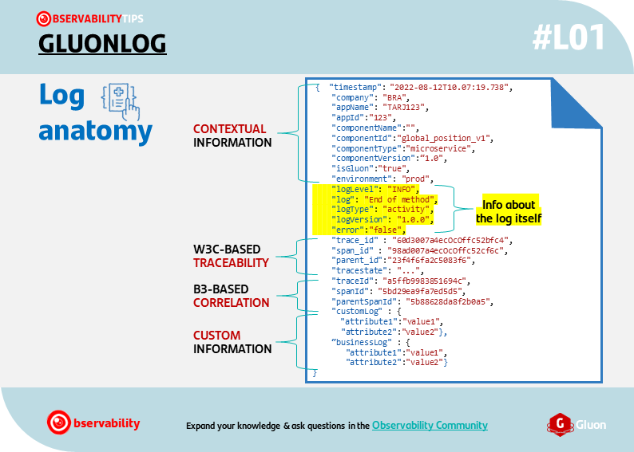

# Overview

The main goals of GLUONLOG is to:

1. **Facilitate the sharing** of the log events between Santander Group entities,
platforms, and apps.
2. **Assure a minimum set of fields** to provide meaningful information for a
basic operation. This structure can be extended with new attributes as needed.
3. **Industrialize the definition and creation** of log events, by providing a
starting point.

## Main features

The *GLUON common basic LOG structure* (GLUONLOG) has been designed to allow to:

{align=right width="50%" height="50%"}

1. **Contextualize** - Logs share a common minimal basic structure, with key information.
2. **Trace** - Log events include the W3C Trace Context specification, in order
to link the log layer with the APM layer.
3. **Correlate** - Thanks to the B3 specification, hierarchical correlations are
possible.
4. **Be agnostic** - It allows to isolate the common structure for
particularities of the platform, company or technology.
5. **Customize** - Development teams can fit the log events to the use case needs,
by extending the custom nodes.
