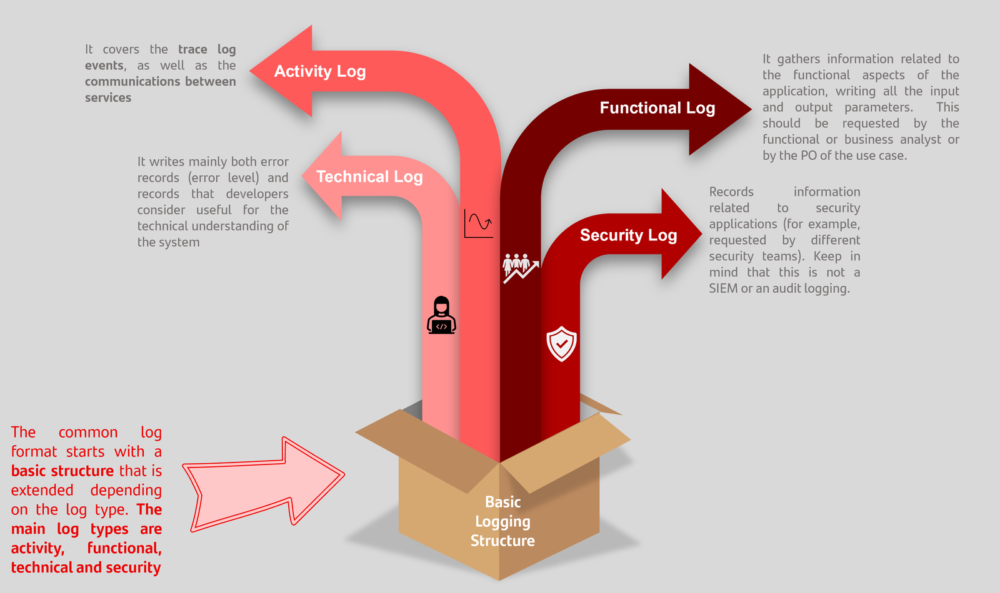
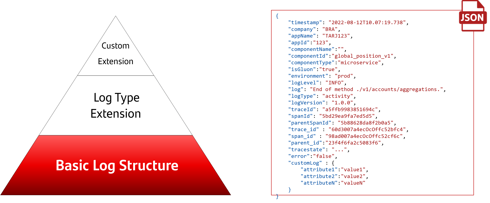
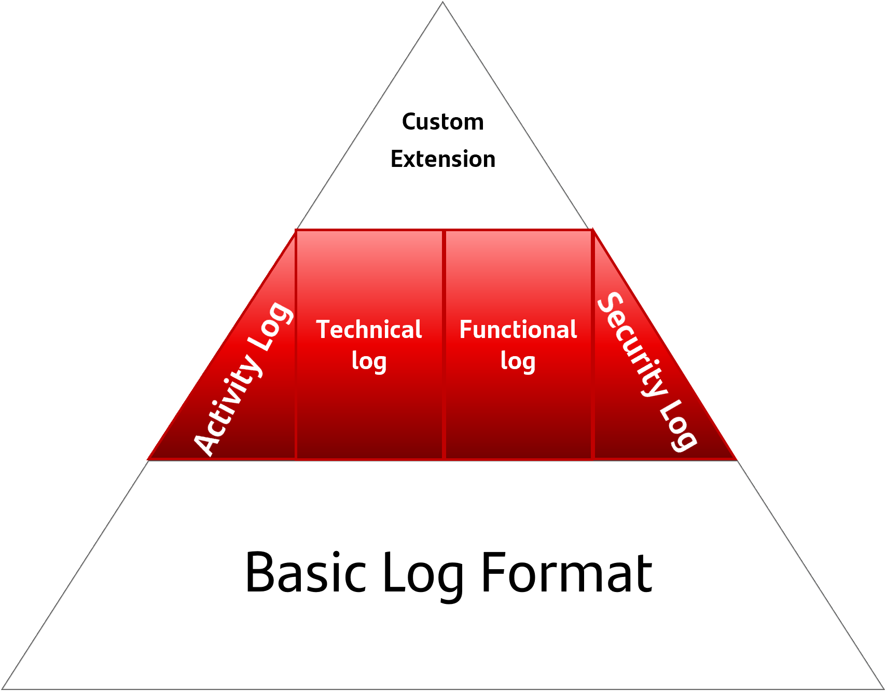
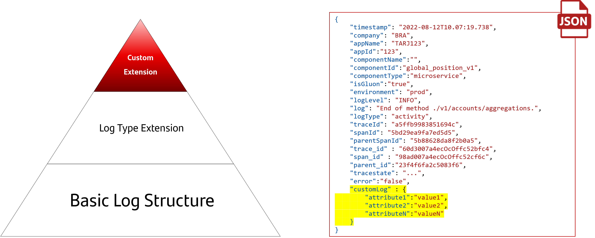

# GLUONLOG v1.0.0

GLUONLOG is the JSON-based format common structured log for Gluon, which is made
 up of several attributes and nodes, as follows.

Far from being a rigid structure, it is extensible. As we will see, customizable
content nodes have been designed so that each technology, business, and use case
can include truly useful information.

Finally, note that these log types are compatible with both GLUONLOG 1.0 and
GLOBALOG 2.0, except the attributes change depending on the flavor.

## Common log types



## How is GLUONLOG made up?

First, we start from a basic log structure that will be shared across all log
types (technical, activity, functional, and security).

Then, this format will be extended by each log type with the additional fields
associated with them.

Finally, each application, business use case or technology will extend the log
with the possibility of including custom fields that they consider necessary
to monitor their operation.

## Common structure

As a starting point, all types of logs should share a basic structure to provide
enough information for a basic operation​​​​​​​, that allows us to identify key data
such as traceability, products, applications…



The basic structure is extended with attributes associated with the different types of log.

## Structures by log type

Below are provided samples of log outputs. Some attributes may be wrong or outdated. Please, check the *Attributes. List & details* section for further information.

<figure markdown>
{width="400"}
</figure>

### Activity log

**When *activity logs* are created**

It depends on the use case. Typically, in REST communications they are created
in the response of the request, at least. For message-driven communications, at
least two log events are created: the first, when the event is sent by the
producer, and netx when the consumer receives it. Pay *fields. List & details*
section, in order to set the right values to the attributes (e.g., the right
value for the URL or the method attributes).

??? example "***Activity log* output sample**"

    Note: some attributes may be wrong or outdated. Please, check the *Attributes.
    List & details* section for further and updated information.

    ```json
    {
        "timestamp": "2022-08-12T10.07:19.738",
        "company": "BRA",
        "appName": "TARJ123",
        "appId":"123",
        "componentName":"",
        "componentId":"global_position_v1",
        "componentType":"microservice",
        "isGluon":"true",
        "environment": "PRO",
        "logLevel": "INFO",
        "log": "End of method ./v1/accounts/aggregations.",
        "logType": "activity",
        "logVersion" :"1.0.0",
        "traceld": "a5ffb9983851694c",
        "spanId": "5bd29ea9fa7ed5d5",
        "parentSpanId": "5b88628da8f2b0a5",
        "trace_id" : "60d3007a4ecOcOffc52bfc4",
        "span id" : "98ad007a4ecOcOffc52cf6c",
        "parent_id":"23f4f6fa2c5083f6",
        "tracestate": "b3=60d3007a4ecOcOffc52bfc486a4lelef-23f4f6fa2c5083f6-1-c52bfc48",
        "error":"false",
        "customLog" : {
            "customLog.attribue1":"value1",
            "customLog.attribue2":"value2",
            "customLog.attribue3":"value3"
        },
        "inputTimestamp": "2022-08-12T10:07:1",
        "method" : "GET",
        "returnCode" : "200",
        "url" : "api/vi/accounts/home",
    }
    ```

### Technical log

**When *technical logs* are created**

*At least, whenever there is an error (this is mandatory)*. In addition,
 developers can generate technical log events with information related to
 technical actions (e.g., the classic INFO logs, for  established
 connections, service ready, thread created…). Note that this technical
 information are not mandatory, only to give more detail or improve the
 understanding of the situation.

??? example "***Technical log* output sample**"

    Note: some attributes may be wrong or outdated. Please, check the *Attributes.
    List & details* section for further and updated information.

    ```json
    {
        "timestamp": "2022-08-12T10.07:19.738",
        "company": "BRA",
        "appName": "TARJ123",
        "appId":"123",
        "componentName":"",
        "componentId":"global_position_v1",
        "componentType":"microservice",
        "isGluon":"true",
        "environment": "PRO",
        "logLevel": "INFO",
        "log": "End of method ./v1/accounts/aggregations.",
        "logType": "technical",
        "logVersion": "1.0.0",
        "traceld": "a5ffb9983851694c",
        "spanId": "5bd29ea9fa7ed5d5",
        "parentSpanId": "5b88628da8f2b0a5",
        "trace_id" : "60d3007a4ecOcOffc52bfc4",
        "span id" : "98ad007a4ecOcOffc52cf6c",
        "parent_id":"23f4f6fa2c5083f6",
        "tracestate": "b3=60d3007a4ecOcOffc52bfc486a4lelef-23f4f6fa2c5083f6-1-c52bfc48",
        "error":"false",
        "customLog" : {
            "customLog.attribue1":"value1",
            "customLog.attribue2":"value2",
            "customLog.attribue3":"value3"
        }
    }
    ```

### Functional log

**When *functional logs* are created**

It depends on the functional requirements. This type of log is highly dependent
on the use case. For example, a requirement might be “generate a log event every
time a payment is received, including the following data (...)”.

??? example "***Functional log* output sample**"

    Note: some attributes may be wrong or outdated. Please, check the *Attributes.
    List & details* section for further and updated information.

    ```json
    {
        "timestamp": "2022-08-12T10.07:19.738",
        "company": "BRA",
        "appName": "TARJ123",
        "appId":"123",
        "componentName":"",
        "componentId":"global_position_v1",
        "componentType":"microservice",
        "isGluon":"true",
        "environment": "PRO",
        "logLevel": "INFO",
        "log": "End of method ./v1/accounts/aggregations.",
        "logType": "functional",
        "logVersion":"1.0.0",
        "traceld": "a5ffb9983851694c",
        "spanId": "5bd29ea9fa7ed5d5",
        "parentSpanId": "5b88628da8f2b0a5",
        "trace_id" : "60d3007a4ecOcOffc52bfc4",
        "span id" : "98ad007a4ecOcOffc52cf6c",
        "parent_id":"23f4f6fa2c5083f6",
        "tracestate": "b3=60d3007a4ecOcOffc52bfc486a4lelef-23f4f6fa2c5083f6-1-c52bfc48",
        "error":"false",
        "customLog" : {
            "customLog.attribue1":"value1",
            "customLog.attribue2":"value2",
            "customLog.attribue3":"value3"
        },
        "businessLog" : {
            "input": "(\n \.connectionv, \.1666954860164v.\n",
            "output": "(\n \.showcoachmarkv, false,\n}"
        }
    }
    ```

### Security log

**When *security logs* are created**

It depends on the security requirements. This type of log is highly dependent
on the use case. All the specific data related to security is set within
the *securityAttributes* node.

??? Example "***Security log* output sample**"

    Note: some attributes may be wrong or outdated. Please, check the *Attributes.
    List & details* section for further and updated information.

    ```json
    {
        "timestamp": "2022-08-12T10.07:19.738",
        "company": "BRA",
        "appName": "TARJ123",
        "appId":"123",
        "componentName":"",
        "componentId":"global_position_v1",
        "componentType":"microservice",
        "isGluon":"true",
        "environment": "PRO",
        "logLevel": "INFO",
        "log": "End of method ./v1/accounts/aggregations.",
        "logType": "security",
        "traceld": "a5ffb9983851694c",
        "spanId": "5bd29ea9fa7ed5d5",
        "parentSpanId": "5b88628da8f2b0a5",
        "trace_id" : "60d3007a4ecOcOffc52bfc4",
        "span id" : "98ad007a4ecOcOffc52cf6c",
        "parent_id":"23f4f6fa2c5083f6",
        "tracestate": "b3=60d3007a4ecOcOffc52bfc486a4lelef-23f4f6fa2c5083f6-1-c52bfc48",
        "error":"false",
        "customLog" : {
            "customLog.attribue1":"value1",
            "customLog.attribue2":"value2",
            "customLog.attribue3":"value3"
        },
        "result" : {
            "resultCode" : "OK",
            "securityAttributes" : {
                    "": ""
            },
        }
    }
    ```

## Custom extensions



The common structure is also extended with fields associated with the operability
of the application. The customLog, businessLog, and securityAttributes are the
places where this custom information should be logged. All of them are free-content
node, what means that it can change depending on the use case, technology, or
even the entity.

### customLog node

The customLog node is the only one included within the four log types.
Some of these attributes are common for all the use cases by technology;
others are only for specific use cases.

It should be fulfilled valuable information related to the technology, platform,
or the use case that make easier the operation. Regarding this, the technology
expert, the product owner or the operations and business teams are some of those
in charge of defining these attributes.

Finally, keep in mind that **functional identifiders** related to the use case
are keys to put the log correlation to the higher level.

### businessLog node

The attributes to be included are primarily defined by the use case owner or by
different operational teams (eg business operations and monitoring teams).
This node is only inside the functional log type, **and sensitive information
is not allowed**.

### result node

Security teams are main responsible for defining the content of the
securityAttributes. This node is specific to the security log type,
and the main use is for output data related to security concerns or
from security services developed in house.
