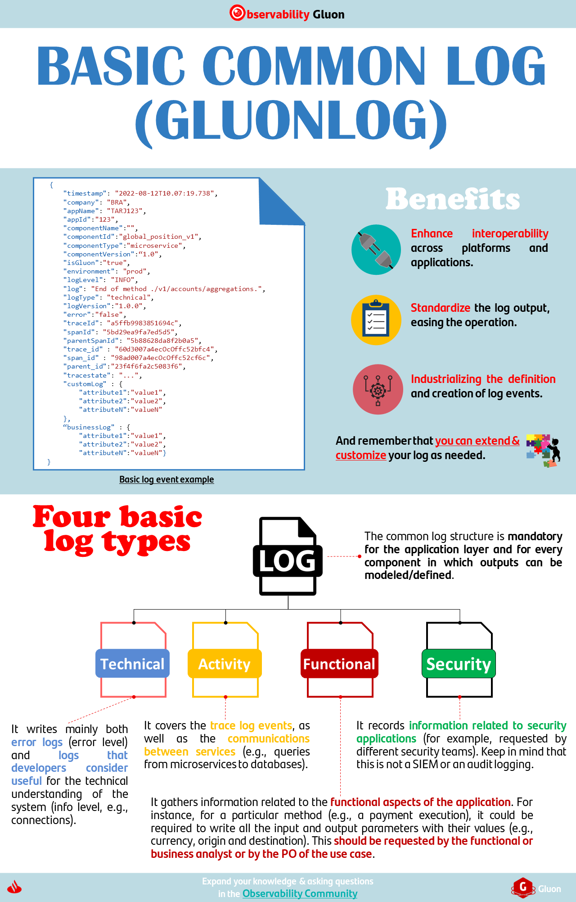

# Overview

Logs represent events that happen within the component, and its internal status. It is mainly used for having a real-time statistical view of your business and systems, for diagnostics, or to extend the E2E tracing, among others use cases.

## GLUONLOG standard

{ align=right width="25%" height="25%"}

GLUONLOG is the basic structure defined for the components GLUON-made, defined to standardize the log output, and ease the operation.

**All Gluon components comply with observability standards**, so they implement GLUONLOG out-of-the-box. GLUONLOG can be customized, by adding new information within the nodes defined for this purpose.

???+ warning
    Currently, GLUONLOG is being implemented in the GLUON microservices and APIs, so it will be available out-of-the-box in future versions of these components.

Finally, for non GLUON-made components, it is highly recommendable to adopt this structure, in order to standardize the operation.

## How-To

To know how the logging is addressed by the GLUON components, please, check the following documentation:

* [Microservices](https://github.alm.europe.cloudcenter.corp/pages/sanes-darwin-backend/darwin-spring-boot/current/darwin-project/darwin-spring-boot-logging/index.html)
* APIs
