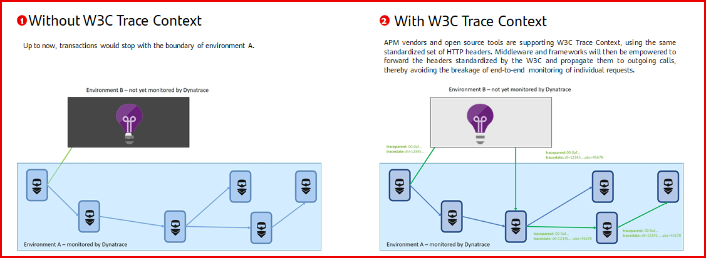

# W3C Trace Context specification

## Why do we use the W3C Trace Context specification for tracing at APM layer?

The reasons for adopting this specification are the following:

- It is defined by Microsoft, Dynatrace (the corporate APM and monitoring tool) and Google, and it is adopted by a wide range of vendors such as Elastic Stack, OpenTelemetry, Spring Sleuth, New Relic, Datadog...

- CNCF projects like OpenTelemetry (OpenCensus + OpenTracing) has implementations compatible with the W3C Trace Context in many languages and frameworks and assure integration with a wide range of traceability products while preventing vendor lock-in.

Finally, keep in mind that, independently of the tracing standard, any APM and tracing solution need to propagate specific headers.
The chance is leveraging on the W3C Trace Context to avoid the vendor locking, even to ensure the interoperability between monitored systems with different monitoring solutions.

## An example of APM interoperability

- Keep in mind that, until now, each APM vendor -Azure Application Insights, Dynatrace, etc- used their owns headers:

- **Broadcom CA Technologies APM**: x-apm-brtm-response-bt (e.g. cross process data: 403ABEBEC0A8AA802B5F4D54E6299691).

- **Azure Application Insights**: operation-id (e.g.: ad9a9b24f13c46eab97527f1e35a6615).

- **Dynatrace**: x-dynatrace (e.g. PT=9988707;PA=1029499134;SP=Marr****.com Production;PS=-659768705).

- Now, the transaction can be traced when it leaves the first system by the APM tool of the second system, and continue the flow when it enters the source system.

!!! warning "Keep this in mind! APM proprietary headers"
    Keep in mind that previously commented does not mean that the specific vendor headers are not being used (probably they are in use for internal managements of the APM tool).
    What was explained above means that thanks to the W3C specification, the tracking context is propagated through different APMs, ensuring traceability between them.

## Why don't we use this specification for log correlation?

??? info "Expand your knowledge"

    This is a very smart and common logical question. Why do we use two specs instead of one?

    The main reason is that W3C Trace Context is focused in how to pass the trace context through two or more APMs, not in the process (how the APMs solves the traceability). So each APM implements it as it decides, and that causes problems, mainly in agent-based scenarios. These agents don't share the spanId, so you'll never be able to correlate logs until the agents share it with the service. Think that the identifier is within the agent itself, not within the service, so you can't access to the spanId.

    However, the evolution of the implementation of the W3C Trace Context standard by Dynatrace will continue to be closely followed, since if at any time they specify how to solve the correlation of log and trace events, it will become a complete standard and the adoption as the main standard will be reviewed. The goal is to simplify.

## W3C Trace Context definition

The W3C Trace Context is the IT Industry specification for tracing at APM layer. This standard aims to set a common way to trace for any APM, easing the tracing across several systems monitored by several APM solutions.

### Main elements in W3C specification

The picture shows the main elements in [W3C Trace Context v1 specification](https://www.w3.org/TR/trace-context-1/):

- **Traceparent** - This HTTP header field identifies the incoming request in a tracing system. It has four fields:

- **version**: 2HEXDIGLC

- **trace-id**: 32HEXDIGLC

- **parent-id**: 16HEXDIGLC

- **trace-flags**: 2HEXDIGLC

- **Tracestate** - The main purpose of this HTTP header is to provide additional vendor-specific trace identification information across different distributed tracing systems and is a companion header for the traceparent field.
It also conveys information about the request’s position in multiple distributed tracing graphs.

## How to use this standard? Dynatrace OneAgent vs. Opentelemetry

The current APM solution is an agent-based solution. This means that there is an agent -in fact there are hundreds- in charge of generating the telemetry and managing the traces.
Thus, for the supported technologies -for example, Java, NodeJS or .NET among others-, the agent is totally in charge of managing the tracing. But for unsupported technologies, we must take advantage of Opentelemetry.

### Let's talk about tools and frameworks

Dynatrace is the current monitoring & APM solution. Dynatrace is compliant to W3C Trace Context specification, so for supported technologies, the main solution is to use Dynatrace.

But what about the supported technologies that implement Opentelemetry? Currently, there are some incompatibilities and side effects in scenarios where the process has activated OTEL and is being traced and instrumented by the Dynatrace OneAgent.
Thus, until the coexistence between OneAgent and OTEL in the same process evolves and matures, use these tools as follows:

!!! note ""
    - For supported technologies by the OneAgent, it manages the traceability and instrumentation. And you should disable OTEL for these two concerns, in order to side effects like spans duplicated.

    - For unsupported techonologies, such as Python, OTEL is the solution. 

    - Other use cases must be analyzed.

_Note: that this is a temporary measure. It is necessary to closely follow the evolution of both tools, as well as perform internal tests, in order to get the most out of the advantages of each of them._
