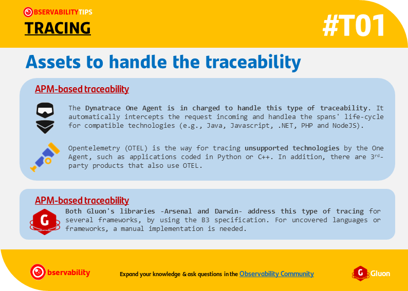
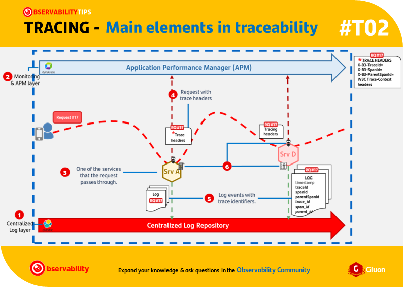
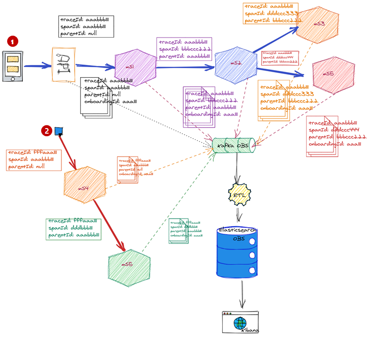
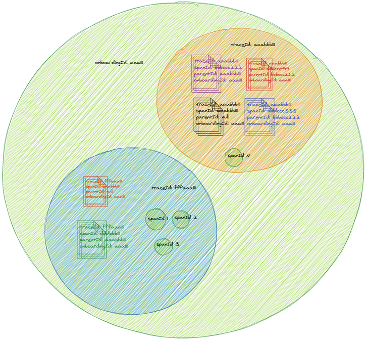

# Overview

{align="right" width="50%"}

Traces allow to correlate every request that belongs to the same transaction, making it possible to have an end-to-end view of the transaction. In addition, they contextualize metrics and log events, linking them whenever is possible.

Finally, **depending on the technology and the use case, we have specific assets to handle the traceability**. Take a look to the flashcard for learn more about it.

??? warning "Pay attention: about tracing standards"

    - These tracing identifiers are not functional or business identifiers, and
    cannot be used to identify entities (e.g. customers, payments, people ...).
    These trace identifiers are used to trace end-to-end requests, to illustrate
    how services communicate with each other, and to correlate telemetry and log
    events, not to trace specific entities.

    - **Both specifications must coexist**:

        - the B3 16 hexadec. multiple headers encoding for log correlation
        and log-based tracing.

        - the W3C Trace Context for interoperability between APMs and tracing frameworks.

    - Currently, W3C Trace Context is not enough for log correlation and tracing:
    this recommendation is focused on passing the context, not on processing.

    - Unlike the B3, which definition allows correlating log events, every request
    includes the reference to the spand id, the W3C Trace Context does not define
    what to do with the span-id, delegating in the vendor implementation.
    The consequence is a disparate implementation, depending on the tracing solution,
    and the inability to access that identifier in agent-based solutions (see the
    "Hierarchical correlation: a gap in the W3C Trace Context definition" section).

    - However, the evolution of the W3C Trace Context standard and the OTEL adoption
    by Dynatrace will continue to be closely followed, since if at any time they specify
    how to solve the correlation
    of log and trace events, it will become a complete standard and the adoption as
    the main standard will be reviewed. The goal is to simplify.

---

## Main elements in traceability

??? info "Expand your knowledge: explanation of the main elements of traceability."
    1. Centralized log - Elastic Stack as main technology. Centralized repository
    where the observability logs (technical, activity and functional) are sent.
    It is necessary for a log-based traceability

    2. Application Performance Monitor - Dynatrace as APM and technical monitoring tool.

    3. Services - The services should implement the tracing and log correlation
    standards. Depending on the technology and the use case, the implementation
    can differ. E.g.: while and API handles the traceability by defining policies
    a Spring Boot microservice handles it by using SDKs.

    4. Request with trace headers:

        - To enable traceability, it is necessary to generate and propagate the
        trace identifiers.

        - There are implemented two tracing specification: W3C Trace Context and X-B3.

    5. Log events with trace identifiers - Every component should:

        - generate a trace log event in order to record that the request passed
        through the component;

        - include the trace identifiers, for enabling the log correlation and
        linking the both APM and centralized log repository layers.

    6. Libraries, policies/scripts and Dynatrace One Agent:

        - Libraries for managing the X-B3 specification (e.g.: Spring Sleuth)

        - Policies and scripts for managing the X-B3 specification (e.g. policies at
        gateway level for APIs or scripts in case of Mulesoft APIs).

        - Dynatrace One Agent by APM-based tracing. For unsupported technologies, Opentelemetry.

---

## What not to use traceability for

Traceability itself is not a solution thought for tracing entire business processes,
but for help to understand atomic online transactions. However, we can get a more
complete picture of the business processes by leveraging in log-based traceability
(which relies on log correlation).

The following example is key to illustrating **the importance of including the
functional ID in the customLog** node, for all types of logs generated within
the business/technical process. In addition, it is **key to have a well-defined
functional log**, since it helps to understand the process.

!!! example "Realistic example"
    Suppose that you are in the following process (e.g., an onboarding process):

    {align="left" width="75%"}

    This operation is initiated by the user **"1"** The first part of the operation is online, and a traceId is created in the API (which is forwarded downstream). When this part of the operation is finish, the traceId finish too.

    But there is another flow **"2"**, that is started by a scheduled task. For this flow, a new traceId will be generated. So, all the logs that the (micro)services generates have another traceId, different from the first part of the operation.
    
      
    
    ---

    How can we get a complete picture of the process? Let's see the next picture:

    {align="left" width="75%"}

    Here, we can see that there are two groups, one group for each traceId.

    What is the meaning of the flowId (in this example the *onboardingId*)? This functional identifier is specific to the operation, and it is useful for grouping all the logs related to that operation.

    If you want to group all the generated logs along the operation, the only way is by adding the functional identifier to the log event output. Then, you will be able to correlate all the log events generated in the different flows that are part of the operation.
