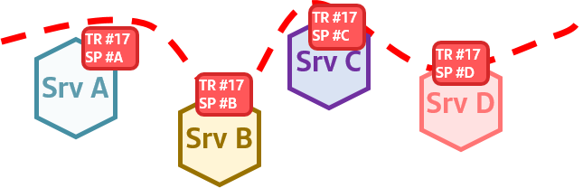
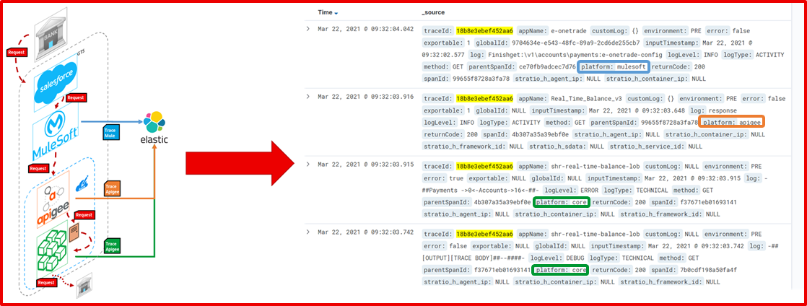
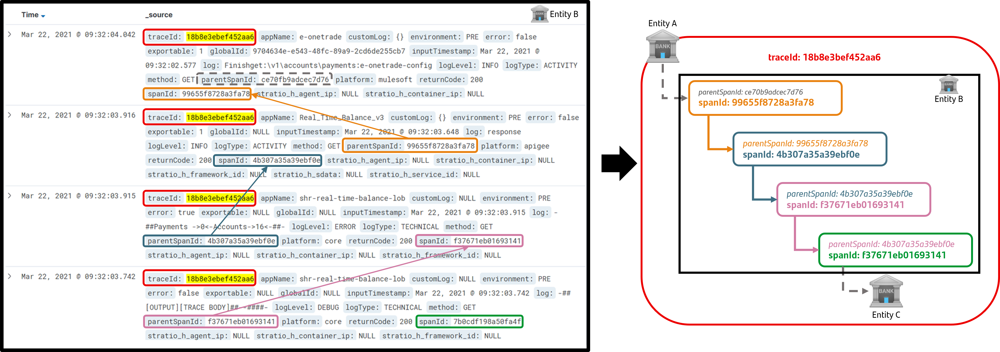

# B3 specification

[B3 Propagation](https://github.com/openzipkin/b3-propagation) is a specification for the header "b3" and those that start with "X-b3-". These headers are used for
trace context propagation across service boundaries. Note that in b3 specification, the X-B3- prefix is for maintaining backward compatibility. Specifically, we are using the B3 multiple 16 hexadecimal header encoding.

!!! warning ""
    Both, X-B3 and W3C Trace Context specifications should coexist: the first one for logs correlation and to extend the E2E, and the second one for allowing the APM interoperability.

??? info "Why do we continue to use the b3 specification"
    The rational for the B3 adoption for log correlation is:

    - **B3 specification does not suffer the ["hierarchical correlation gap"](https://confluence.alm.europe.cloudcenter.corp/display/ARCHOBSERV/OBS.ST.TLC00+-+Tracing+specifications).**

    - It’s the native tracing implementation for Spring Cloud ecosystem.

    - CNCF projects like OpenTelemetry (OpenCensus + OpenTracing) have implementations compatible with B3 Propagation in many languages and frameworks and assure integration with a wide range of traceability products while preventing vendor lock-in.

    - At the time of establishing which specification to follow (September 2019), the status of the W3C recommendation document was "candidate for proposal of recommendation".

    - In Santander Group, there is a wide installed services running this specification.

## Main elements in B3 specification

The main elements of the B3 specification are described below:

!!! info ""
    - **TraceId** - The **X-B3-TraceId** header is encoded as 32 or 16 lower-hex characters. **We employ the 16 lower-hex characters definition**. It looks like X-B3-TraceId: 463ac35c9f6413ad.
    - **SpanId** - The **X-B3-SpanId** header is encoded as 16 lower-hex characters. For example, a SpanId header might look like: X-B3-SpanId: a2fb4a1d1a96d312.
    - **ParentSpanId** - The **X-B3-ParentSpanId** header may be present on a child span and must be absent on the root span. It is encoded as 16 lower-hex characters.
    or example, a ParentSpanId header might look like: X-B3-ParentSpanId: 020000000000001.
    - **Sampled** - The **X-B3-Sampled** only can take {0, 1} value.

## Processes involved in traceability

### Process of creation and propagation of trace identifiers

It is the process in charge of creating the identifiers - in our case controlled in the X-B3 specification - and propagating them in each request through different mechanisms (for HTTP requests, through headers).

<figure markdown>
  
</figure>

**Step 1**. The X-B3 parameters are propagated in the headers of each request.
 

**Step 2**. When a request enters a component, it applies the following algorithm:

  - **Step 2.1**. Generate X-B3-TraceId :material-arrow-left: This is immutable throughout the entire operation. It is generated if it is not already informed or if the format doesn't match with the x-b3 specification.

  - **Step 2.2**. Generate X-B3-SpanId :material-arrow-left: Unless you already come with it or if the format doesn't match with the x-b3 specification. In that case, the value must be "0000000000000001".

  - **Step 2.3**. X-B3-ParentSpanId :material-arrow-left: if there are not any trace identifiers, it does mean
  that is the first component. So, the value is null.
  
  - **Step 2.4**. X-B3-Sampled :material-arrow-left: if not informed, set it to 0 or 1, randomly (depending on
  the % *4* of requests that you want to sample) *or if the format doesn't match
  with the x-b3 specification*.
 

**Step 3**. The current element, at the time of making a new request to another element, must:

  - **Step 3.1**. Set the current X-B3-SpanId as X-B3-ParentSpanId

  - **Step 3.2**. Generates the X-B3-SpanId that belongs to the new request.

  - **Step 3.3**. Propagate the X-B3-TraceId, X-B3-SpanId, X-B3-ParentSpanId, X-B3-Sampled
  headers in the new request.

---

### Trace registration process

It is the process in charge of persist the trace in a repository or backend (e.g. a Centralized Log Repository).

<figure markdown>
  
</figure>

**Step 1**. The trace record shall consist of at least the fields indicated in GLUONLOG (the common log structure for GLUON). Note that the *logType* attribute is set as "ACTIVITY".

**Step 2**. An activity trace log event per component will be created. To do this, proceed as follows:

  - In synchronous requests:

**Step 1**. The trace record shall consist of at least the fields indicated in GLUONLOG (the common log structure for GLUON). Note that the *logType* attribute is set as "ACTIVITY".

**Step 2**. An activity trace log event per component will be created. To do this, proceed as follows:

  - In synchronous requests:

    - When the request is received, the component will save a timestamp (inputTimestamp field).

    - When issuing the response, a log record will be created with the structure indicated in 1 and whose inputTimestamp field will have the inputTimestamp previously got it.

  - In asynchronous requests:

    - When the service ends its operative.

Regardless of this process, all log events generated by each component within the course of this request will carry the trace identifiers generated in the context of the request, as well as this common log structure,
**which can be enriched with the fields that the expert of each technology and business case considers useful for troubleshooting**.

---

## A realistic B3-based use case

!!! example "Log correlation in Global Trade Services (GTS)"
    

    In this log excerpt, several layers - the Mulesoft Cloud Hub, Apigee and microservices layers- are using the B3 standard for log correlation and to extend the E2E (remember that Dynatrace does not monitor Mulesoft Cloud Hub).

    All their log events have included the B3 tracing headers (the traceId is highlighted in the picture).

    

    We can reconstruct the calling tree by linking the three tracing headers included in every log event:

    - If you notice, the parentSpanId of the last **microservice** matches the spanId of the **previous one**.
    - Also, its parentSpanId matches the caller's spanId (**Apigee**).
    - Similarly, it occurs between **Apigee** and **Mulesoft** (the initial trace).
